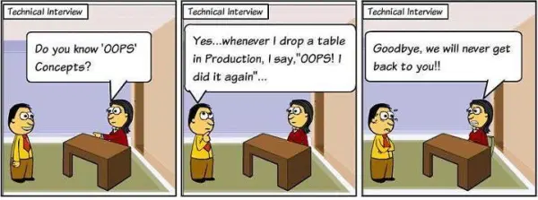
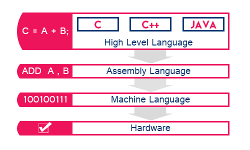
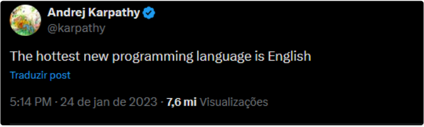
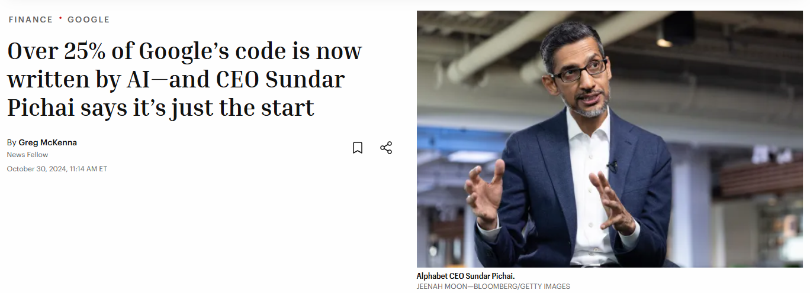
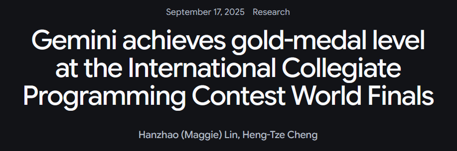
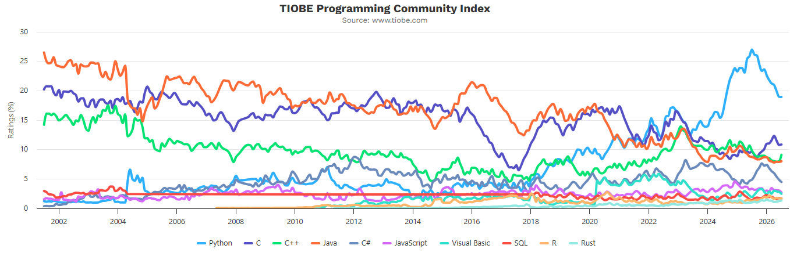
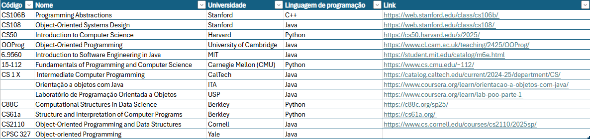
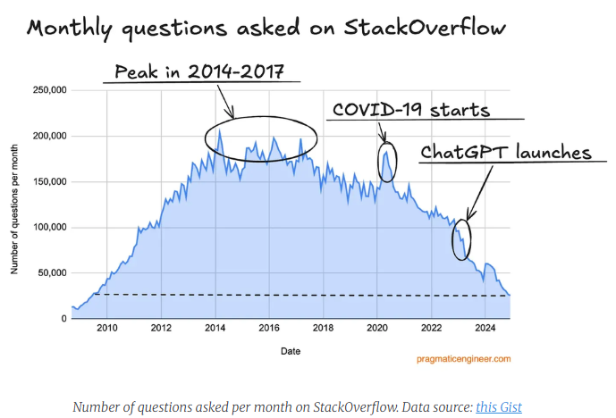
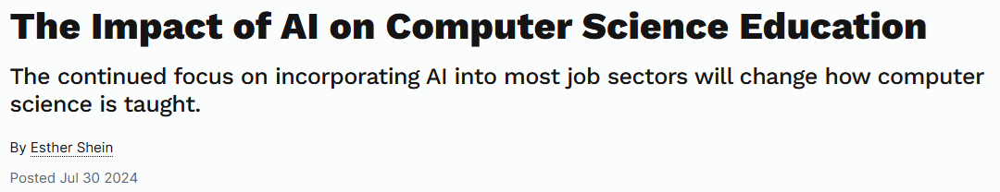
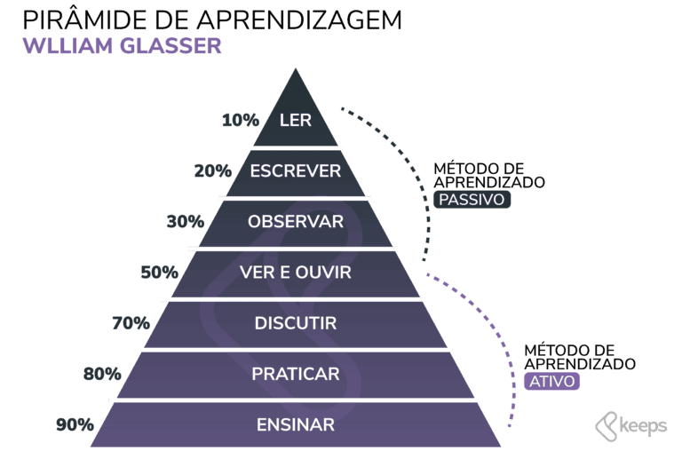

<!-- _class: title -->
<!-- _paginate: false -->

# Introdução e contextualização

## Programação Orientada a Objetos

**Objetivos da aula**

- Reconhecer a importância da disciplina
- Compreender os fundamentos de programação
- Entender a escolha da linguagem Java
- Refletir sobre o impacto da inteligência artificial
- Conhecer o plano de ensino da disciplina

2026.2 
Prof. Fabricio Santana 
fabricio.santana@idp.edu.br 
www.linkedin.com/in/fabriciofsantana/

---

<!-- _class: compact -->

# Que experiências você traz?

<table class="tiny">
  <thead>
    <tr>
      <th>1º Semestre</th>
      <th>2º Semestre</th>
      <th>3º Semestre</th>
      <th>4º Semestre</th>
    </tr>
  </thead>
  <tbody>
    <tr>
      <td>Introdução à Computação</td>
      <td>Oficina em Impressões 3D</td>
      <td>Oficina em Soluções Web</td>
      <td>Oficina de Equipamentos de TI</td>
    </tr>
    <tr>
      <td>Algoritmos e Lógica de Programação</td>
      <td>Estruturas de Dados</td>
      <td>Técnicas de Prog. e Análise de Algorit.</td>
      <td>Arquit. e Organização de Comp.</td>
    </tr>
    <tr>
      <td>Lógica Computacional</td>
      <td>Modelagem e Prog. Estatística</td>
      <td><strong>Programação Orientada a Objetos</strong></td>
      <td>Inteligência Artificial</td>
    </tr>
    <tr>
      <td>Álgebra Linear e Aplicações</td>
      <td>Empreendedorismo e Inovação</td>
      <td>Banco de Dados</td>
      <td>Big Data e NoSQL</td>
    </tr>
    <tr>
      <td>Cálculo Diferencial e Integral I</td>
      <td>Cálculo Diferencial e Integral II</td>
      <td>Processo de Software</td>
      <td>Redes de Comp. e Internet</td>
    </tr>
  </tbody>
</table>

Fonte: <a href="https://drive.google.com/file/d/1yv4lRcL0QbDrtp5EPggcznkop8zSo_MT/view">Matriz 2025 - disciplinas obrigatórias do 1º ao 4º semestre</a>

---

# Qual a contribuição da disciplina?

> Aprender a construir softwares a partir dos **conceitos** do problema a ser resolvido, onde cada conceito encapsula **atributos e comportamentos**, tornando o software mais compreensível, reutilizável e fácil de evoluir.

Fonte: <a href="https://saileshdhakal.com.np/posts/oops-concept">Cartoon de classe e objeto</a>

---

# Que caminho seguir?

> Antes de escolher ferramentas e tecnologias, precisamos discutir direção: **que problemas queremos ser capazes de resolver**?

Fonte: <a href="https://www.linkedin.com/pulse/se-voc%C3%AA-n%C3%A3o-sabe-para-onde-ir-qualquer-caminho-serve-pablo-berriel/">Alice no País das Maravilhas</a>

---

# Por que aprender programação?

<iframe
  style="display: block; width: 100%; aspect-ratio: 16 / 9; border: 0;"
  src="https://www.youtube.com/embed/BRTOlPdyPYU?start=74"
  title="Entrevista com Steve Jobs"
  allow="accelerometer; autoplay; clipboard-write; encrypted-media; gyroscope; picture-in-picture; web-share"
  referrerpolicy="strict-origin-when-cross-origin"
  allowfullscreen
></iframe>

> Everybody in this country should learn how to program a computer, should learn a computer language, because it teaches you how to think.

Steve Jobs, 1995

Fonte: <a href="https://www.youtube.com/watch?v=BRTOlPdyPYU&t=74s">Entrevista em vídeo disponível no YouTube</a>

---

# O que é programação?

> Programação é a arte de **dizer** ao computador **o que fazer**.

Donald Knuth, autor de <em>The Art of Computer Programming</em>

> Um **algoritmo** é um **conjunto de instruções** para concluir uma **tarefa**.

BHARGAVA, Aditya Y. <em>Grokking Algorithms</em>. 2. ed. Manning Publications, 2024.

---

# O que é programação?

**Programar é se comunicar com o computador.**

**Elementos da comunicação**

- Emissor e receptor
- Canal: meio
- Referente: conteúdo
- Mensagem: forma
- Código: signos

**Elementos da linguagem**

- Léxico: vocabulário
- Sintaxe: estrutura
- Semântica: significado

---

# Como se comunicar com um computador?

**[Linguagens de programação](https://en.wikipedia.org/wiki/Programming_language)**

- [Linguagem de máquina](https://en.wikipedia.org/wiki/Machine_code)
- [Linguagem assembly](https://en.wikipedia.org/wiki/Assembly_language)
- [Linguagem de alto nível](https://en.wikipedia.org/wiki/High-level_programming_language)
  - Exemplo: Java

Fonte: <a href="http://www.btechsmartclass.com/c_programming/C-Computer-Languages.html">BTech Smart Class — Computer Languages</a>

---

# O que muda com a IA?

Fonte: <a href="https://x.com/karpathy/status/1617979122625712128">Publicação de Andrej Karpathy</a>

---

# O que muda com a IA?

<iframe
  style="display: block; width: 100%; aspect-ratio: 16 / 9; border: 0;"
  src="https://www.youtube.com/embed/yj73GIEKmLI"
  title="Entrevista com Jensen Huang"
  allow="accelerometer; autoplay; clipboard-write; encrypted-media; gyroscope; picture-in-picture; web-share"
  referrerpolicy="strict-origin-when-cross-origin"
  allowfullscreen
></iframe>

> Everybody in the world is now a programmer.

Jensen Huang, 2024

Fonte: <a href="https://www.youtube.com/watch?v=yj73GIEKmLI">Entrevista em vídeo</a>

---

# O que muda com a IA?

Fonte: <a href="https://fortune.com/2024/10/30/googles-code-ai-sundar-pichai/">Relato sobre IA e código no Google</a>

---

# O que muda com a IA?

<iframe
  style="display: block; width: 100%; aspect-ratio: 16 / 9; border: 0;"
  src="https://www.youtube.com/embed/uDL_6A6zB0w"
  title="Entrevista com Mark Zuckerberg"
  allow="accelerometer; autoplay; clipboard-write; encrypted-media; gyroscope; picture-in-picture; web-share"
  referrerpolicy="strict-origin-when-cross-origin"
  allowfullscreen
></iframe>

> Probably in 2025 [...] we are going to have an AI that can effectively be a sort of mid-level engineer [...] that can write code.

Mark Zuckerberg, 2025

Fonte: <a href="https://www.youtube.com/watch?v=uDL_6A6zB0w">Entrevista em vídeo</a>

---

<!-- _class: compact -->

# O que muda com a IA?

**Progresso dos modelos da OpenAI em codificação**

- Primeiro modelo de raciocínio: top 1 milhão
- o1, setembro de 2024: top 10 mil
- o3, janeiro de 2025: top 175
- Modelo interno, fevereiro de 2025: top 50
- Projeção para o fim de 2025: top 1

<iframe
  style="display: block; width: 100%; aspect-ratio: 16 / 9; border: 0;"
  src="https://www.youtube.com/embed/8LmfkUb2uIY?start=1201"
  title="Progresso dos modelos de inteligência artificial em programação"
  allow="accelerometer; autoplay; clipboard-write; encrypted-media; gyroscope; picture-in-picture; web-share"
  referrerpolicy="strict-origin-when-cross-origin"
  allowfullscreen
></iframe>

Fonte: <a href="https://www.youtube.com/watch?v=8LmfkUb2uIY&t=1201s">Entrevista em vídeo disponível no YouTube</a>

---

# O que muda com a IA?

Fonte: <a href="https://deepmind.google/blog/gemini-achieves-gold-medal-level-at-the-international-collegiate-programming-contest-world-finals/">Gemini achieves gold-medal level at the ICPC World Finals</a>

---

# Qual linguagem de programação aprender?

A disciplina adota a linguagem de programação **Java**.

  <iframe
    style="display: block; width: 100%; height: 650px; border: 0;"
    src="https://flo.uri.sh/visualisation/24825595/embed?auto=1"
    title="Gráfico sobre linguagens de programação"
    scrolling="yes"
    allowfullscreen
  ></iframe>

Fonte: <a href="https://spectrum.ieee.org/top-programming-languages-2025">IEEE Spectrum — Top Programming Languages 2025</a>

---

# Qual linguagem de programação aprender?

A disciplina adota a linguagem de programação **Java**.

Fonte: <a href="https://www.tiobe.com/tiobe-index/">TIOBE Index</a>

---

# Qual linguagem de programação aprender?

A disciplina adota a linguagem de programação **Java**.

Fonte: <a href="https://onedrive.live.com/:x:/g/personal/187d9a0eb7d8e7f9/IQD559i3Dpp9IIAYky8AAAAAAWJ5BL3UognXN1-yVGYKq6Y?rtime=5Wb6y_Tz3kg&amp;redeem=aHR0cHM6Ly8xZHJ2Lm1zL3gvYy8xODdkOWEwZWI3ZDhlN2Y5L0Vmbm4yTGNPbW4wZ2dCaVRMd0FBQUFBQllua0V2ZFNpQ2RjM1g3SlVaZ3FycGc_ZT1MbDRHdDY">Mapeamento de linguagens em outros cursos</a>

---

# Como aprender programação hoje?

As ferramentas usadas para aprender e resolver dúvidas de programação estão mudando rapidamente.

Fonte: <a href="https://blog.pragmaticengineer.com/stack-overflow-is-almost-dead/">Stack Overflow is almost dead</a>

---

<!-- _class: compact -->

# Como aprender programação hoje?

**ChatGPT**

- Tarefas concluídas mais rapidamente.
- Desempenho inferior em prova escrita sem consulta.

**Code Llama**

- Segundo grupo mais rápido.
- Metade dos alunos aprovada na prova escrita sem consulta.

**Google**

- Maior tempo para completar as tarefas.
- Todos aprovados na prova escrita sem consulta.

Fonte: <a href="https://cacm.acm.org/news/the-impact-of-ai-on-computer-science-education/">The Impact of AI on Computer Science Education</a>

---

<!-- _class: compact -->

# Como você vai aprender?

- Discussão em grupo: aulas dialogadas.
- Leituras e resumos.
- Exercícios práticos.
- Seminário.
- Projeto.
- Aulas teóricas.
- **Explorando de forma autodidata.**
- **Praticando.**
- **Praticando.**
- **Praticando.**

---

# Como você vai aprender?

**Pirâmide de aprendizagem**

Fonte: <a href="https://keeps.com.br/piramide-de-aprendizagem-de-william-glasser-conceito-e-estrutura/">Pirâmide de aprendizagem de William Glasser</a>

---

# O que você vai aprender?

- Introdução à Plataforma Java.
- Introdução à Programação em Java.
- Elementos da linguagem Java: tipos primitivos e operadores.
- Entrada e saída de dados (I/O).
- Estruturas de controle e de seleção.
- Fundamentos da Programação Orientada a Objetos.
- Tratamento de exceções.
- Manipulação de arquivos.
- Estruturas de dados e coleções.
- Persistência em banco de dados relacional: JDBC e JPA.

Fonte: Plano de Ensino da Disciplina

---

# Qual objetivo da disciplina?

Ao final da disciplina, os estudantes serão capazes de aplicar os princípios, fundamentos e práticas da Programação Orientada a Objetos (POO) no desenvolvimento de sistemas de software, utilizando linguagens e frameworks apropriados para criar soluções modulares, reutilizáveis e de fácil manutenção.

Fonte: Plano de Ensino da Disciplina

---

# Quais objetivos específicos?

- Distinguir o paradigma de orientação a objeto em face do paradigma estruturado.
- Implementar algoritmos e programas com classes, objetos, coleções e associações.
- Avaliar classes, classes abstratas, interfaces e enumerações.
- Compreender o mecanismo de exceções e empregá-lo na construção de software mais confiável.
- Construir softwares capazes de realizar persistência de dados com arquivos e bancos relacionais.
- Identificar a separação de responsabilidades e aplicar camadas e MVC.
- Identificar e aplicar os pilares da POO: herança, polimorfismo, encapsulamento e abstração.
- Empregar conceitos avançados de POO em projetos de software.
- Utilizar IDEs para implementar, testar e depurar sistemas orientados a objetos.
- Avaliar a qualidade do código e refatorar sistemas conforme princípios SOLID.

Fonte: Plano de Ensino da Disciplina

---

<!-- _class: compact -->

# Como o aprendizado será avaliado?

- 10 exercícios práticos de programação: 0,0 a 0,4 cada um (NE1-10).
- 10 resumos de leituras: 0,0 a 0,2 cada um (NR1-10).
- 10 estudos dirigidos via prompt: 0,0 a 0,2 cada um.
- 10 questionários: 0,0 a 0,2 cada um (NQ1-10).
- 2 provas teóricas: 0,0 a 3,0 (NT1 e NT2).
- 2 provas práticas: 0,0 a 2,0 cada uma (NP1 e NP2).
- Avaliação 1: NE1-5 + NR1-5 + estudos dirigidos 1-5 + NQ1-5 + NT1 + NP1.
- Avaliação 2: NE6-10 + NR6-10 + estudos dirigidos 6-10 + NQ6-10 + NT2 + NP2.
- Ponto adicional por participação: 0,0 a 0,5 em cada AV, não cumulativo.
- Nota máxima de cada avaliação: 10,0.

Fonte: Plano de Ensino da Disciplina

---

<!-- _class: compact -->

# O que fazer para a próxima aula?

- Revisar o [repositório da disciplina no GitHub](https://github.com/fabriciosantana/poo).
- Preparar sua estação para desenvolvimento Java.
  - Sugestão: usar distribuição Linux
    - [WSL](https://learn.microsoft.com/pt-br/windows/wsl/install)
    - [GitHub Codespaces](https://github.com/features/codespaces)
    - [Dev Containers](https://containers.dev/)
  - [VS Code](https://code.visualstudio.com/) e extensões Java
  - [JDK 21](https://docs.oracle.com/en/java/javase/21/)
    - Sugestão: [OpenJDK](https://openjdk.org/) ou outra distribuição
  - [GitHub](https://github.com/): criar conta gratuita
    - [GitHub Client (gh)](https://cli.github.com/)
  - Opcionais:
    - [SDKMAN](https://sdkman.io/), [JUnit 5](https://junit.org/) e [Maven](https://maven.apache.org/).

- Informações adicionais:
  - [Introduction to Linux](https://training.linuxfoundation.org/training/introduction-to-linux/)
  - [Getting started with Visual Studio Code](https://code.visualstudio.com/docs/introvideos/basics)
  - [Intro to GitHub](https://education.github.com/experiences/intro_to_github)
  - [GitHub Foundations](https://education.github.com/experiences/foundations_certificate)

---

<!-- _class: compact -->

# 1ª Leitura

- SCHILDT, Herbert. [The history and evolution of Java](https://1drv.ms/b/s!Avnn2LcOmn0Y3mnfmCUIsHXeIOq5?e=jeM4eh). In: _Java: the complete reference_. 12. ed. New York: McGraw Hill, 2021. Cap. 1.
- Procedimento para entrega do resumo:
  - Escrever o resumo em folha A4 branca.
  - Fazer fork do repositório da disciplina.
  - Digitalizar em PDF e gravar no diretório 
    - `poo/readings/01-history/seunome-seusobrenome.pdf`.
  - Enviar pull request para o repositório da disciplina.
  - Submeter o link do pull request no Ambiente Virtual.
- **Prazo**: conforme Ambiente Virtual.

