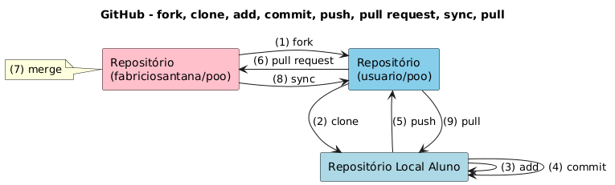
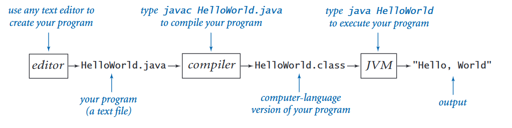

<!-- _class: title -->
<!-- _paginate: false -->

# Configuração do ambiente, visão geral do github e procedimento para submissão de tarefas

## Programação Orientada a Objetos

<div class="objectives">

**Objetivos da aula**

- Configurar a estação de desenvolvimento
- Conhecer o GitHub e o procedimento para submissão de tarefas
- Desenvolver, compilar, executar e testar o programa Hello, World!
- Submeter o programa ao repositório da disciplina
- Registrar a tarefa no Ambiente Virtual

</div>

<div class="contact">
2026.2<br>
Prof. Fabricio Santana<br>
fabricio.santana@idp.edu.br<br>
www.linkedin.com/in/fabriciofsantana/
</div>

---

<!-- _class: compact -->

# Como configurar a estação de desenvolvimento?

<div class="columns small">

<div>

**Preparação do ambiente**

- Consulte o diretório `howto` no [repositório da disciplina](https://github.com/fabriciosantana/poo/)
- Linux para as atividades práticas:
  - [WSL](https://learn.microsoft.com/pt-br/windows/wsl/install)
  - [GitHub Codespaces](https://github.com/features/codespaces)
  - [Dev Containers](https://code.visualstudio.com/docs/devcontainers/containers)
- [VS Code](https://code.visualstudio.com/) e extensões Java
- [JDK 21](https://docs.oracle.com/en/java/javase/21/), preferencialmente [OpenJDK](https://openjdk.org/)
- Conta no [GitHub](https://github.com/)
- [SDKMAN](https://sdkman.io/), [JUnit 5](https://junit.org/junit5/) e [Maven](https://maven.apache.org/)

</div>

<div>

**Materiais adicionais**

- [Introduction to Linux](https://training.linuxfoundation.org/training/introduction-to-linux/)
- [Getting started with Visual Studio Code](https://code.visualstudio.com/docs/introvideos/basics)
- [Intro to GitHub](https://education.github.com/experiences/intro_to_github)
- [GitHub Foundations](https://education.github.com/experiences/foundations_certificate)

</div>

</div>

---

<!-- _class: compact -->

# Configuração do ambiente de desenvolvimento

<div class="small">

Revise o roteiro de instalação no diretório `howto` do [repositório da disciplina](https://github.com/fabriciosantana/poo).

**✅ VS Code instalado**

```console
$ code --version
1.132.1
c2d1b13fdc4a77628e5f3bb70173351c8f2fbad1
x64
```

**✅ JDK 21 instalado**

```console
$ java --version
openjdk 21.0.2 2024-01-16
OpenJDK Runtime Environment
OpenJDK 64-Bit Server VM
```

**✅ Extensões Java do VS Code instaladas**

</div>

---

<!-- _class: compact -->

# Configuração do ambiente de desenvolvimento

<div class="small">

Revise o roteiro de instalação no diretório `howto` do [repositório da disciplina](https://github.com/fabriciosantana/poo).

**✅ Git**

```console
$ git --version
git version 2.51.1
```
**✅ Git LFS**

```console
$ git lfs --version
git-lfs/3.4.1
```

**✅ GitHub CLI**

```console
$ gh --version
gh version 2.97.0
```

O GitHub CLI é opcional pois é possível realizar as operações em [github.com](https://github.com/).

</div>

---

<!-- _class: compact -->

# Configuração do ambiente de desenvolvimento

<div class="small">

Revise o roteiro de instalação no diretório `howto` do [repositório da disciplina](https://github.com/fabriciosantana/poo).

**✅ Fazer o fork do repositório da disciplina**

```console
$ gh repo fork \
  fabriciosantana/poo
```

O fork também pode ser criado em [github.com](https://github.com/).

**✅ Clonar seu repositório criado no fork**

```console
$ git clone \
  https://github.com/\
  seu-usuario/poo.git
```

Substitua `seu-usuario` pelo seu login.

**✅ Verificar arquivos locais**

```console
$ cd poo
$ ls
```

</div>

---

# Fluxo para submissão de tarefas



<div class="source">Fonte: <a href="https://github.com/fabriciosantana">github.com/fabriciosantana</a></div>

---

# Como um programa Java é executado?

> **Write once, run anywhere.**



<div class="source">Fonte: SEDEGWICK, Robert; WAYNE, Kevin. <em>Computer Science: An Interdisciplinary Approach</em>. Addison-Wesley, 2016. Conceito: <a href="https://en.wikipedia.org/wiki/Write_once,_run_anywhere">Write once, run anywhere</a>.</div>

---

<!-- _class: compact -->

# Primeiro programa Java

<div class="small">

**✅ Escrever programa `HelloWorld.java`**

```java
public class HelloWorld {
  public static void main(String[] args) {
    System.out.println("Hello, World!");
  }
}
```

**✅ Compilar programa**

```console
$ javac HelloWorld.java
```

**✅ Executar programa**

```console
$ java HelloWorld
Hello, World!
```

</div>

---

<!-- _class: compact -->

# Submeter programa

<div class="small">

**✅ Adicionar no repositório local**

```console
$ git add HelloWorld.java
```

**✅ _Comitar_ no repositório local**

```console
$ git commit -m \
  "Programa HelloWorld"
```

**✅ Publicar no repositório remoto**

```console
$ git push
```

</div>

Depois do `push`, abra um **pull request** pela interface do GitHub e registre seu link no Ambiente Virtual.

---

# Ambiente preparado!

Parabéns, seu ambiente está pronto a disciplina.

