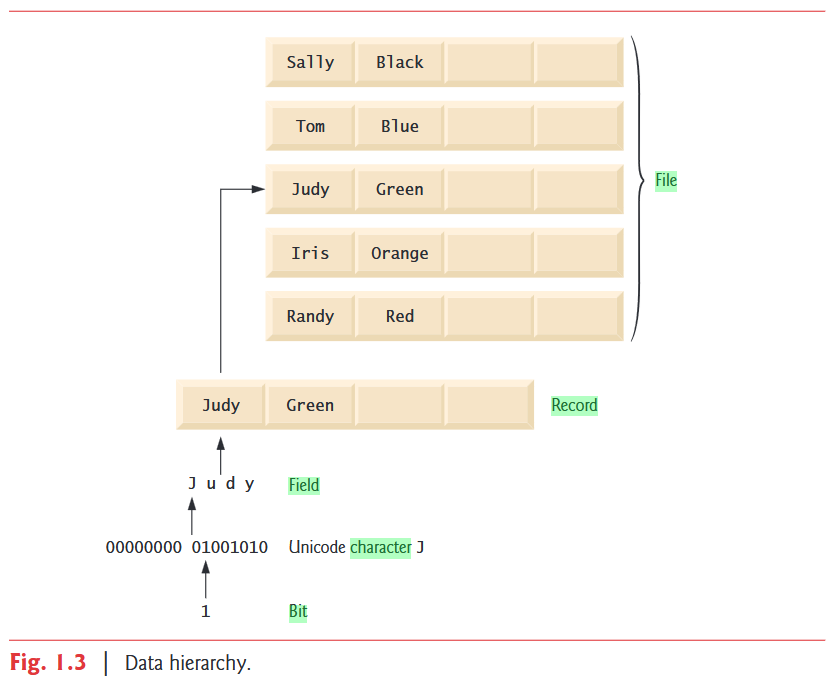
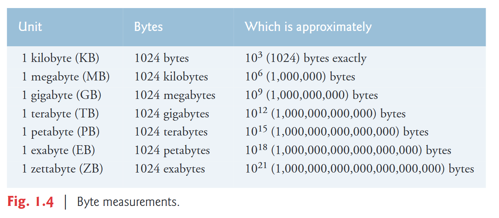

<!-- _class: title -->
<!-- _paginate: false -->

# Plataforma Java: ferramentas, jshell, java e javac

## Programação Orientada a Objetos

<div class="objectives">

**Objetivos da aula**

- Compreender aspectos introdutórios da programação de computadores
- Conhecer a plataforma Java e suas principais ferramentas
- Experimentar código Java no JShell

</div>

<div class="contact">
2026.2<br>
Prof. Fabricio Santana<br>
fabricio.santana@idp.edu.br<br>
www.linkedin.com/in/fabriciofsantana/
</div>

---

# O que é programação?

> Programação é a arte de **dizer** ao computador **o que fazer**.

<div class="small author-note">Donald Knuth, autor de <em>The Art of Computer Programming</em></div>

> Um **algoritmo** é um **conjunto de instruções** para concluir uma **tarefa**.

<div class="small author-note">BHARGAVA, Aditya Y. <em>Grokking Algorithms</em>. 2. ed. Manning Publications, 2024.</div>

---

# O que é programação?

**Programar é se comunicar com o computador.**

<div class="columns">

<div class="callout">

**Elementos da comunicação**

- Emissor e receptor
- Canal: meio
- Referente: conteúdo
- Mensagem: forma
- Código: signos

</div>

<div class="callout">

**Elementos da linguagem**

- Léxico: vocabulário
- Sintaxe: estrutura
- Semântica: significado

</div>

</div>

---

# Como o computador executa uma tarefa?

**Arquitetura de Von Neumann**


<div class="source">Fonte: <a href="https://en.wikipedia.org/wiki/Von_Neumann_architecture">Von Neumann architecture — Wikipedia</a></div>

---

# Qual a função de um programa?

**Manipular dados**



<div class="source">Fonte: DEITEL, Paul; DEITEL, Harvey. <em>Java: How to Program, Early Objects</em>. 11. ed. Pearson, 2017.</div>

---

# Qual a função de um programa?

**Manipular dados representados em bytes**



<div class="source">Fonte: DEITEL, Paul; DEITEL, Harvey. <em>Java: How to Program, Early Objects</em>. 11. ed. Pearson, 2017.</div>

---

# Como instruir um computador?

<div class="columns" style="align-items: center;">

<div>

**[Linguagens de programação](https://en.wikipedia.org/wiki/Programming_language)**

- [Linguagem de máquina](https://en.wikipedia.org/wiki/Machine_code)
- [Linguagem assembly](https://en.wikipedia.org/wiki/Assembly_language)
- [Linguagem de alto nível](https://en.wikipedia.org/wiki/High-level_programming_language)
  - Exemplo: Java

</div>

<div>


</div>

</div>

<div class="source">Fonte: <a href="http://www.btechsmartclass.com/c_programming/C-Computer-Languages.html">BTech Smart Class — Computer Languages</a></div>

---

<!-- _class: compact -->

# Qual o próximo passo?

<div class="columns" style="align-items: center;">

<div class="small">

**Progresso dos modelos da OpenAI em codificação**

- Primeiro modelo de raciocínio: top 1 milhão
- o1, setembro de 2024: top 10 mil
- o3, janeiro de 2025: top 175
- Modelo interno, fevereiro de 2025: top 50
- Projeção para o fim de 2025: top 1

</div>

<div>

<iframe
  style="display: block; width: 100%; aspect-ratio: 16 / 9; border: 0;"
  src="https://www.youtube.com/embed/8LmfkUb2uIY?start=1201"
  title="Progresso dos modelos de inteligência artificial em programação"
  allow="accelerometer; autoplay; clipboard-write; encrypted-media; gyroscope; picture-in-picture; web-share"
  referrerpolicy="strict-origin-when-cross-origin"
  allowfullscreen
></iframe>

</div>

</div>

<div class="source">Fonte: <a href="https://www.youtube.com/watch?v=8LmfkUb2uIY&t=1201s">Entrevista em vídeo disponível no YouTube</a></div>

---

# Qual o próximo passo?


<div class="source">Fonte: <a href="https://deepmind.google/blog/gemini-achieves-gold-medal-level-at-the-international-collegiate-programming-contest-world-finals/">Gemini achieves gold-medal level at the ICPC World Finals</a></div>

---

# O que é a plataforma Java?

> Java é um conjunto de softwares e especificações que fornece uma plataforma para desenvolver aplicações e executá-las em diferentes ambientes computacionais.


<div class="source">Fonte: <a href="https://en.wikipedia.org/wiki/Java_(software_platform)">Java (software platform) — Wikipedia</a></div>

---

# O que usar para programar Java?

**Plataformas Java**

- **Java SE: Standard Edition**
- Java EE: Enterprise Edition / Jakarta EE
- Java ME: Micro Edition
- Java Card

<div class="source">Fonte: MUGHAL, Khalid; STRELNIKOV, Vasily. <em>OCP Oracle Certified Professional Java SE 17 Developer Programmer's Guide</em>. Oracle Press, 2023.</div>

---

<!-- _class: compact -->

# Quais são as principais características do Java?

- Implementa vários paradigmas de programação:
  - Programação orientada a objetos
  - Programação procedural
  - Programação funcional
- Bytecode interpretado pela Java Virtual Machine(JVM)
- Arquitetura neutra e portabilidade do bytecode: *Write once, run anywhere*
- Simples, dinâmico e distribuído
- Robusto e seguro
- Desempenho e suporte a múltiplas threads

<div class="source">Fonte: MUGHAL, Khalid; STRELNIKOV, Vasily. <em>OCP Oracle Certified Professional Java SE 17 Developer Programmer's Guide</em>. Oracle Press, 2023.</div>

---

<!-- _class: compact -->

# Quais são as ferramentas Java?

O **Java Development Kit (JDK)** reúne as principais ferramentas:

<div class="columns small">

<div>

- `jshell`: ambiente REPL
- `javac`: compila código Java em bytecode
- `java`: executa uma aplicação Java

</div>

<div>

- `jar`: empacota arquivos para distribuição
- `javadoc`: gera documentação do código
- `jpackage`: cria pacotes executáveis

</div>

</div>

<div class="source">Fonte: <a href="https://docs.oracle.com/en/java/javase/21/docs/specs/man/index.html">Java Development Kit Version 21 Tool Specifications</a></div>

---

<!-- _class: compact -->

# O que usar para programar Java?

Instale o **Java Development Kit(JDK)** conforme as orientações do [repositório da disciplina](https://github.com/fabriciosantana/poo) e confirme a instalação:

```console
$ java --version
openjdk 21.0.2 2024-01-16
OpenJDK Runtime Environment (build 21.0.2+13-58)
OpenJDK 64-Bit Server VM (build 21.0.2+13-58, mixed mode, sharing)
```

---

<!-- _class: compact -->

# O que é o JShell?

<div class="small">

- Ambiente para aprendizagem e execução rápida de código 
- Conhecido pelo acrônimo **REPL** (*Read, Evaluate, Print, Loop*) .

**Iniciar jshell**

```console
$ jshell
| Welcome to JShell
jshell>
```

**Executar instruções Java e comandos jshell**

```console
jshell> "Hello, World!"
$1 ==> "Hello, World!"
```

**Sair**

```console
jshell> /exit
| Goodbye
```

</div>

---

<!-- _class: compact -->

# Principais comandos do JShell

Experimente executá-los no terminal

<div class="columns small">

<div>

```console
jshell> /list
jshell> /edit [opção]
jshell> /drop {nome|id|intervalo}
jshell> /save [opções] arquivo
jshell> /open arquivo
jshell> /reload
```

</div>

<div>

```console
jshell> /reset
jshell> /history
jshell> /types [opção]
jshell> /vars
jshell> /help
jshell> /exit
```

</div>

</div>

<div class="source">Fonte: <a href="https://docs.oracle.com/en/java/javase/21/docs/specs/man/jshell.html">JShell Tool Reference — Java 21</a></div>

---

# Por que usar o JShell?

- Permite testar código Java sem criar arquivos `.java`
- Oferece feedback imediato para aprender sintaxe e semântica
- É ideal para explorar tipos primitivos e operadores
- Mantém o estado entre comandos, incluindo variáveis, métodos e classes
- Segue o ciclo *Read → Evaluate → Print → Loop*
- Disponibiliza comandos para inspecionar, editar, salvar e recarregar trechos

---

# 1ª Atividade de implementação