<!-- _class: title -->
<!-- _paginate: false -->

# Elementos da linguagem Java

## Programação Orientada a Objetos

<div class="objectives">

**Objetivos da aula**

- Reconhecer os elementos da linguagem Java
- Executar comandos da linguagem Java no JShell

</div>

<div class="contact">
2026.2<br>
Prof. Fabricio Santana<br>
fabricio.santana@idp.edu.br<br>
www.linkedin.com/in/fabriciofsantana/
</div>

---

# Elementos da linguagem Java

<div class="columns">
<div>

**Elementos básicos**

- *Identifiers* (identificadores)
- *Keywords* (palavras-chave)
- *Literals* (literais)
- *Separators* (separadores)
- *Operators* (operadores)

</div>
<div></div>
<div>

---

# Elementos da linguagem Java: _identifiers_

<div class="columns small">
<div>

**Elementos básicos**

- **_Identifiers_** (identificadores)
- *Keywords* (palavras-chave)
- *Literals* (literais)
- *Separators* (separadores)
- *Operators* (operadores)

</div>

<div>

- Nomes que identificam variáveis, classes, métodos etc.
- Compostos por uma sequência de letras, números e outros caracteres permitidos
- Não podem começar com um algarismo
- Diferenciam maiúsculas de minúsculas (*case-sensitive*)

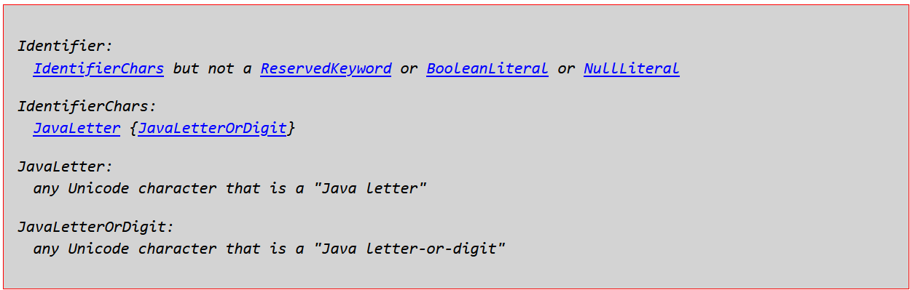

</div></div>

<div class="source">Fonte: <a href="https://docs.oracle.com/javase/specs/jls/se21/html/jls-3.html#jls-3.8">Java Language Specification — §3.8</a></div>

---

# Elementos da linguagem Java: _keywords_

<div class="columns small">
<div>

**Elementos básicos**

- *Identifiers* (identificadores)
- **_Keywords_** (palavras-chave)
- *Literals* (literais)
- *Separators* (separadores)
- *Operators* (operadores)

</div>

<div>

- Palavras reservadas da linguagem
- Não podem ser usadas como identificadores
- `true`, `false` e `null` são literais reservados

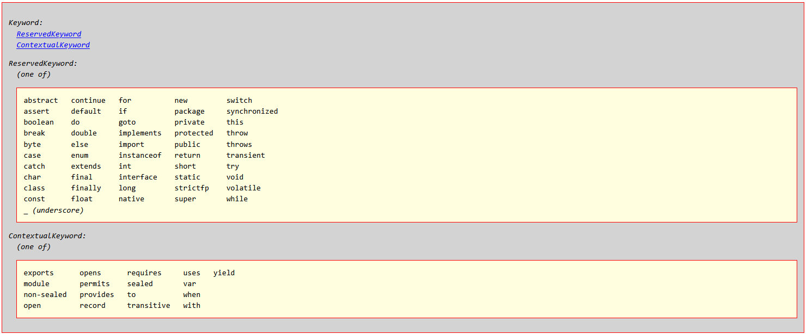

</div></div>

<div class="source">Fonte: <a href="https://docs.oracle.com/javase/specs/jls/se21/html/jls-3.html#jls-3.9">Java Language Specification — §3.9</a></div>

---

# Elementos da linguagem Java: _literals_

<div class="columns small">
<div>

**Elementos básicos**

- *Identifiers* (identificadores)
- *Keywords* (palavras-chave)
- **_Literals_** (literais)
- *Separators* (separadores)
- *Operators* (operadores)

</div>

<div>

Representações de valores constantes:

- Números inteiros ou decimais
- Caracteres: `'A'`
- Booleanos: `true` e `false`
- Strings: `"Abc"`
- Referência nula: `null`

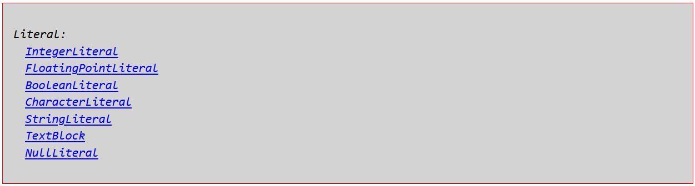

</div></div>

<div class="source">Fonte: <a href="https://docs.oracle.com/javase/specs/jls/se21/html/jls-3.html#jls-3.10">Java Language Specification — §3.10</a></div>

---

# Elementos da linguagem Java: _integer literals_

<div class="columns small">
<div>

**Elementos básicos**

- *Identifiers* (identificadores)
- *Keywords* (palavras-chave)
- **_Literals_** (literais)
- *Separators* (separadores)
- *Operators* (operadores)

</div><div>

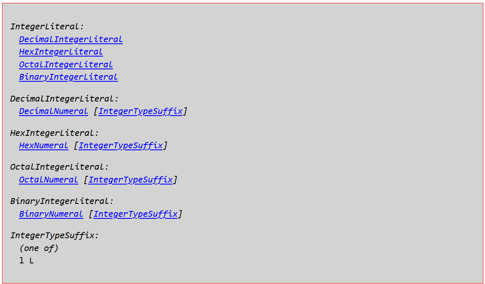

</div></div>

<div class="source">Fonte: <a href="https://docs.oracle.com/javase/specs/jls/se21/html/jls-3.html#jls-IntegerLiteral">Java Language Specification — IntegerLiteral</a></div>

---

# Elementos da linguagem Java: _integer literals_

<div class="columns small">
<div>

**Elementos básicos**

- *Identifiers* (identificadores)
- *Keywords* (palavras-chave)
- **_Literals_** (literais)
- *Separators* (separadores)
- *Operators* (operadores)

</div><div>

```console
jshell> 10       // decimal
$1 ==> 10
jshell> 0X10     // hexadecimal
$2 ==> 16
jshell> 010      // octal
$3 ==> 8
jshell> 0B10     // binário
$4 ==> 2
```

</div></div>

<div class="source">Fonte: <a href="https://docs.oracle.com/javase/specs/jls/se21/html/jls-3.html#jls-IntegerLiteral">Java Language Specification — IntegerLiteral</a></div>

---

# Elementos da linguagem Java: _floating-point_

<div class="columns small">
<div>

**Elementos básicos**

- *Identifiers* (identificadores)
- *Keywords* (palavras-chave)
- **_Literals_** (literais)
- *Separators* (separadores)
- *Operators* (operadores)

</div><div>

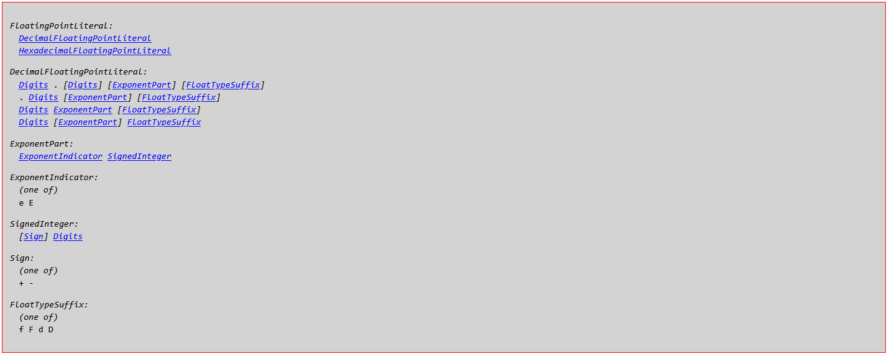

</div></div>

<div class="source">Fonte: <a href="https://docs.oracle.com/javase/specs/jls/se21/html/jls-3.html#jls-3.10.2">Java Language Specification — §3.10.2</a></div>

---

# Elementos da linguagem Java: _floating-point literals_

<div class="columns small">
<div>

**Elementos básicos**

- *Identifiers* (identificadores)
- *Keywords* (palavras-chave)
- **_Literals_** (literais)
- *Separators* (separadores)
- *Operators* (operadores)

</div><div>

```console
jshell> 10F
$1 ==> 10.0
jshell> 10E2F
$2 ==> 1000.0
jshell> 10.0
$3 ==> 10.0
jshell> 10D
$4 ==> 10.0
jshell> 10E2
$5 ==> 1000.0
```

</div></div>

<div class="source">Fonte: <a href="https://docs.oracle.com/javase/specs/jls/se21/html/jls-3.html#jls-3.10.2">Java Language Specification — §3.10.2</a></div>

---

# Elementos da linguagem Java: _boolean literals_

<div class="columns small">
<div>

**Elementos básicos**

- *Identifiers* (identificadores)
- *Keywords* (palavras-chave)
- **_Literals_** (literais)
- *Separators* (separadores)
- *Operators* (operadores)

</div><div>

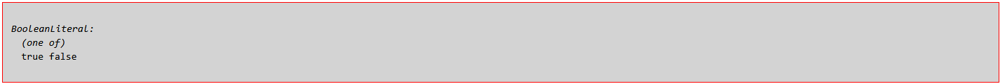

</div></div>

<div class="source">Fonte: <a href="https://docs.oracle.com/javase/specs/jls/se21/html/jls-3.html#jls-BooleanLiteral">Java Language Specification — BooleanLiteral</a></div>

---

# Elementos da linguagem Java: _boolean literals_

<div class="columns small">
<div>

**Elementos básicos**

- *Identifiers* (identificadores)
- *Keywords* (palavras-chave)
- **_Literals_** (literais)
- *Separators* (separadores)
- *Operators* (operadores)

</div><div>

```console
jshell> true
$1 ==> true

jshell> false
$2 ==> false
```

</div></div>

<div class="source">Fonte: <a href="https://docs.oracle.com/javase/specs/jls/se21/html/jls-3.html#jls-BooleanLiteral">Java Language Specification — BooleanLiteral</a></div>

---

# Elementos da linguagem Java: _character literals_

<div class="columns small">
<div>

**Elementos básicos**

- *Identifiers* (identificadores)
- *Keywords* (palavras-chave)
- **_Literals_** (literais)
- *Separators* (separadores)
- *Operators* (operadores)

</div><div>

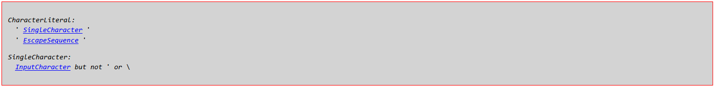

</div></div>

<div class="source">Fonte: <a href="https://docs.oracle.com/javase/specs/jls/se21/html/jls-3.html#jls-CharacterLiteral">Java Language Specification — CharacterLiteral</a></div>

---

# Elementos da linguagem Java: _character literals_

<div class="columns small">
<div>

**Elementos básicos**

- *Identifiers* (identificadores)
- *Keywords* (palavras-chave)
- **_Literals_** (literais)
- *Separators* (separadores)
- *Operators* (operadores)

</div><div>

```console
jshell> 'A'
$1 ==> 'A'
jshell> 'a'
$2 ==> 'a'
jshell> '$'
$3 ==> '$'
jshell> '\u0024'
$4 ==> '$'
```

</div></div>

<div class="source">Fonte: <a href="https://docs.oracle.com/javase/specs/jls/se21/html/jls-3.html#jls-CharacterLiteral">Java Language Specification — CharacterLiteral</a></div>

---

# Elementos da linguagem Java: _string literals_

<div class="columns small">
<div>

**Elementos básicos**

- *Identifiers* (identificadores)
- *Keywords* (palavras-chave)
- **_Literals_** (literais)
- *Separators* (separadores)
- *Operators* (operadores)

</div><div>

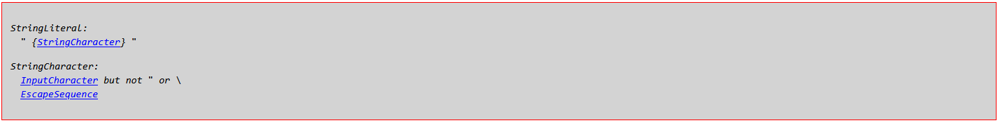

</div></div>

<div class="source">Fonte: <a href="https://docs.oracle.com/javase/specs/jls/se21/html/jls-3.html#jls-StringLiteral">Java Language Specification — StringLiteral</a></div>

---

# Elementos da linguagem Java: _string literals_

<div class="columns small">
<div>

**Elementos básicos**

- *Identifiers* (identificadores)
- *Keywords* (palavras-chave)
- **_Literals_** (literais)
- *Separators* (separadores)
- *Operators* (operadores)

</div><div>

```console
jshell> ""
$1 ==> ""
jshell> "Programação Orientada a Objetos"
$2 ==> "Programação Orientada a Objetos"
jshell> "Programação " +
   ...> "Orientada a " +
   ...> "Objetos"
$3 ==> "Programação Orientada a Objetos"
```

</div></div>

<div class="source">Fonte: <a href="https://docs.oracle.com/javase/specs/jls/se21/html/jls-3.html#jls-StringLiteral">Java Language Specification — StringLiteral</a></div>

---

# Elementos da linguagem Java: _separators_

<div class="columns small">
<div>

**Elementos básicos**

- *Identifiers* (identificadores)
- *Keywords* (palavras-chave)
- *Literals* (literais)
- **_Separators_** (separadores)
- *Operators* (operadores)

</div>

<div>

- *Tokens* cujo significado depende do contexto
- Exemplos: `(` `)` `{` `}` `[` `]` `;` `,` `.` `...` `@` `::`

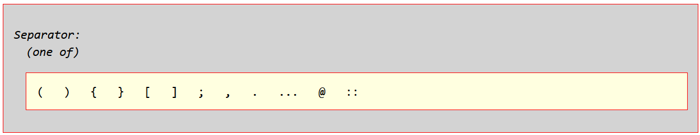
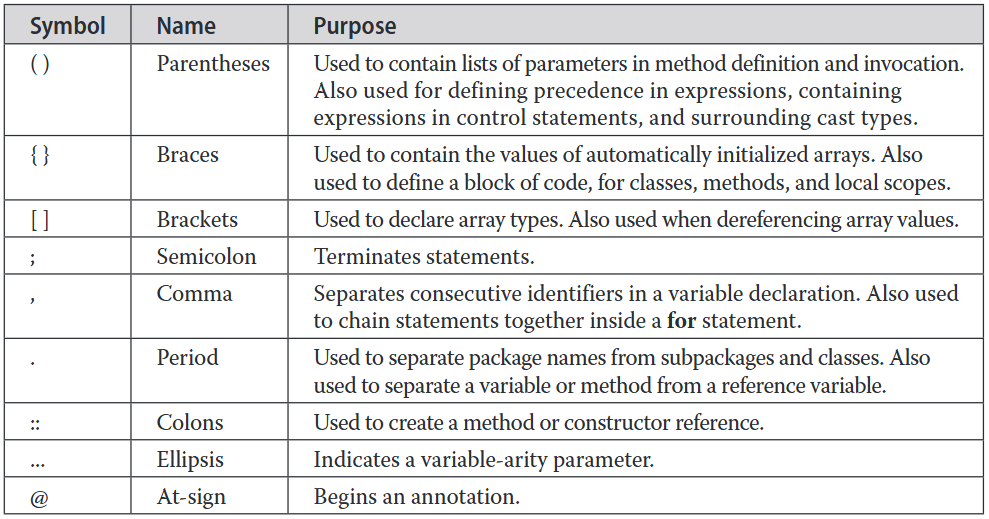

</div></div>

<div class="source">Fontes: <a href="https://docs.oracle.com/javase/specs/jls/se21/html/jls-3.html#jls-3.11">Java Language Specification — §3.11</a>; SCHILDT, Herbert. <em>Java: The Complete Reference</em>. 12. ed., 2021.</div>

---

# Elementos da linguagem Java: _operators_

<div class="columns small">
<div>

**Elementos básicos**

- *Identifiers* (identificadores)
- *Keywords* (palavras-chave)
- *Literals* (literais)
- *Separators* (separadores)
- **_Operators_** (operadores)
   - Aritméticos
   - Relacionais
   - Lógicos
   - Bit a bit (*bitwise*)

</div>

<div>

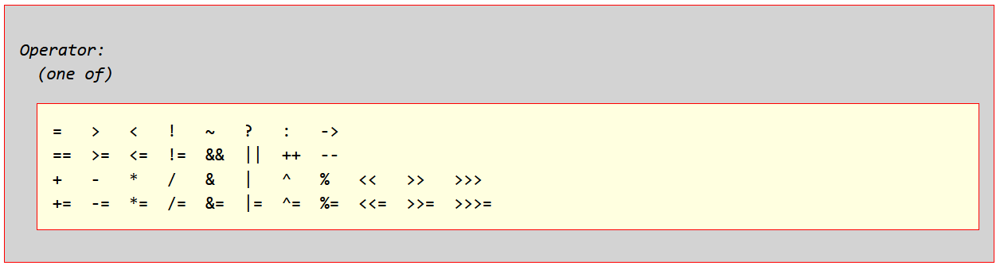

</div></div>

<div class="source">Fonte: <a href="https://docs.oracle.com/javase/specs/jls/se21/html/jls-3.html#jls-3.12">Java Language Specification — §3.12</a></div>

---

<!-- _class: compact -->

# Elementos da linguagem Java: _arith. operators_

<div class="columns small">

<div>

**Elementos básicos**

- *Identifiers* (identificadores)
- *Keywords* (palavras-chave)
- *Literals* (literais)
- *Separators* (separadores)
- **_Operators_** (operadores)
   - **Aritméticos**
   - Relacionais
   - Lógicos
   - Bit a bit (*bitwise*)

</div><div>

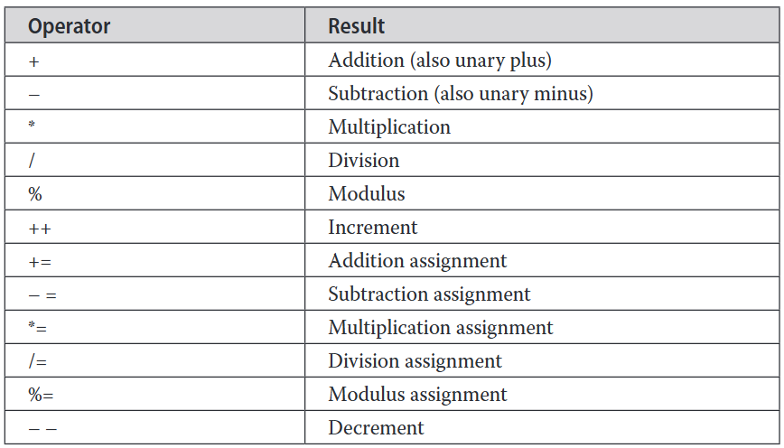

</div></div>

<div class="source">Fonte: SCHILDT, Herbert. <em>Java: The Complete Reference</em>. 12. ed., 2021.</div>

---

<!-- _class: compact -->

# Elementos da linguagem Java: _arith. operators_

<div class="columns small">

<div>

**Elementos básicos**

- *Identifiers* (identificadores)
- *Keywords* (palavras-chave)
- *Literals* (literais)
- *Separators* (separadores)
- **_Operators_** (operadores)
   - **Aritméticos**
   - Relacionais
   - Lógicos
   - Bit a bit (*bitwise*)

</div><div>

```console
jshell> 10 + 10 // adição
$1 ==> 20
jshell> 10 - 10 // subtração
$2 ==> 0
jshell> 10 * 10 // multiplicação
$3 ==> 100
jshell> 10 / 10 // divisão
$4 ==> 1
jshell> 23 % 10 // módulo
$5 ==> 3
jshell> 10 + 0B1010 + 012 + 0XA
$6 ==> 40
```

</div></div>

<div class="source">Fonte: SCHILDT, Herbert. <em>Java: The Complete Reference</em>. 12. ed., 2021.</div>

---

<!-- _class: compact -->

# Elementos da linguagem Java: _relational operators_

<div class="columns small">
<div>

**Elementos básicos**

- *Identifiers* (identificadores)
- *Keywords* (palavras-chave)
- *Literals* (literais)
- *Separators* (separadores)
- **_Operators_** (operadores)
   - Aritméticos
   - **Relacionais**
   - Lógicos
   - Bit a bit (*bitwise*)

</div><div>

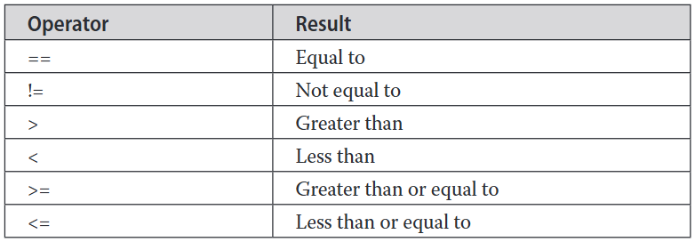

</div></div>

<div class="source">Fonte: SCHILDT, Herbert. <em>Java: The Complete Reference</em>. 12. ed., 2021.</div>

---

<!-- _class: compact -->

# Elementos da linguagem Java: _relational operators_

<div class="columns small">
<div>

**Elementos básicos**

- *Identifiers* (identificadores)
- *Keywords* (palavras-chave)
- *Literals* (literais)
- *Separators* (separadores)
- **_Operators_** (operadores)
   - Aritméticos
   - **Relacionais**
   - Lógicos
   - Bit a bit (*bitwise*)

</div><div>

```console
jshell> 1 + 1 == 2 // igual
$1 ==> true
jshell> 1 + 1 != 3 // diferente
$2 ==> true
jshell> 1 + 1 > 3  // maior
$3 ==> false
jshell> 1 + 1 < 3  // menor
$4 ==> true
jshell> 1 + 1 >= 2 // maior ou igual
$5 ==> true
jshell> 1 + 1 <= 2 // menor ou igual
$6 ==> true
```

</div></div>

<div class="source">Fonte: SCHILDT, Herbert. <em>Java: The Complete Reference</em>. 12. ed., 2021.</div>

---

<!-- _class: compact -->

# Elementos da linguagem Java: _logical operators_

<div class="columns small">
<div>

**Elementos básicos**

- *Identifiers* (identificadores)
- *Keywords* (palavras-chave)
- *Literals* (literais)
- *Separators* (separadores)
- **_Operators_** (operadores)
   - Aritméticos
   - Relacionais
   - **Lógicos**
   - Bit a bit (*bitwise*)

</div><div>

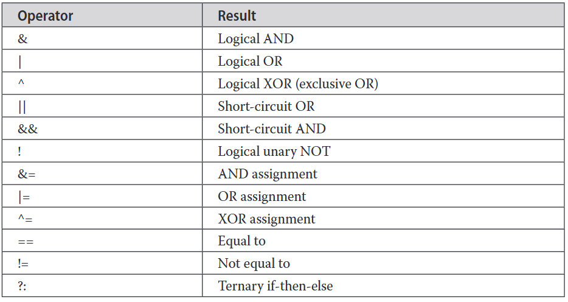

</div></div>

<div class="source">Fonte: SCHILDT, Herbert. <em>Java: The Complete Reference</em>. 12. ed., 2021.</div>

---

<!-- _class: compact -->

# Elementos da linguagem Java: _logical operators_

<div class="columns small">
<div>

**Elementos básicos**

- *Identifiers* (identificadores)
- *Keywords* (palavras-chave)
- *Literals* (literais)
- *Separators* (separadores)
- **_Operators_** (operadores)
   - Aritméticos
   - Relacionais
   - **Lógicos**
   - Bit a bit (*bitwise*)

</div><div>

```console
jshell> true && false // E
$1 ==> false
jshell> true || false // OU
$2 ==> true
jshell> true ^ false  // OU exclusivo
$3 ==> true
jshell> !true         // negação
$4 ==> false
jshell> 1 + 1 == 2 ? true : false
$5 ==> true
```

</div></div>

<div class="source">Fonte: SCHILDT, Herbert. <em>Java: The Complete Reference</em>. 12. ed., 2021.</div>

---

<!-- _class: compact -->

# Elementos da linguagem Java: _bitwise operators_

<div class="columns small">
<div>

**Elementos básicos**

- *Identifiers* (identificadores)
- *Keywords* (palavras-chave)
- *Literals* (literais)
- *Separators* (separadores)
- **_Operators_** (operadores)
   - Aritméticos
   - Relacionais
   - Lógicos
   - **Bit a bit (*bitwise*)**

</div><div>

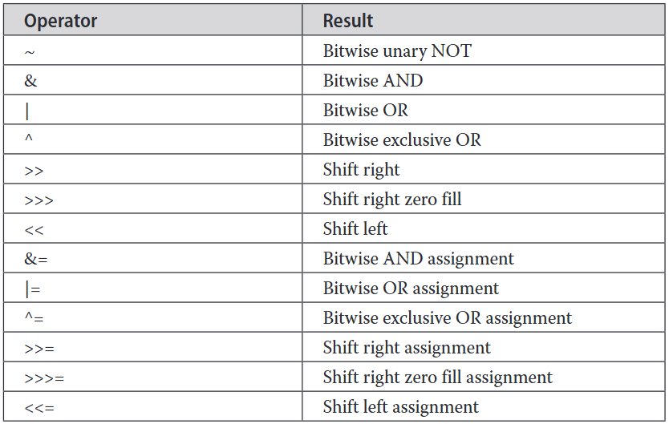

</div></div>

<div class="source">Fonte: SCHILDT, Herbert. <em>Java: The Complete Reference</em>. 12. ed., 2021.</div>

---

<!-- _class: compact -->

# Elementos da linguagem Java: _bitwise operators_

<div class="columns small">
<div>

**Elementos básicos**

- *Identifiers* (identificadores)
- *Keywords* (palavras-chave)
- *Literals* (literais)
- *Separators* (separadores)
- **_Operators_** (operadores)
   - Aritméticos
   - Relacionais
   - Lógicos
   - **Bit a bit (*bitwise*)**

</div><div>

```console
jshell> ~0B10
$1 ==> -3
jshell> 0B101 & 0B100
$2 ==> 4
jshell> 0B101 ^ 0B100
$3 ==> 1
jshell> 0B101 | 0B100
$4 ==> 5
jshell> 0B101 >> 1
$5 ==> 2
jshell> 0B101 << 1
$6 ==> 10
```

</div></div>

<div class="source">Fonte: SCHILDT, Herbert. <em>Java: The Complete Reference</em>. 12. ed., 2021.</div>

---

# Outros elementos formam a linguagem Java

- Tipos de dados (*data types*)
- Variáveis (*variables*)
- Declarações (*declarations*)
- Expressões (*expressions*)
- Instruções (*statements*)

---

# Tipos primitivos?

> Java possui oito tipos primitivos.

<div class="columns small">
<div>

**Números inteiros**

- `byte`
- `short`
- `int`
- `long`

**Caractere**

- `char`

</div><div>

**Ponto flutuante**

- `float`
- `double`

**Valor booleano**

- `boolean`

</div></div>

> Os demais são tipos complexos ou por referência, sejam eles fornecidos pela plataforma (_built-in_) ou criados pelo programador (_custom_).

---

<!-- _class: compact -->

# Classes *wrapper*

> Classes *wrapper* são tipos por referência que encapsulam valores primitivos em objetos. Elas permitem usar esses valores onde objetos são exigidos e oferecem métodos e constantes úteis; a conversão pode ocorrer automaticamente por *autoboxing* e *unboxing*.

<table class="small">
<thead><tr><th>Tipo primitivo</th><th>Classe wrapper</th><th>Tipo primitivo</th><th>Classe wrapper</th></tr></thead>
<tbody>
<tr><td><code>byte</code></td><td><a href="https://docs.oracle.com/en/java/javase/21/docs/api/java.base/java/lang/Byte.html">Byte</a></td><td><code>long</code></td><td><a href="https://docs.oracle.com/en/java/javase/21/docs/api/java.base/java/lang/Long.html">Long</a></td></tr>
<tr><td><code>short</code></td><td><a href="https://docs.oracle.com/en/java/javase/21/docs/api/java.base/java/lang/Short.html">Short</a></td><td><code>float</code></td><td><a href="https://docs.oracle.com/en/java/javase/21/docs/api/java.base/java/lang/Float.html">Float</a></td></tr>
<tr><td><code>char</code></td><td><a href="https://docs.oracle.com/en/java/javase/21/docs/api/java.base/java/lang/Character.html">Character</a></td><td><code>double</code></td><td><a href="https://docs.oracle.com/en/java/javase/21/docs/api/java.base/java/lang/Double.html">Double</a></td></tr>
<tr><td><code>int</code></td><td><a href="https://docs.oracle.com/en/java/javase/21/docs/api/java.base/java/lang/Integer.html">Integer</a></td><td><code>boolean</code></td><td><a href="https://docs.oracle.com/en/java/javase/21/docs/api/java.base/java/lang/Boolean.html">Boolean</a></td></tr>
</tbody>
</table>

---

<!-- _class: compact -->

# Tamanho dos tipos primitivos

<table class="tiny">
<thead><tr><th>Tipo</th><th>Tamanho em Bits</th><th>Quantidade de valores</th><th>Mínimo</th><th>Máximo</th></tr></thead>
<tbody>
<tr><td><code>byte</code></td><td>8</td><td>2⁸ = 256</td><td>−128</td><td>127</td></tr>
<tr><td><code>short</code></td><td>16</td><td>2¹⁶ = 65.536</td><td>−32.768</td><td>32.767</td></tr>
<tr><td><code>int</code></td><td>32</td><td>2³² = 4.294.967.296</td><td>−2³¹</td><td>2³¹ − 1</td></tr>
<tr><td><code>long</code></td><td>64</td><td>2⁶⁴ = 18.446.744.073.709.551.616</td><td>−2⁶³</td><td>2⁶³ − 1</td></tr>
<tr><td><code>float</code></td><td>32</td><td>2³² representações</td><td>IEEE 754, precisão simples</td><td></td></tr>
<tr><td><code>double</code></td><td>64</td><td>2⁶⁴ representações</td><td>IEEE 754, precisão dupla</td><td></td></tr>
<tr><td><code>char</code></td><td>16</td><td>2¹⁶ = 65.536</td><td><code>\u0000</code></td><td><code>\uFFFF</code></td></tr>
<tr><td><code>boolean</code></td><td>—</td><td>2</td><td colspan="2"><code>true</code> ou <code>false</code></td></tr>
</tbody>
</table>

---

# Como inteiros com sinal são representados?

**Complemento de dois (*two's complement*)**

Exemplo com 8 bits:

- `5`: `00000101`
- `−5`: `11111011`

Para obter a representação negativa, inverta os bits do valor positivo e some `1`.

<div class="source">Fonte: <a href="https://en.wikipedia.org/wiki/Two%27s_complement">Two's complement — Wikipedia</a></div>

---

# Variáveis

```java
tipo identificador [ = valor ] [, identificador [ = valor ] ...];
```

- Toda variável tem tipo, nome, tamanho e valor
- Variáveis locais podem usar inferência de tipo: `var v = 1;`
- Escopo determina onde a variável pode ser usada
- Inicialização atribui o primeiro valor
- Conversões podem ocorrer entre tipos compatíveis

---

# Como os elementos se relacionam?

- **Identificadores** nomeiam variáveis, classes, métodos etc.
- **Palavras-chave** têm significado reservado
- **Literais** representam valores constantes
- **Separadores** delimitam trechos de código
- **Operadores** realizam operações sobre valores
- **Tipos de dados** definem os valores e operações permitidos
- **Variáveis** armazenam valores de determinado tipo
- **Declarações** introduzem elementos: `int x;`
- **Expressões** produzem valores: `x + 5`
- **Instruções** representam ações: `int y = x + 5;`

---

# 1ª Atividade de implementação

Implemente os programas de acordo com a especificação disponível no repositório da disciplina:

- Calculadora de índice de massa corporal (IMC)
- Calculadora da área de um polígono regular
- Sequência de Fibonacci
- Elefante visitando amigo
- Senha forte

**Prazo:** conforme o Ambiente Virtual.
