<!-- _class: title -->
<!-- _paginate: false -->

## Programação Orientada a Objetos

# Java Collections Framework

<div class="objectives">

**Objetivos da aula**

- Compreender o papel do _Java Collections Framework_
- Diferenciar interfaces, implementações e algoritmos
- Conhecer `List`, `Set`, `Queue`, `Deque` e `Map`
- Realizar operações comuns em coleções
- Reconhecer diferenças de desempenho das coleções

</div>

<div class="contact">
Prof. Fabricio Santana<br>
fabricio.santana@idp.edu.br<br>
www.linkedin.com/in/fabriciofsantana/
</div>

---

# Por que coleções se já existe Array?

- **Array**: estrutura de dados de tamanho fixo que armazena dados do mesmo tipo de maneira contínua
  - **Limitações**
    - pouca expressividade sobre intenção
    - operações comuns precisam ser implementadas manualmente
    - remoção, busca, ordenação e agrupamento viram código repetitivo
  - **Quando usar?**
    - tamanho é conhecido e fixo
    - precisa de acesso rápido por índice (performance)
  - **Quando evitar?**
    - necessidade de redimensionamento dinâmico

---

# Coleção: o que é?

**Ideia central**

> Coleções são `estruturas de dados` para organizar e manipular grupos de objetos, permitindo, de forma padronizada, `adicionar`, `remover` , `pesquisar` e `percorrer`.


---

# Coleção: principais benefícios

- **Organização:** mantém vários elementos juntos de forma estruturada
- **Eficiência:** oferece operações prontas para manipular dados
- **Segurança:** reduz erros e facilita o gerenciamento dos dados
- **Flexibilidade:** existem diferentes tipos de coleções para diferentes necessidades

---

# _Java Collections Framework_: arquitetura

**Arquitetura unificada**

> O _Java Collections Framework_ é uma arquitetura formada que oferece estrutura de dados para organizar e manipular grupos de objetos independentemente dos detalhes de implementação.

**Organização**

> O _Java Collections Framework_ está organizado no pacote `java.util` por meio de uma série de classes e interfaces

---

# _Java Collections Framework_: estrutura de dados

**Principais estruturas de dados**

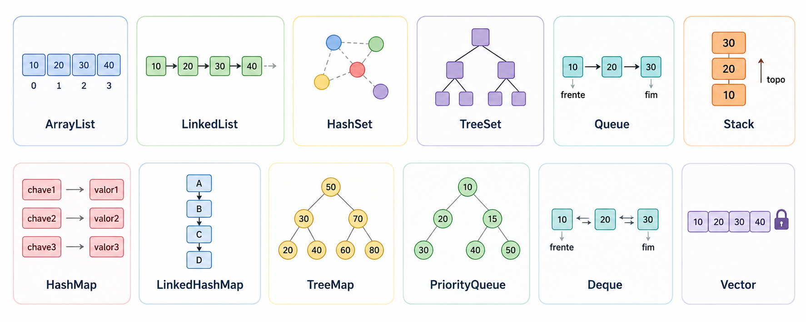

---

# _Java Collections Framework_: principais interfaces

**As interfaces estão disponíveis no pacote `java.util`.**

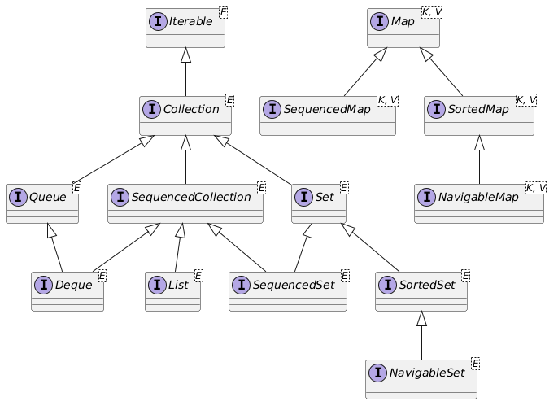

---

# _Java Collections Framework_: principais interfaces

**As interfaces garantem a flexibilidade do _collections framework_**

<table class="tiny">
  <thead>
    <tr>
      <th>Interface</th>
      <th>Descrição</th>
    </tr>
  </thead>
  <tbody>
    <tr>
      <td><code>Collection</code></td>
      <td>Interface raiz da hierarquia de coleções. Dela derivam interfaces como <code>Set</code>, <code>Queue</code> e <code>List</code>.</td>
    </tr>
    <tr>
      <td><code>Set</code></td>
      <td>Coleção que não permite elementos duplicados.</td>
    </tr>
    <tr>
      <td><code>SortedSet</code></td>
      <td>Coleção ordenada que não permite elementos duplicados.</td>
    </tr>
    <tr>
      <td><code>List</code></td>
      <td>Coleção ordenada por posição que pode conter elementos duplicados.</td>
    </tr>
    <tr>
      <td><code>Queue</code></td>
      <td>Coleção normalmente usada como fila, em geral com política primeiro a entrar, primeiro a sair.</td>
    </tr>
    <tr>
      <td><code>Deque</code></td>
      <td>Fila de duas pontas; pode funcionar como fila ou pilha.</td>
    </tr>
    <tr>
      <td><code>Map</code></td>
      <td>Estrutura que associa chaves a valores e não permite chaves duplicadas. Não deriva de <code>Collection</code>.</td>
    </tr>
    <tr>
      <td><code>SortedMap</code></td>
      <td>Um <code>Map</code> com ordenação natural pela chave ou por um comparador.</td>
    </tr>    
  </tbody>
</table>

---

# _Java Collections Framework_: principais classes

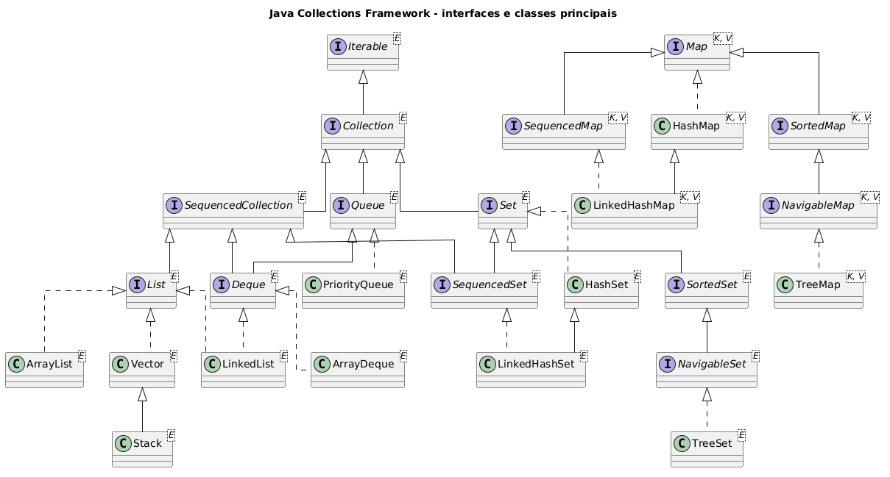

---

<!-- _class: compact -->

# _Java Collections Framework_: principais classes

As classes do _collections framework_ estão disponíveis no pacote `java.util`.

<table class="tiny">
  <thead>
    <tr>
      <th>Implementação</th>
      <th>Interface principal</th>
      <th>Descrição</th>
    </tr>
  </thead>
  <tbody>
    <tr>
      <td><code>ArrayList</code></td>
      <td><code>List</code></td>
      <td>Lista baseada em array redimensionável. Boa para acesso por índice e percorrimento.</td>
    </tr>
    <tr>
      <td><code>LinkedList</code></td>
      <td><code>List</code> / <code>Deque</code></td>
      <td>Lista encadeada. Pode ser usada como lista, fila ou pilha.</td>
    </tr>
    <tr>
      <td><code>HashSet</code></td>
      <td><code>Set</code></td>
      <td>Conjunto baseado em tabela hash. Não garante ordem dos elementos.</td>
    </tr>
    <tr>
      <td><code>TreeSet</code></td>
      <td><code>SortedSet</code></td>
      <td>Conjunto ordenado, normalmente pela ordem natural dos elementos ou por um comparador.</td>
    </tr>
    <tr>
      <td><code>ArrayDeque</code></td>
      <td><code>Deque</code></td>
      <td>Fila de duas pontas baseada em array redimensionável. Útil para filas e pilhas.</td>
    </tr>
    <tr>
      <td><code>HashMap</code></td>
      <td><code>Map</code></td>
      <td>Mapa baseado em tabela hash. Associa chaves a valores e não garante ordem.</td>
    </tr>
    <tr>
      <td><code>TreeMap</code></td>
      <td><code>SortedMap</code></td>
      <td>Mapa ordenado pelas chaves, usando ordem natural ou um comparador.</td>
    </tr>
  </tbody>
</table>

---

# _Java Collections Framework_: critérios de escolha

Considere os seguintes critérios:

- **Ordenação**: precisa manter a ordem dos elementos?
- **Duplicidade**: pode haver elementos duplicados?
- **Eficiência**: necessidade de acesso rápido por índice?
- **Alteração**: muitas inserções e remoções no meio da coleção?
- **Modelo**: modelo de fila (FIFO) ou pilha (LIFO)?
- **Estrutura**: precisa associar chave-valor?

---

# _Java Collections Framework_: qual escolher?

<table class="tiny">
  <thead>
    <tr>
      <th>Necessidade</th>
      <th>Interface</th>
      <th>Implementação</th>
      <th>Critério de escolha</th>
    </tr>
  </thead>
  <tbody>
    <tr>
      <td>Lista ordenada por posição</td>
      <td><code>List</code></td>
      <td><code>ArrayList</code></td>
      <td>boa escolha padrão; acesso por índice eficiente.</td>
    </tr>
    <tr>
      <td>Lista com operações nas extremidades</td>
      <td><code>List</code> / <code>Deque</code></td>
      <td><code>LinkedList</code></td>
      <td>útil para inserir/remover no início ou no fim.</td>
    </tr>
    <tr>
      <td>Conjunto sem repetição</td>
      <td><code>Set</code></td>
      <td><code>HashSet</code></td>
      <td>não garante ordem; busca e inserção tendem a ser eficientes.</td>
    </tr>
    <tr>
      <td>Conjunto sem repetição em ordem de inserção</td>
      <td><code>SequencedSet</code></td>
      <td><code>LinkedHashSet</code></td>
      <td>preserva a ordem em que os elementos foram adicionados.</td>
    </tr>
    <tr>
      <td>Conjunto sem repetição ordenado</td>
      <td><code>SortedSet</code></td>
      <td><code>TreeSet</code></td>
      <td>mantém elementos ordenados por ordem natural ou comparador.</td>
    </tr>
    <tr>
      <td>Fila ou pilha</td>
      <td><code>Deque</code></td>
      <td><code>ArrayDeque</code></td>
      <td>boa opção para FIFO, LIFO e operações nas duas pontas.</td>
    </tr>
    <tr>
      <td>Associação chave-valor</td>
      <td><code>Map</code></td>
      <td><code>HashMap</code></td>
      <td>acesso por chave sem garantia de ordem.</td>
    </tr>
    <tr>
      <td>Mapa ordenado por chave</td>
      <td><code>SortedMap</code></td>
      <td><code>TreeMap</code></td>
      <td>mantém chaves em ordem natural ou por comparador.</td>
    </tr>
  </tbody>
</table>

---

# java.util.ArrayList: hierarquia

<div class="columns">
<div>

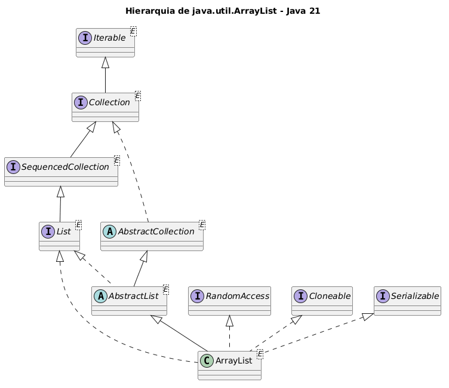

</div>
<div>

- array redimensionável
- mantém a ordem de inserção
- permite elementos duplicados
- permite valor nulo (`null`)
- suporta _generics_
  - verifica tipo na compilação
- não é _thread-safe_
- complexidade das operações
  - acesso por índice: O(1)
  - adição no final: O(1) amortizado
  - remoção no final: O(1)
  - inserção/remoção no meio: O(n)

</div>
</div>

---

# java.util.ArrayList: hierarquia simplificada

<div class="columns">

<div>

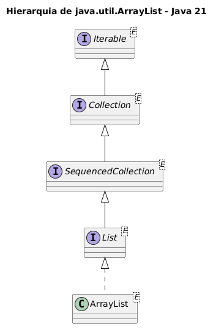

</div>

<div>

```java
import java.util.ArrayList;
import java.util.List;
//...
ArrayList alunos = new ArrayList();

List professores = new ArrayList();
```

**_Generics_**

```java
import java.util.ArrayList;
import java.util.List;
//...
ArrayList<String> alunos = new ArrayList<>();

List<Professor> professores = new ArrayList<>();
```

</div>

</div>

---

<!-- _class: compact -->

# java.util.ArrayList: principais métodos

- `add(E e)`: adiciona um elemento ao final da lista.
- `get(int i)`: retorna o elemento armazenado em uma posição.
- `set(int i, E e)`: substitui o elemento de uma posição.
- `remove(int i)`: remove o elemento localizado em uma posição.
- `contains(Object o)`: verifica se a lista contém determinado elemento.
- `indexOf(Object o)`: retorna a posição da primeira ocorrência ou `-1`.
- `size()`: retorna a quantidade de elementos na lista.
- `isEmpty()`: indica se a lista está vazia.
- `clear()`: remove todos os elementos da lista.
- `getFirst()` / `getLast()`: acessa o primeiro ou o último elemento da lista.

---

# java.util.ArrayList: exemplo

<div class="columns">

<div>

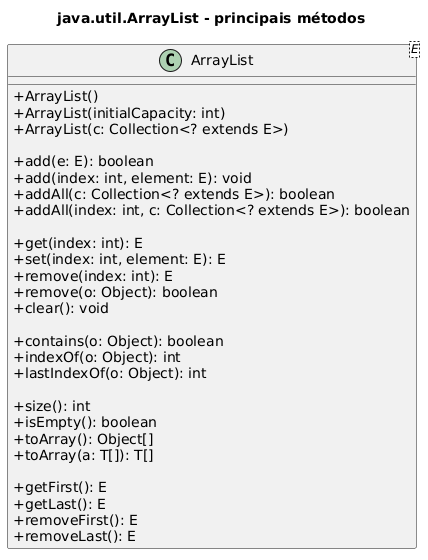

</div>

<div>

```java
import java.util.ArrayList;
//...
ArrayList alunos = new ArrayList<>();

alunos.add(new Aluno("Fabricio"));
alunos.add(new Aluno("João"));

System.out.println(alunos); //[Fabricio, João]

System.out.println(alunos.get(1)); //João

alunos.set(0, "Maria");
System.out.println(alunos); //[Maria, João]

System.out.println(alunos.size()); // 2

alunos.remove(1);
System.out.println(alunos); //[Maria]

System.out.println(alunos.size()); // 1

alunos.add("Paulo"); // elemento com tipo diferente
```

</div>

</div>

---

# java.util.ArrayList: exemplo com _generics_

<div class="callout">

**Recomendação**

Sempre definir o tipo de uma coleção

</div>

```java
import java.util.ArrayList;
//...
ArrayList<Aluno> alunos = new ArrayList<>();

alunos.add(new Aluno("Fabricio"));
alunos.add(new Aluno("João"));

alunos.add("Paulo"); // Erro na compilação
```

As demais coleções serão apresentadas apenas com _generics_

---

<!-- _class: compact -->

# java.util.LinkedList: hierarquia

<div class="columns">
<div>

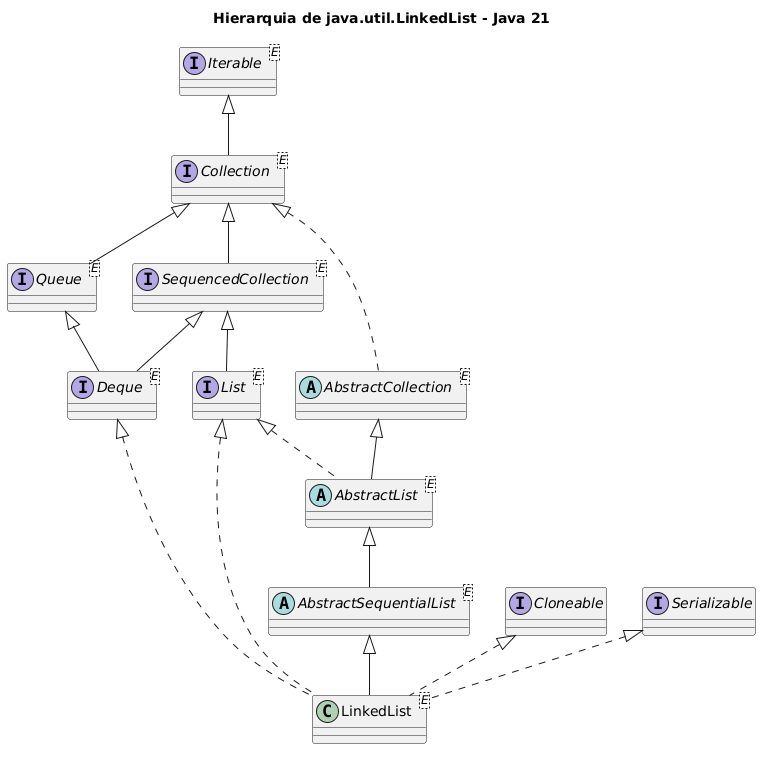

</div>
<div>

- Lista duplamente encadeada
- Usada como lista, fila ou pilha
  - `List`, `Queue` e `Deque`
- Mantém a ordem de inserção
- Permite elementos duplicados
- Permite valores `null`
- Consome mais memória
  - cada elemento aponta para o próximo e para o anterior
- Complexidade das operações
  - acesso por índice: O(n)
  - inserção/remoção nas extremidades: O(1)
  - busca até uma posição no meio: O(n)
  </div>
  </div>

---

# java.util.LinkedList: hierarquia simplificada

<div class="columns">

<div>

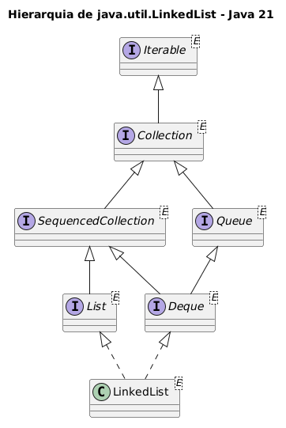

</div>

<div>

```java
import java.util.LinkedList;
import java.util.Queue;
import java.util.Deque;
import java.util.List;
//...

LinkedList<String> alunos = new LinkedList<>();

List<Professor> professores = new LinkedList<>();

Queue<Registro> registro = new LinkedList<>();

Deque<Professor> filaProfessores = new LinkedList<>();

```

</div>

</div>

---

<!-- _class: compact -->

# java.util.LinkedList: principais métodos

- `add(E e)`: adiciona um elemento ao final da lista.
- `addFirst(E e)`: adiciona um elemento no início.
- `addLast(E e)`: adiciona um elemento no fim.
- `get(int i)`: retorna o elemento armazenado em uma posição.
- `getFirst()` / `getLast()`: acessa o primeiro ou o último elemento.
- `remove(int i)`: remove o elemento localizado em uma posição.
- `removeFirst()` / `removeLast()`: remove o primeiro ou o último elemento.
- `peek()`: consulta o primeiro elemento sem removê-lo.
- `poll()`: remove e retorna o primeiro elemento, ou `null` se estiver vazia.
- `push(E e)` / `pop()`: usa a lista como pilha.

<div class="source">Fonte: <a href="https://docs.oracle.com/en/java/javase/21/docs/api/java.base/java/util/LinkedList.html">Oracle Java SE 21 - LinkedList</a></div>

---

# java.util.LinkedList: exemplo

<div class="columns">

<div>

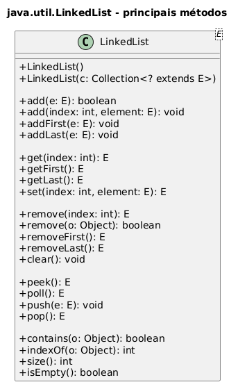

</div>

<div>

```java
import java.util.LinkedList;
//...

LinkedList<String> nomes = new LinkedList<>();

nomes.add("Ana");
nomes.addLast("Bruno");
nomes.addFirst("Carla");

System.out.println(nomes); //[Carla, Ana, Bruno]

System.out.println(nomes.getFirst()); //Carla

nomes.removeLast();
System.out.println(nomes); //[Carla, Ana]

nomes.push("Diego");
System.out.println(nomes.pop()); //Diego
```

</div>

</div>

---

<!-- _class: compact -->

# java.util.ArrayDeque: hierarquia

<div class="columns">
<div>

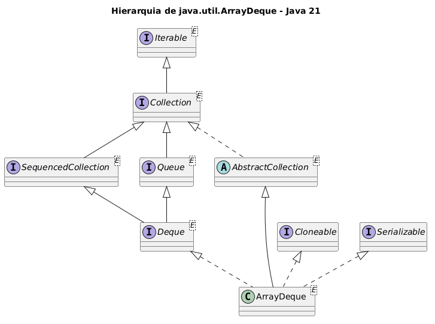

</div>
<div>

- Fila de duas pontas baseada em array redimensionável
- Implementa `Deque`
- Pode ser usada como fila ou pilha
- Não permite valores `null`
- Não é _thread-safe_
- Costuma ser preferível a `Stack` para pilhas
- Complexidade das operações
  - inserção/remoção nas extremidades: O(1) amortizado
  - busca por elemento: O(n)

</div>
</div>

---

# java.util.ArrayDeque: hierarquia simplificada

<div class="columns">

<div>

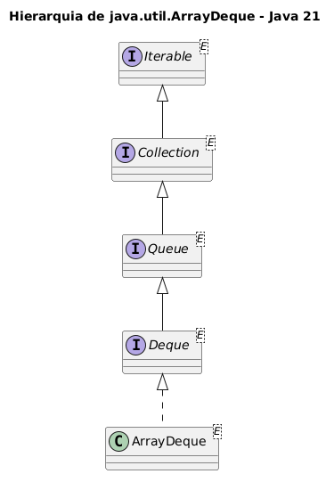

</div>

<div>

```java
import java.util.ArrayDeque;
import java.util.Queue;
import java.util.Deque;
//...

ArrayDeque<String> historico = new ArrayDeque<>();

Queue<String> atendimentos = new ArrayDeque<>();

Deque<String> pilha = new ArrayDeque<>();
```

</div>

</div>

---

<!-- _class: compact -->

# java.util.ArrayDeque: principais métodos

- `add(E e)`: adiciona um elemento ao final.
- `addFirst(E e)`: adiciona um elemento no início.
- `addLast(E e)`: adiciona um elemento no fim.
- `offer(E e)`: tenta adicionar um elemento ao final.
- `getFirst()` / `getLast()`: acessa o primeiro ou o último elemento.
- `peek()` / `peekFirst()` / `peekLast()`: consulta elementos sem remover.
- `remove()` / `removeFirst()` / `removeLast()`: remove elementos.
- `poll()` / `pollFirst()` / `pollLast()`: remove ou retorna `null` se vazia.
- `push(E e)` / `pop()`: usa o deque como pilha.
- `size()` / `isEmpty()` / `clear()`: consulta ou limpa a coleção.

<div class="source">Fonte: <a href="https://docs.oracle.com/en/java/javase/21/docs/api/java.base/java/util/ArrayDeque.html">Oracle Java SE 21 - ArrayDeque</a></div>

---

# java.util.ArrayDeque: exemplo

<div class="columns">

<div>

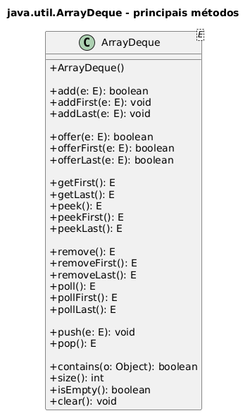

</div>

<div>

```java
import java.util.ArrayDeque;
//...

ArrayDeque<String> tarefas = new ArrayDeque<>();

tarefas.addLast("A");
tarefas.addLast("B");
tarefas.addFirst("Urgente");

System.out.println(tarefas); //[Urgente, A, B]

System.out.println(tarefas.removeFirst()); //Urgente

tarefas.push("Topo");
System.out.println(tarefas.pop()); //Topo

System.out.println(tarefas.peek()); //A
```

</div>

</div>

---

# Interfaces: visão geral

<div class="callout">

**Separar contrato de implementação**

Uma interface define o que uma coleção deve fazer; uma classe concreta define como isso será feito.

</div>

Exemplo:

```java
List<String> nomes = new ArrayList<>();
Set<Integer> matriculas = new HashSet<>();
Map<String, Aluno> alunosPorCpf = new HashMap<>();
```

O tipo à esquerda comunica intenção. O tipo à direita escolhe a estrutura concreta.

---

# Map é diferente

`Map` não é uma `Collection` no sentido estrito.

Um mapa associa **chaves** a **valores**:

```java
Map<String, Integer> frequencia = new HashMap<>();
frequencia.put("Java", 3);
frequencia.put("POO", 2);

Integer ocorrencias = frequencia.get("Java");
```

Mesmo não sendo uma coleção, `Map` oferece visões manipuláveis como coleções: `keySet()`, `values()` e `entrySet()`.

---

# Escolha por intenção

<table class="small">
  <thead>
    <tr>
      <th>Quando você precisa...</th>
      <th>Use</th>
      <th>Exemplo</th>
    </tr>
  </thead>
  <tbody>
    <tr>
      <td>manter ordem por posição</td>
      <td><code>List</code></td>
      <td>notas de um aluno</td>
    </tr>
    <tr>
      <td>evitar duplicidade</td>
      <td><code>Set</code></td>
      <td>matrículas inscritas</td>
    </tr>
    <tr>
      <td>processar por ordem de chegada</td>
      <td><code>Queue</code></td>
      <td>fila de atendimento</td>
    </tr>
    <tr>
      <td>associar chave e valor</td>
      <td><code>Map</code></td>
      <td>CPF → aluno</td>
    </tr>
  </tbody>
</table>

---

<!-- _class: compact -->

# Implementações gerais

<table class="tiny">
  <thead>
    <tr>
      <th>Interface</th>
      <th>Tabela hash</th>
      <th>Array redimensionável</th>
      <th>Árvore balanceada</th>
      <th>Lista ligada</th>
      <th>Hash + lista ligada</th>
    </tr>
  </thead>
  <tbody>
    <tr>
      <td><code>Set</code></td>
      <td><code>HashSet</code></td>
      <td></td>
      <td><code>TreeSet</code></td>
      <td></td>
      <td><code>LinkedHashSet</code></td>
    </tr>
    <tr>
      <td><code>List</code></td>
      <td></td>
      <td><code>ArrayList</code></td>
      <td></td>
      <td><code>LinkedList</code></td>
      <td></td>
    </tr>
    <tr>
      <td><code>Deque</code></td>
      <td></td>
      <td><code>ArrayDeque</code></td>
      <td></td>
      <td><code>LinkedList</code></td>
      <td></td>
    </tr>
    <tr>
      <td><code>Map</code></td>
      <td><code>HashMap</code></td>
      <td></td>
      <td><code>TreeMap</code></td>
      <td></td>
      <td><code>LinkedHashMap</code></td>
    </tr>
  </tbody>
</table>

<div class="source">Fonte: <a href="https://docs.oracle.com/javase/8/docs/technotes/guides/collections/overview.html">Oracle Java SE 8 - Collections Framework Overview</a></div>

---

<!-- _class: compact -->

# Comportamento das implementações: List e Queue

<table class="tiny">
  <thead>
    <tr>
      <th>Implementação</th>
      <th>Ordem</th>
      <th>Duplicados</th>
      <th><code>null</code></th>
      <th>Quando usar</th>
    </tr>
  </thead>
  <tbody>
    <tr>
      <td><code>ArrayList</code></td>
      <td>inserção</td>
      <td>sim</td>
      <td>sim</td>
      <td>boa escolha padrão para consultas e acesso por índice.</td>
    </tr>
    <tr>
      <td><code>LinkedList</code></td>
      <td>inserção</td>
      <td>sim</td>
      <td>sim</td>
      <td>útil quando há muitas operações nas extremidades.</td>
    </tr>
    <tr>
      <td><code>Vector</code></td>
      <td>inserção</td>
      <td>sim</td>
      <td>sim</td>
      <td>classe legada sincronizada; em geral, prefira alternativas modernas.</td>
    </tr>
    <tr>
      <td><code>PriorityQueue</code></td>
      <td>prioridade</td>
      <td>sim</td>
      <td>não</td>
      <td>quando os elementos precisam sair por prioridade, não por chegada.</td>
    </tr>
    <tr>
      <td><code>ArrayDeque</code></td>
      <td>fila/pilha</td>
      <td>sim</td>
      <td>não</td>
      <td>boa opção para fila ou pilha sem sincronização.</td>
    </tr>
  </tbody>
</table>

<div class="source">Fonte: adaptado do arquivo de referência <code>collections.jpeg</code>.</div>

---

<!-- _class: compact -->

# Comportamento das implementações: Set e Map

<table class="tiny">
  <thead>
    <tr>
      <th>Implementação</th>
      <th>Ordem</th>
      <th>Duplicidade</th>
      <th><code>null</code></th>
      <th>Quando usar</th>
    </tr>
  </thead>
  <tbody>
    <tr>
      <td><code>HashSet</code></td>
      <td>não garante</td>
      <td>não permite elementos repetidos</td>
      <td>até um elemento</td>
      <td>conjunto único sem preocupação com ordem.</td>
    </tr>
    <tr>
      <td><code>LinkedHashSet</code></td>
      <td>inserção</td>
      <td>não permite elementos repetidos</td>
      <td>até um elemento</td>
      <td>conjunto único preservando ordem de inserção.</td>
    </tr>
    <tr>
      <td><code>TreeSet</code></td>
      <td>ordenada</td>
      <td>não permite elementos repetidos</td>
      <td>não, no uso comum</td>
      <td>conjunto único sempre ordenado.</td>
    </tr>
    <tr>
      <td><code>HashMap</code></td>
      <td>não garante</td>
      <td>chaves únicas; valores podem repetir</td>
      <td>uma chave; vários valores</td>
      <td>associação chave-valor eficiente sem ordem.</td>
    </tr>
    <tr>
      <td><code>LinkedHashMap</code></td>
      <td>inserção</td>
      <td>chaves únicas; valores podem repetir</td>
      <td>uma chave; vários valores</td>
      <td>mapa preservando ordem de inserção.</td>
    </tr>
    <tr>
      <td><code>TreeMap</code></td>
      <td>por chave</td>
      <td>chaves únicas; valores podem repetir</td>
      <td>sem chave nula; valores nulos possíveis</td>
      <td>mapa ordenado por chave.</td>
    </tr>
  </tbody>
</table>

<div class="source">Fonte: adaptado do arquivo de referência <code>collections.jpeg</code>.</div>

---

# List

Use `List` quando:

- a posição importa;
- elementos repetidos são permitidos;
- você precisa acessar por índice;
- a ordem de inserção deve ser preservada.

```java
List<String> disciplinas = new ArrayList<>();
disciplinas.add("Algoritmos");
disciplinas.add("POO");
disciplinas.add("Banco de Dados");

System.out.println(disciplinas.get(1)); // POO
```

---

# ArrayList ou LinkedList?

<div class="columns small">

<div class="callout">

**ArrayList**

- boa escolha padrão;
- acesso por índice rápido;
- bom para percorrer e consultar;
- inserções no meio podem custar caro.

</div>

<div class="callout">

**LinkedList**

- implementa `List` e `Deque`;
- pode ajudar em inserções/remoções nas extremidades;
- acesso por índice tende a ser mais caro.

</div>

</div>

---

# Set

Use `Set` quando duplicidade não faz sentido.

```java
Set<String> linguagens = new HashSet<>();
linguagens.add("Java");
linguagens.add("Python");
linguagens.add("Java");

System.out.println(linguagens.size()); // 2
```

<div class="callout">

**Atenção**

Para objetos próprios, `Set` depende de `equals()` e `hashCode()` para decidir se dois elementos são iguais.

</div>

---

# Escolhendo um Set

<table class="small">
  <thead>
    <tr>
      <th>Implementação</th>
      <th>Característica principal</th>
    </tr>
  </thead>
  <tbody>
    <tr>
      <td><code>HashSet</code></td>
      <td>não garante ordem; costuma ser eficiente para busca.</td>
    </tr>
    <tr>
      <td><code>LinkedHashSet</code></td>
      <td>mantém ordem de inserção.</td>
    </tr>
    <tr>
      <td><code>TreeSet</code></td>
      <td>mantém elementos ordenados.</td>
    </tr>
  </tbody>
</table>

---

# Map

Use `Map` quando o acesso natural é por chave.

```java
Map<String, Aluno> alunos = new HashMap<>();

alunos.put("123.456.789-00", new Aluno("Ana"));
alunos.put("987.654.321-00", new Aluno("Bruno"));

Aluno aluno = alunos.get("123.456.789-00");
```

Chaves são únicas. Se uma chave for inserida novamente, o valor anterior será substituído.

---

# Percorrendo um Map

```java
for (String cpf : alunos.keySet()) {
    System.out.println(cpf);
}

for (Aluno aluno : alunos.values()) {
    System.out.println(aluno.nome());
}

for (Map.Entry<String, Aluno> entrada : alunos.entrySet()) {
    System.out.println(entrada.getKey() + ": " + entrada.getValue());
}
```

`entrySet()` costuma ser a melhor opção quando você precisa de chave e valor.

---

# Queue e Deque

`Queue` representa uma fila.

```java
Queue<String> fila = new ArrayDeque<>();
fila.add("Ana");
fila.add("Bruno");

System.out.println(fila.remove()); // Ana
```

`Deque` permite inserir e remover nas duas pontas.

```java
Deque<String> historico = new ArrayDeque<>();
historico.push("Tela inicial");
historico.push("Cadastro");
System.out.println(historico.pop()); // Cadastro
```

---

<!-- _class: compact -->

# Generics

Generics tornam o tipo dos elementos explícito.

```java
List<String> nomes = new ArrayList<>();
nomes.add("Ana");
// nomes.add(10); // erro de compilação
```

Sem generics, erros aparecem tarde:

```java
List nomes = new ArrayList();
nomes.add("Ana");
nomes.add(10);
```

<div class="callout">

**Regra prática**

Prefira coleções parametrizadas: `List<Aluno>`, `Set<String>`, `Map<Long, Pedido>`.

</div>

---

# Iteração

Formas comuns de percorrer coleções:

```java
for (String nome : nomes) {
    System.out.println(nome);
}

nomes.forEach(System.out::println);
```

Quando for remover durante a iteração, use `Iterator`:

```java
Iterator<String> it = nomes.iterator();
while (it.hasNext()) {
    if (it.next().isBlank()) {
        it.remove();
    }
}
```

---

# Operações opcionais

Algumas operações de modificação podem ser opcionais.

Uma implementação pode lançar:

```java
UnsupportedOperationException
```

Exemplo comum:

```java
List<String> nomes = Arrays.asList("Ana", "Bruno");
nomes.add("Carla"); // pode lançar UnsupportedOperationException
```

<div class="source">Fonte: <a href="https://docs.oracle.com/javase/8/docs/technotes/guides/collections/overview.html">Oracle Java SE 8 - Collections Framework Overview</a></div>

---

<!-- _class: compact -->

# Termos importantes

<table class="small">
  <thead>
    <tr>
      <th>Termo</th>
      <th>Ideia</th>
    </tr>
  </thead>
  <tbody>
    <tr>
      <td>unmodifiable</td>
      <td>não permite operações como <code>add</code>, <code>remove</code> ou <code>clear</code>.</td>
    </tr>
    <tr>
      <td>immutable</td>
      <td>garante que nenhuma alteração visível ocorrerá na coleção.</td>
    </tr>
    <tr>
      <td>fixed-size</td>
      <td>mantém tamanho constante, ainda que elementos possam mudar.</td>
    </tr>
    <tr>
      <td>random access</td>
      <td>acesso indexado rápido, geralmente em tempo constante.</td>
    </tr>
  </tbody>
</table>

---

# Algoritmos

A classe `Collections` oferece métodos estáticos para operações comuns.

```java
List<Integer> notas = new ArrayList<>(List.of(8, 10, 6));

Collections.sort(notas);
Collections.reverse(notas);
Collections.shuffle(notas);

Integer maior = Collections.max(notas);
Integer menor = Collections.min(notas);
```

<div class="callout">

**Reuso**

Você usa algoritmos prontos sem acoplar o código a uma implementação específica.

</div>

---

# Wrappers

Wrappers adicionam comportamento a coleções existentes.

```java
List<String> nomes = new ArrayList<>();

List<String> sincronizada =
    Collections.synchronizedList(nomes);

List<String> somenteLeitura =
    Collections.unmodifiableList(nomes);
```

Segundo a Oracle, os wrappers podem acrescentar funcionalidades como sincronização a implementações não sincronizadas.

---

# Iteradores fail-fast

As implementações novas possuem iteradores _fail-fast_.

<div class="callout">

**O que isso significa?**

Se a coleção for modificada de forma indevida enquanto está sendo percorrida, o iterador tenta detectar o problema rapidamente.

</div>

Exemplo do erro comum:

```java
for (String nome : nomes) {
    nomes.remove(nome); // risco de ConcurrentModificationException
}
```

---

# Concorrência

Coleções usadas por várias threads exigem cuidado.

Interfaces e classes específicas ajudam nesse cenário:

- `BlockingQueue`
- `ConcurrentMap`
- `ConcurrentNavigableMap`
- `CopyOnWriteArrayList`
- `ConcurrentHashMap`
- `ConcurrentSkipListMap`

<div class="source">Fonte: <a href="https://docs.oracle.com/javase/8/docs/technotes/guides/collections/overview.html">Oracle Java SE 8 - Collections Framework Overview</a></div>

---

# Exemplo completo

```java
record Aluno(String nome, String matricula) {}

List<Aluno> alunos = List.of(
    new Aluno("Ana", "001"),
    new Aluno("Bruno", "002"),
    new Aluno("Ana", "003")
);

Map<String, Long> porNome = alunos.stream()
    .collect(Collectors.groupingBy(
        Aluno::nome,
        Collectors.counting()
    ));

System.out.println(porNome);
```

Coleções se integram naturalmente com APIs modernas como Streams.

---

# Boas práticas

- Programe para interfaces: `List`, `Set`, `Map`.
- Escolha implementação conforme uso esperado.
- Use generics sempre que possível.
- Não dependa de ordem quando a implementação não garante ordem.
- Implemente `equals()` e `hashCode()` corretamente em objetos usados em `Set` ou como chave de `Map`.
- Prefira APIs prontas antes de reinventar estruturas.

---

<!-- _class: compact -->

# Exercício 1

Modele um cadastro simples de alunos.

Requisitos:

- Crie uma classe ou `record` `Aluno`.
- Armazene alunos em uma `List<Aluno>`.
- Permita alunos com o mesmo nome.
- Liste todos os alunos em ordem de cadastro.
- Conte quantos alunos existem.

Depois responda:

- `ArrayList` é uma boa escolha aqui? Por quê?

---

<!-- _class: compact -->

# Exercício 2

Agora controle matrículas inscritas em uma atividade.

Requisitos:

- Use `Set<String>` para armazenar matrículas.
- Tente inserir a mesma matrícula duas vezes.
- Exiba a quantidade final de inscrições.
- Troque `HashSet` por `LinkedHashSet`.

Depois responda:

- O que mudou?
- O que permaneceu igual?

---

<!-- _class: compact -->

# Exercício 3

Crie um índice de alunos por matrícula.

Requisitos:

- Use `Map<String, Aluno>`.
- Cadastre pelo menos três alunos.
- Busque um aluno pela matrícula.
- Percorra o mapa usando `entrySet()`.
- Teste o que acontece ao inserir uma matrícula repetida.

Depois responda:

- Por que `Map` não é simplesmente uma lista?

---

# Fechamento

<div class="callout">

**Mensagem principal**

O Java Collections Framework permite escrever código mais claro, reutilizável e eficiente ao separar intenção, contrato e implementação.

</div>

Para escolher bem:

- comece pela interface;
- pense em duplicidade, ordem, busca e concorrência;
- só então escolha a implementação.

<div class="source">Fonte principal: <a href="https://docs.oracle.com/javase/8/docs/technotes/guides/collections/overview.html">Oracle Java SE 8 - Collections Framework Overview</a></div>
