<!-- _class: title -->
<!-- _paginate: false -->

## Programação Orientada a Objetos

# Java Collections Framework

<div class="objectives">

**Objetivos da aula**

- Compreender o papel do _Java Collections Framework_
- Diferenciar interfaces, implementações e algoritmos
- Conhecer `List`, `Set`, `Queue`, `Deque` e `Map`
- Realizar operações comuns em coleções
- Reconhecer diferenças de desempenho das coleções

</div>

<div class="contact">
Prof. Fabricio Santana<br>
fabricio.santana@idp.edu.br<br>
www.linkedin.com/in/fabriciofsantana/
</div>

---

# Por que coleções se já existe Array?

- **Array**: estrutura de dados de tamanho fixo que armazena dados do mesmo tipo de maneira contínua
  - **Limitações**
    - pouca expressividade sobre intenção
    - operações comuns precisam ser implementadas manualmente
    - remoção, busca, ordenação e agrupamento viram código repetitivo
  - **Quando usar?**
    - tamanho é conhecido e fixo
    - precisa de acesso rápido por índice (performance)
  - **Quando evitar?**
    - necessidade de redimensionamento dinâmico

---

# Coleção: o que é?

**Ideia central**

> Coleções são `estruturas de dados` para organizar e manipular grupos de objetos, permitindo, de forma padronizada, `adicionar`, `remover` , `pesquisar` e `percorrer`.


---

# Coleção: principais benefícios

- **Organização:** mantém vários elementos juntos de forma estruturada
- **Eficiência:** oferece operações prontas para manipular dados
- **Segurança:** reduz erros e facilita o gerenciamento dos dados
- **Flexibilidade:** existem diferentes tipos de coleções para diferentes necessidades

---

# _Java Collections Framework_: arquitetura

**Arquitetura unificada**

> O _Java Collections Framework_ é uma arquitetura formada que oferece estrutura de dados para organizar e manipular grupos de objetos independentemente dos detalhes de implementação.

**Organização**

> O _Java Collections Framework_ está organizado no pacote `java.util` por meio de uma série de classes e interfaces

---

# _Java Collections Framework_: estrutura de dados

**Principais estruturas de dados**


---

# _Java Collections Framework_: principais interfaces

**As interfaces estão disponíveis no pacote `java.util`.**


---

<!-- _class: compact -->

# _Java Collections Framework_: interfaces de coleção

**As interfaces garantem a flexibilidade do _collections framework_**

<table class="tiny">
  <thead>
    <tr>
      <th>Interface</th>
      <th>Descrição</th>
    </tr>
  </thead>
  <tbody>
    <tr>
      <td><code>Collection</code></td>
      <td>Interface raiz da hierarquia de coleções. Dela derivam interfaces como <code>Set</code>, <code>Queue</code> e <code>List</code>.</td>
    </tr>
    <tr>
      <td><code>SequencedCollection</code></td>
      <td>Coleção com ordem de encontro definida, acesso às extremidades e visão reversa.</td>
    </tr>
    <tr>
      <td><code>Set</code></td>
      <td>Coleção que não permite elementos duplicados.</td>
    </tr>
    <tr>
      <td><code>SequencedSet</code></td>
      <td>Conjunto com ordem de encontro previsível e operações nas extremidades.</td>
    </tr>
    <tr>
      <td><code>SortedSet</code></td>
      <td>Coleção ordenada que não permite elementos duplicados.</td>
    </tr>
    <tr>
      <td><code>NavigableSet</code></td>
      <td>Conjunto ordenado com operações de navegação para vizinhos, extremos e ordem inversa.</td>
    </tr>
    <tr>
      <td><code>List</code></td>
      <td>Coleção ordenada por posição que pode conter elementos duplicados.</td>
    </tr>
    <tr>
      <td><code>Queue</code></td>
      <td>Coleção normalmente usada como fila, em geral com política primeiro a entrar, primeiro a sair.</td>
    </tr>
    <tr>
      <td><code>Deque</code></td>
      <td>Fila de duas pontas; pode funcionar como fila ou pilha.</td>
    </tr>
  </tbody>
</table>

---

<!-- _class: compact -->

# _Java Collections Framework_: interfaces de mapa

`Map` faz parte do _Collections Framework_, mas não herda de `Collection`.

<table class="tiny">
  <thead>
    <tr>
      <th>Interface</th>
      <th>Descrição</th>
    </tr>
  </thead>
  <tbody>
    <tr>
      <td><code>Map</code></td>
      <td>Estrutura que associa chaves a valores e não permite chaves duplicadas. Não deriva de <code>Collection</code>.</td>
    </tr>
    <tr>
      <td><code>SequencedMap</code></td>
      <td>Mapa com ordem de encontro definida, acesso à primeira/última entrada e visão reversa.</td>
    </tr>
    <tr>
      <td><code>SortedMap</code></td>
      <td>Um <code>Map</code> com ordenação natural pela chave ou por um comparador.</td>
    </tr>
    <tr>
      <td><code>NavigableMap</code></td>
      <td>Mapa ordenado com operações de navegação pelas chaves e visões em ordem inversa.</td>
    </tr>
  </tbody>
</table>

---

# _Java Collections Framework_: principais classes


---

<!-- _class: compact -->

# _Java Collections Framework_: principais classes

As classes do _collections framework_ estão disponíveis no pacote `java.util`.

Implementações concretas de `List`, `Queue`, `Deque` e `Set`

<table class="tiny">
  <thead>
    <tr>
      <th>Implementação</th>
      <th>Interface principal</th>
      <th>Descrição</th>
    </tr>
  </thead>
  <tbody>
    <tr>
      <td><code>ArrayList</code></td>
      <td><code>List</code></td>
      <td>Lista baseada em array redimensionável. Boa para acesso por índice e percorrimento.</td>
    </tr>
    <tr>
      <td><code>LinkedList</code></td>
      <td><code>List</code> / <code>Deque</code></td>
      <td>Lista encadeada. Pode ser usada como lista, fila ou pilha.</td>
    </tr>
        <tr>
      <td><code>ArrayDeque</code></td>
      <td><code>Deque</code></td>
      <td>Fila de duas pontas baseada em array redimensionável. Útil para filas e pilhas.</td>
    </tr>
    <tr>
      <td><code>PriorityQueue</code></td>
      <td><code>Queue</code></td>
      <td>Fila em que a cabeça é definida por prioridade, ordem natural ou comparador.</td>
    </tr>
    <tr>
      <td><code>HashSet</code></td>
      <td><code>Set</code></td>
      <td>Conjunto baseado em tabela hash. Não garante ordem dos elementos.</td>
    </tr>
    <tr>
      <td><code>LinkedHashSet</code></td>
      <td><code>SequencedSet</code></td>
      <td>Conjunto baseado em hash que preserva ordem de inserção.</td>
    </tr>
    <tr>
      <td><code>TreeSet</code></td>
      <td><code>SortedSet</code></td>
      <td>Conjunto ordenado, normalmente pela ordem natural dos elementos ou por um comparador.</td>
    </tr>
  </tbody>
</table>

---

<!-- _class: compact -->

# _Java Collections Framework_: principais classes

As classes do _collections framework_ estão disponíveis no pacote `java.util`.

Implementações concretas de `Map`

<table class="tiny">
  <thead>
    <tr>
      <th>Implementação</th>
      <th>Interface principal</th>
      <th>Descrição</th>
    </tr>
  </thead>
  <tbody>
    <tr>
      <td><code>HashMap</code></td>
      <td><code>Map</code></td>
      <td>Mapa baseado em tabela hash. Associa chaves a valores e não garante ordem.</td>
    </tr>
    <tr>
      <td><code>LinkedHashMap</code></td>
      <td><code>SequencedMap</code></td>
      <td>Mapa baseado em hash que preserva ordem de inserção ou de acesso.</td>
    </tr>
    <tr>
      <td><code>TreeMap</code></td>
      <td><code>SortedMap</code></td>
      <td>Mapa ordenado pelas chaves, usando ordem natural ou um comparador.</td>
    </tr>
  </tbody>
</table>

---

# Coleção: interfaces vs. classes

<div class="callout">

**Separar contrato de implementação**

Uma interface define o que uma coleção deve fazer; uma classe concreta define como isso será feito.

</div>

Exemplo:

```java
List<String> nomes = new ArrayList<>();
Set<Integer> matriculas = new HashSet<>();
Map<String, Aluno> alunosPorCpf = new HashMap<>();
```

A interface comunica intenção. A classe implementa a estrutura concreta.

`Map` também faz parte do _Collections Framework_, mas não herda de `Collection`: ele representa associação chave-valor.

---

# _Java Collections Framework_: critérios de escolha

Considere os seguintes critérios:

- **Ordenação**: precisa manter a ordem dos elementos?
- **Duplicidade**: pode haver elementos duplicados?
- **Eficiência**: necessidade de acesso rápido por índice?
- **Alteração**: muitas inserções e remoções?
- **Modelo**: modelo de fila (FIFO) ou pilha (LIFO)?
- **Estrutura**: precisa associar chave-valor?

---

# _Java Collections Framework_: qual escolher?

<table class="tiny">
  <thead>
    <tr>
      <th>Necessidade</th>
      <th>Interface</th>
      <th>Implementação</th>
      <th>Critério de escolha</th>
    </tr>
  </thead>
  <tbody>
    <tr>
      <td>Lista ordenada por posição</td>
      <td><code>List</code></td>
      <td><code>ArrayList</code></td>
      <td>boa escolha padrão; acesso por índice eficiente.</td>
    </tr>
    <tr>
      <td>Lista com operações nas extremidades</td>
      <td><code>List</code> / <code>Deque</code></td>
      <td><code>LinkedList</code></td>
      <td>útil nas extremidades; no meio, só compensa quando já há um iterador posicionado.</td>
    </tr>
    <tr>
      <td>Conjunto sem repetição</td>
      <td><code>Set</code></td>
      <td><code>HashSet</code></td>
      <td>não garante ordem; busca e inserção tendem a ser eficientes.</td>
    </tr>
    <tr>
      <td>Conjunto sem repetição em ordem de inserção</td>
      <td><code>SequencedSet</code></td>
      <td><code>LinkedHashSet</code></td>
      <td>preserva a ordem em que os elementos foram adicionados.</td>
    </tr>
    <tr>
      <td>Conjunto sem repetição ordenado</td>
      <td><code>SortedSet</code></td>
      <td><code>TreeSet</code></td>
      <td>mantém elementos ordenados por ordem natural ou comparador.</td>
    </tr>
    <tr>
      <td>Fila ou pilha</td>
      <td><code>Deque</code></td>
      <td><code>ArrayDeque</code></td>
      <td>boa opção para FIFO, LIFO e operações nas duas pontas.</td>
    </tr>
    <tr>
      <td>Associação chave-valor</td>
      <td><code>Map</code></td>
      <td><code>HashMap</code></td>
      <td>acesso por chave sem garantia de ordem.</td>
    </tr>
    <tr>
      <td>Mapa ordenado por chave</td>
      <td><code>SortedMap</code></td>
      <td><code>TreeMap</code></td>
      <td>mantém chaves em ordem natural ou por comparador.</td>
    </tr>
  </tbody>
</table>

---

# java.util.ArrayList: hierarquia

<div class="columns">
<div>


</div>
<div>

- array redimensionável
- mantém a ordem de inserção
- permite elementos duplicados
- permite valor nulo (`null`)
- suporta _generics_
  - verifica tipo na compilação
- não é _thread-safe_
- complexidade das operações
  - acesso por índice: O(1)
  - adição no final: O(1) amortizado
  - remoção no final: O(1)
  - inserção/remoção no meio: O(n)

</div>
</div>

---

# java.util.ArrayList: hierarquia simplificada

<div class="columns">

<div>


</div>

<div>

```java
import java.util.ArrayList;
import java.util.List;
//...
ArrayList alunos = new ArrayList();

List professores = new ArrayList();
```

**_Generics_**

```java
import java.util.ArrayList;
import java.util.List;
//...
ArrayList<String> alunos = new ArrayList<>();

List<Professor> professores = new ArrayList<>();
```

</div>

</div>

---

<!-- _class: compact -->

# java.util.ArrayList: principais métodos

- `add(E e)`: adiciona um elemento ao final da lista.
- `get(int i)`: retorna o elemento armazenado em uma posição.
- `set(int i, E e)`: substitui o elemento de uma posição.
- `remove(int i)`: remove o elemento localizado em uma posição.
- `contains(Object o)`: verifica se a lista contém determinado elemento.
- `indexOf(Object o)`: retorna a posição da primeira ocorrência ou `-1`.
- `size()`: retorna a quantidade de elementos na lista.
- `isEmpty()`: indica se a lista está vazia.
- `clear()`: remove todos os elementos da lista.
- `getFirst()` / `getLast()`: acessa o primeiro ou o último elemento da lista.

---

# java.util.ArrayList: exemplo

<div class="columns">

<div>


</div>

<div>

```java
import java.util.ArrayList;
//...
ArrayList alunos = new ArrayList<>();

alunos.add(new Aluno("Fabricio"));
alunos.add(new Aluno("João"));

System.out.println(alunos); //[Fabricio, João]

System.out.println(alunos.get(1)); //João

alunos.set(0, "Maria");
System.out.println(alunos); //[Maria, João]

System.out.println(alunos.size()); // 2

alunos.remove(1);
System.out.println(alunos); //[Maria]

System.out.println(alunos.size()); // 1

alunos.add("Paulo"); // elemento com tipo diferente
```

</div>

</div>

---

# java.util.ArrayList: exemplo com _generics_

<div class="callout">

**Recomendação**

Sempre definir o tipo de uma coleção

</div>

```java
import java.util.ArrayList;
//...
ArrayList<Aluno> alunos = new ArrayList<>();

alunos.add(new Aluno("Fabricio"));
alunos.add(new Aluno("João"));

alunos.add("Paulo"); // Erro na compilação
```

As demais coleções serão apresentadas apenas com _generics_

---

<!-- _class: compact -->

# java.util.ArrayList: iteração

Formas comuns de percorrer uma `ArrayList`:

<div class="columns small">

<div>

```java
ArrayList<String> nomes =
    new ArrayList<>();

nomes.add("Ana");
nomes.add("Bruno");
nomes.add("Carla");

for (int i = 0; i < nomes.size(); i++) {
    System.out.println(nomes.get(i));
}

for (String nome : nomes) {
    System.out.println(nome);
}
```

</div>

<div>

```java
nomes.forEach(System.out::println);

Iterator<String> it = nomes.iterator();

while (it.hasNext()) {
    String nome = it.next();

    if (nome.startsWith("B")) {
        it.remove();
    }
}
```

- Use `for` com índice quando a posição importa.
- Use `for-each` ou `forEach` para leitura simples.
- Use `Iterator` para remover durante a iteração.

</div>

</div>

---

<!-- _class: compact -->

# java.util.ArrayList: ordem dos elementos

<div class="columns small">

<div>

```java
ArrayList<String> nomes =
    new ArrayList<>();

nomes.add("Bruno");
nomes.add("Ana");
nomes.add("Carla");

System.out.println(nomes);
```

Saída:

```text
[Bruno, Ana, Carla]
```

</div>

<div>

```java
nomes.add(1, "Diego");

System.out.println(nomes);

System.out.println(nomes.get(0));
System.out.println(nomes.get(1));
```

Saída:

```text
[Bruno, Diego, Ana, Carla]
Bruno
Diego
```

- Mantém a ordem por posição.
- Não ordena alfabeticamente de forma automática.
- Inserir em uma posição desloca os elementos seguintes.

</div>

</div>

---

<!-- _class: compact -->

# java.util.LinkedList: hierarquia

<div class="columns">
<div>


</div>
<div>

- Lista duplamente encadeada
- Usada como lista, fila ou pilha
  - `List`, `Queue` e `Deque`
- Mantém a ordem de inserção
- Permite elementos duplicados
- Permite valores `null`
- Consome mais memória
  - cada elemento aponta para o próximo e para o anterior
- Complexidade das operações
  - acesso por índice: O(n)
  - inserção/remoção nas extremidades: O(1)
  - busca até uma posição no meio: O(n)
  </div>
  </div>

---

# java.util.LinkedList: hierarquia simplificada

<div class="columns">

<div>


</div>

<div>

```java
import java.util.LinkedList;
import java.util.Queue;
import java.util.Deque;
import java.util.List;
//...

LinkedList<String> alunos = new LinkedList<>();

List<Professor> professores = new LinkedList<>();

Queue<Registro> registro = new LinkedList<>();

Deque<Professor> filaProfessores = new LinkedList<>();

```

</div>

</div>

---

<!-- _class: compact -->

# java.util.LinkedList: principais métodos

- `add(E e)`: adiciona um elemento ao final da lista.
- `addFirst(E e)`: adiciona um elemento no início.
- `addLast(E e)`: adiciona um elemento no fim.
- `get(int i)`: retorna o elemento armazenado em uma posição.
- `getFirst()` / `getLast()`: acessa o primeiro ou o último elemento.
- `remove(int i)`: remove o elemento localizado em uma posição.
- `removeFirst()` / `removeLast()`: remove o primeiro ou o último elemento.
- `peek()`: consulta o primeiro elemento sem removê-lo.
- `poll()`: remove e retorna o primeiro elemento, ou `null` se estiver vazia.
- `push(E e)` / `pop()`: usa a lista como pilha.

---

# java.util.LinkedList: exemplo

<div class="columns">

<div>


</div>

<div>

```java
import java.util.LinkedList;
//...

LinkedList<String> nomes = new LinkedList<>();

nomes.add("Ana");
nomes.addLast("Bruno");
nomes.addFirst("Carla");

System.out.println(nomes); //[Carla, Ana, Bruno]

System.out.println(nomes.getFirst()); //Carla

nomes.removeLast();
System.out.println(nomes); //[Carla, Ana]

nomes.push("Diego");
System.out.println(nomes.pop()); //Diego
```

</div>

</div>

---

<!-- _class: compact -->

# java.util.LinkedList: iteração

<div class="columns small">

<div>

```java
LinkedList<String> nomes =
    new LinkedList<>();

nomes.add("Ana");
nomes.add("Bruno");
nomes.add("Carla");

for (String nome : nomes) {
    System.out.println(nome);
}

nomes.forEach(System.out::println);
```

</div>

<div>

```java
Iterator<String> it = nomes.iterator();

while (it.hasNext()) {
    if (it.next().startsWith("B")) {
        it.remove();
    }
}

Iterator<String> inverso =
    nomes.descendingIterator();
```

- Percorre em ordem de inserção.
- Use `descendingIterator()` para ordem inversa.
- Use `Iterator` para remover durante a iteração.

</div>

</div>

---

<!-- _class: compact -->

# java.util.LinkedList: ordem dos elementos

<div class="columns small">

<div>

```java
LinkedList<String> nomes =
    new LinkedList<>();

nomes.add("Bruno");
nomes.add("Ana");
nomes.add("Carla");

System.out.println(nomes);
```

Saída:

```text
[Bruno, Ana, Carla]
```

</div>

<div>

```java
nomes.addFirst("Diego");
nomes.addLast("Eva");

System.out.println(nomes);

System.out.println(nomes.getFirst());
System.out.println(nomes.getLast());
```

Saída:

```text
[Diego, Bruno, Ana, Carla, Eva]
Diego
Eva
```

- Mantém a ordem dos nós na lista.
- `addFirst` altera o início da ordem.
- `addLast` preserva a lógica de inserção no fim.

</div>

</div>

---

<!-- _class: compact -->

# java.util.ArrayDeque: hierarquia

<div class="columns">
<div>


</div>
<div>

- Fila de duas pontas baseada em array redimensionável
- Implementa `Deque`
- Pode ser usada como fila ou pilha
- Não permite valores `null`
- Não é _thread-safe_
- Complexidade das operações
  - inserção/remoção nas extremidades: O(1) amortizado
  - busca por elemento: O(n)

</div>
</div>

---

# java.util.ArrayDeque: hierarquia simplificada

<div class="columns">

<div>


</div>

<div>

```java
import java.util.ArrayDeque;
import java.util.Queue;
import java.util.Deque;
//...

ArrayDeque<String> historico = new ArrayDeque<>();

Queue<String> atendimentos = new ArrayDeque<>();

Deque<String> pilha = new ArrayDeque<>();
```

</div>

</div>

---

<!-- _class: compact -->

# java.util.ArrayDeque: principais métodos

- `add(E e)`: adiciona um elemento ao final.
- `addFirst(E e)`: adiciona um elemento no início.
- `addLast(E e)`: adiciona um elemento no fim.
- `offer(E e)`: tenta adicionar um elemento ao final.
- `getFirst()` / `getLast()`: acessa o primeiro ou o último elemento.
- `peek()` / `peekFirst()` / `peekLast()`: consulta elementos sem remover.
- `remove()` / `removeFirst()` / `removeLast()`: remove elementos.
- `poll()` / `pollFirst()` / `pollLast()`: remove ou retorna `null` se vazia.
- `push(E e)` / `pop()`: usa o deque como pilha.
- `size()` / `isEmpty()` / `clear()`: consulta ou limpa a coleção.

---

# java.util.ArrayDeque: exemplo

<div class="columns">

<div>


</div>

<div>

```java
import java.util.ArrayDeque;
//...

ArrayDeque<String> tarefas = new ArrayDeque<>();

tarefas.addLast("A");
tarefas.addLast("B");
tarefas.addFirst("Urgente");

System.out.println(tarefas); //[Urgente, A, B]

System.out.println(tarefas.removeFirst()); //Urgente

tarefas.push("Topo");
System.out.println(tarefas.pop()); //Topo

System.out.println(tarefas.peek()); //A
```

</div>

</div>

---

<!-- _class: compact -->

# java.util.ArrayDeque: iteração

<div class="columns small">

<div>

```java
ArrayDeque<String> tarefas =
    new ArrayDeque<>();

tarefas.addLast("A");
tarefas.addLast("B");
tarefas.addFirst("Urgente");

for (String tarefa : tarefas) {
    System.out.println(tarefa);
}

tarefas.forEach(System.out::println);
```

</div>

<div>

```java
Iterator<String> inverso =
    tarefas.descendingIterator();

while (inverso.hasNext()) {
    System.out.println(inverso.next());
}

while (!tarefas.isEmpty()) {
    System.out.println(tarefas.poll());
}
```

- `for-each` percorre do início para o fim.
- `descendingIterator()` percorre do fim para o início.
- `poll()` consome a fila removendo elementos.

</div>

</div>

---

<!-- _class: compact -->

# java.util.ArrayDeque: ordem dos elementos

<div class="columns small">

<div>

```java
ArrayDeque<String> tarefas =
    new ArrayDeque<>();

tarefas.addLast("A");
tarefas.addLast("B");
tarefas.addFirst("Urgente");

System.out.println(tarefas);
```

Saída:

```text
[Urgente, A, B]
```

</div>

<div>

```java
System.out.println(tarefas.pollFirst());
System.out.println(tarefas.pollLast());

tarefas.push("Topo");

System.out.println(tarefas);
```

Saída:

```text
Urgente
B
[Topo, A]
```

- A ordem depende da extremidade usada.
- `addFirst` e `push` colocam no início.
- `addLast` e `offer` colocam no fim.

</div>

</div>

---

<!-- _class: compact -->

# Ordenação: Comparable e Comparator

Algumas coleções precisam comparar elementos para decidir prioridade ou posição.

<div class="columns small">

<div>

**`Comparable<T>`**

- Define a ordem natural da própria classe.
- Usa o método `compareTo`.
- Exemplo: `String`, `Integer`, `LocalDate`.

```java
class Aluno implements Comparable<Aluno> {
    private String nome;
    private double nota;

    public int compareTo(Aluno outro) {
        return Double.compare(this.nota, outro.nota);
    }
}
```

</div>

<div>

**`Comparator<T>`**

- Define uma ordem externa à classe.
- Permite múltiplas regras de ordenação.
- Muito usado em `PriorityQueue`, `TreeSet` e `TreeMap`.

```java
Comparator<Aluno> porNome =
    Comparator.comparing(Aluno::nome);

Comparator<Aluno> porNotaDesc =
    Comparator.comparing(Aluno::nota).reversed();
```

</div>

</div>

---

<!-- _class: compact -->

# java.util.PriorityQueue: hierarquia

<div class="columns">
<div>

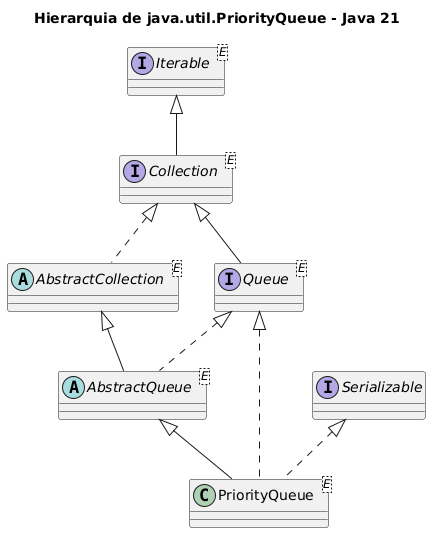

</div>
<div>

- Fila baseada em prioridade
- Implementa `Queue`
- Mantém a cabeça da fila conforme ordem natural ou `Comparator`
- A cabeça da fila é o elemento de maior prioridade
  - na ordem natural, é o menor elemento
- A iteração não garante percorrer em ordem de prioridade
- Não permite valores `null`
- Não é _thread-safe_
- Complexidade das operações
  - inserção e remoção da cabeça: O(log n)
  - consulta da cabeça: O(1)
  - busca por elemento: O(n)

</div>
</div>

---

# java.util.PriorityQueue: hierarquia simplificada

<div class="columns">

<div>

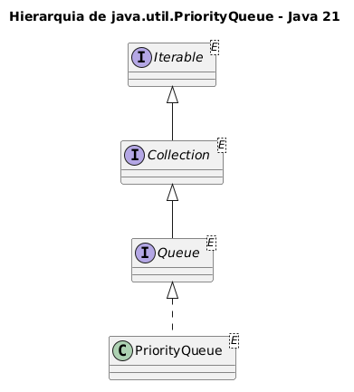

</div>

<div>

```java
import java.util.PriorityQueue;
import java.util.Queue;
//...

PriorityQueue<Integer> prioridades =
    new PriorityQueue<>();

Queue<Integer> fila =
    new PriorityQueue<>();

PriorityQueue<Aluno> porNota =
    new PriorityQueue<>(comparador);
```

</div>

</div>

---

<!-- _class: compact -->

# java.util.PriorityQueue: principais métodos

- `add(E e)`: insere um elemento na fila de prioridade.
- `offer(E e)`: insere um elemento na fila de prioridade.
- `peek()`: consulta a cabeça da fila sem remover.
- `element()`: consulta a cabeça; lança exceção se estiver vazia.
- `poll()`: remove e retorna a cabeça, ou `null` se estiver vazia.
- `remove()`: remove e retorna a cabeça; lança exceção se estiver vazia.
- `remove(Object o)`: remove uma ocorrência específica, se existir.
- `comparator()`: retorna o comparador usado, ou `null` se usa ordem natural.
- `contains(Object o)`: verifica se a fila contém determinado elemento.
- `size()` / `isEmpty()` / `clear()`: consulta ou limpa a coleção.

---

# java.util.PriorityQueue: exemplo

<div class="columns">

<div>

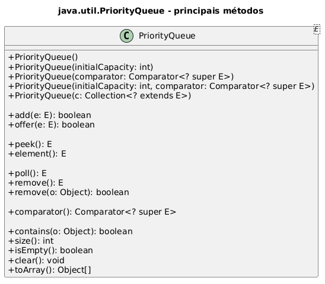

</div>

<div>

```java
import java.util.PriorityQueue;
import java.util.Comparator;
//...

PriorityQueue<Integer> senhas =
    new PriorityQueue<>();

senhas.offer(30);
senhas.offer(10);
senhas.offer(20);

System.out.println(senhas.peek()); //10

System.out.println(senhas.poll()); //10
System.out.println(senhas.poll()); //20

PriorityQueue<String> nomes =
    new PriorityQueue<>(
        Comparator.reverseOrder()
    );
```

</div>

</div>

---

<!-- _class: compact -->

# java.util.PriorityQueue: iteração

<div class="columns small">

<div>

```java
PriorityQueue<Integer> senhas =
    new PriorityQueue<>();

senhas.offer(30);
senhas.offer(10);
senhas.offer(20);

for (Integer senha : senhas) {
    System.out.println(senha);
}
```

`for-each` não garante ordem de prioridade.

</div>

<div>

```java
while (!senhas.isEmpty()) {
    System.out.println(senhas.poll());
}
```

Saída pela prioridade:

```text
10
20
30
```

- Use `peek()` para consultar a próxima prioridade.
- Use `poll()` para processar em ordem de prioridade.

</div>

</div>

---

<!-- _class: compact -->

# java.util.PriorityQueue: ordem dos elementos

<div class="columns small">

<div>

```java
PriorityQueue<Integer> senhas =
    new PriorityQueue<>();

senhas.offer(30);
senhas.offer(10);
senhas.offer(20);

System.out.println(senhas.peek());
```

Saída:

```text
10
```

</div>

<div>

```java
while (!senhas.isEmpty()) {
    System.out.println(senhas.poll());
}
```

Saída pela prioridade:

```text
10
20
30
```

- A cabeça segue a prioridade.
- Na ordem natural, o menor elemento sai primeiro.
- A iteração não garante a ordem de prioridade.

</div>

</div>

---

<!-- _class: compact -->

# java.util.PriorityQueue: ordem com Comparable

<div class="columns small">

<div>

```java
public interface Comparable<T> {
    int compareTo(T outro);
}

class Atendimento
    implements Comparable<Atendimento> {

    String nome;
    int prioridade;

    Atendimento(String nome, int prioridade) {
        this.nome = nome;
        this.prioridade = prioridade;
    }

    public int compareTo(Atendimento outro) {
        return Integer.compare(
            this.prioridade,
            outro.prioridade
        );
    }
}
```

</div>

<div>

```java
PriorityQueue<Atendimento> fila =
    new PriorityQueue<>();

fila.offer(new Atendimento("Ana", 2));
fila.offer(new Atendimento("Bruno", 1));
fila.offer(new Atendimento("Carla", 3));

while (!fila.isEmpty()) {
    System.out.println(fila.poll().nome);
}
```

Saída pela prioridade natural:

```text
Bruno
Ana
Carla
```

- `compareTo` define a ordem natural.
- Menor prioridade numérica sai primeiro.

</div>

</div>

---

<!-- _class: compact -->

# java.util.PriorityQueue: ordem com Comparator

<div class="columns small">

<div>

```java
PriorityQueue<Integer> senhas =
    new PriorityQueue<>(
        Comparator.reverseOrder()
    );

senhas.offer(30);
senhas.offer(10);
senhas.offer(20);

System.out.println(senhas.peek());
```

Saída:

```text
30
```

</div>

<div>

```java
while (!senhas.isEmpty()) {
    System.out.println(senhas.poll());
}
```

Saída pela prioridade:

```text
30
20
10
```

- O `Comparator` troca a regra de prioridade.
- Aqui, a ordem natural dos inteiros foi invertida.
- A maior senha passa a ser processada primeiro.

</div>

</div>

---

<!-- _class: compact -->

# ArrayList, LinkedList, ArrayDeque e PriorityQueue

<table class="tiny">
  <thead>
    <tr>
      <th>Classe</th>
      <th>Uso típico</th>
      <th>Ordem</th>
      <th>null</th>
      <th>Ponto forte</th>
      <th>Cuidado</th>
    </tr>
  </thead>
  <tbody>
    <tr>
      <td><code>ArrayList</code></td>
      <td>lista geral</td>
      <td>inserção/índice</td>
      <td>permite</td>
      <td>acesso por índice O(1)</td>
      <td>inserção/remoção no meio custa O(n)</td>
    </tr>
    <tr>
      <td><code>LinkedList</code></td>
      <td>lista, fila ou pilha</td>
      <td>inserção</td>
      <td>permite</td>
      <td>operações nas extremidades O(1)</td>
      <td>acesso por índice custa O(n)</td>
    </tr>
    <tr>
      <td><code>ArrayDeque</code></td>
      <td>fila ou pilha</td>
      <td>extremidades</td>
      <td>não permite</td>
      <td>fila/pilha eficiente sem classes legadas</td>
      <td>não oferece acesso por índice</td>
    </tr>
    <tr>
      <td><code>PriorityQueue</code></td>
      <td>fila por prioridade</td>
      <td>prioridade</td>
      <td>não permite</td>
      <td>remove primeiro o elemento prioritário</td>
      <td><code>for-each</code> não percorre em ordem de prioridade</td>
    </tr>
  </tbody>
</table>

---

<!-- _class: compact -->

# Igualdade e hash

Coleções baseadas em hash dependem de `equals()` e `hashCode()` para identificar elementos ou chaves.

<div class="columns small">

<div>

**Onde isso aparece**

- `HashSet`: decide se um elemento já existe.
- `LinkedHashSet`: combina unicidade com ordem previsível.
- `HashMap`: localiza valores pela chave.
- `LinkedHashMap`: localiza chaves e preserva ordem.

</div>

<div>

```java
class Aluno {
    private String matricula;
    private String nome;

    // construtor, getters, equals e hashCode
}

Set<Aluno> alunos = new HashSet<>();

alunos.add(new Aluno("001", "Ana"));
alunos.add(new Aluno("001", "Ana"));

System.out.println(alunos.size()); //1
```

- Em classes comuns, implemente `equals()` e `hashCode()` de forma consistente.
- Se a igualdade é pela matrícula, use esse atributo nos dois métodos.

</div>

</div>

---

<!-- _class: compact -->

# java.util.HashSet: hierarquia

<div class="columns">
<div>

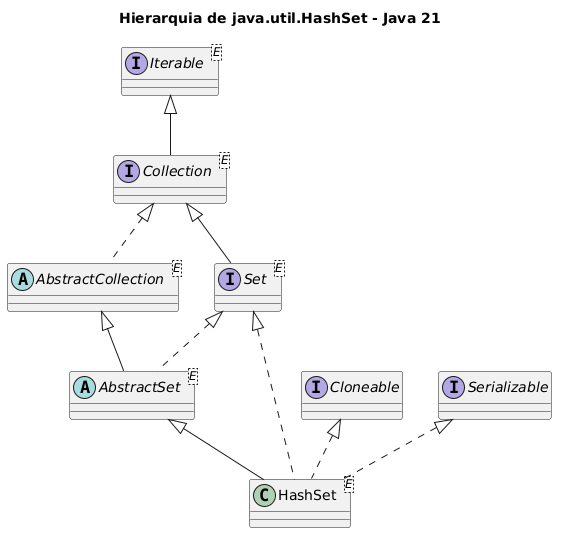

</div>
<div>

- Conjunto baseado em tabela hash
- Implementa `Set`
- Não permite elementos duplicados
- Não garante ordem de iteração
- Permite um valor `null`
- Não é _thread-safe_
- Complexidade das operações
  - `add`, `remove`, `contains` e `size`: O(1), em média
  - iteração depende do tamanho e da capacidade interna

</div>
</div>

---

# java.util.HashSet: hierarquia simplificada

<div class="columns">

<div>

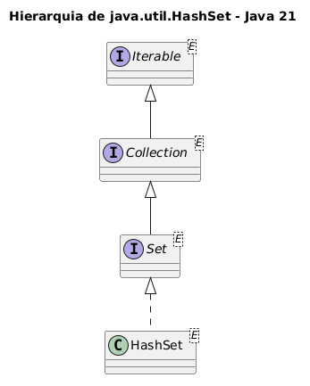

</div>

<div>

```java
import java.util.HashSet;
import java.util.Set;
//...

HashSet<String> linguagens = new HashSet<>();

Set<String> matriculas = new HashSet<>();
```

</div>

</div>

---

<!-- _class: compact -->

# java.util.HashSet: principais métodos

- `add(E e)`: adiciona o elemento se ele ainda não existir.
- `remove(Object o)`: remove o elemento, se estiver presente.
- `contains(Object o)`: verifica se o elemento pertence ao conjunto.
- `iterator()`: percorre os elementos, sem ordem garantida.
- `size()`: retorna a quantidade de elementos.
- `isEmpty()`: indica se o conjunto está vazio.
- `clear()`: remove todos os elementos.
- `toArray()`: converte o conjunto para um array.

---

# java.util.HashSet: exemplo

<div class="columns">

<div>

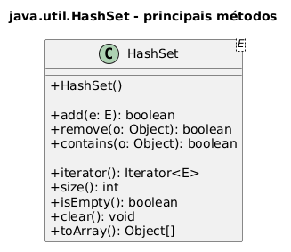

</div>

<div>

```java
import java.util.HashSet;
//...

HashSet<String> linguagens = new HashSet<>();

linguagens.add("Java");
linguagens.add("Python");
linguagens.add("Java");

System.out.println(linguagens.size()); //2

System.out.println(
    linguagens.contains("Java")
); //true

linguagens.remove("Python");
```

</div>

</div>

---

<!-- _class: compact -->

# java.util.HashSet: iteração

<div class="columns small">

<div>

```java
HashSet<String> linguagens =
    new HashSet<>();

linguagens.add("Java");
linguagens.add("Python");
linguagens.add("JavaScript");

for (String linguagem : linguagens) {
    System.out.println(linguagem);
}

linguagens.forEach(System.out::println);
```

</div>

<div>

```java
Iterator<String> it =
    linguagens.iterator();

while (it.hasNext()) {
    String linguagem = it.next();

    if (linguagem.startsWith("J")) {
        it.remove();
    }
}
```

- A ordem de iteração não é garantida.
- Use `Iterator` para remover com segurança.
- Não use `HashSet` quando a ordem importar.

</div>

</div>

---

<!-- _class: compact -->

# java.util.HashSet: ordem dos elementos

<div class="columns small">

<div>

```java
HashSet<String> linguagens =
    new HashSet<>();

linguagens.add("Java");
linguagens.add("Python");
linguagens.add("JavaScript");

System.out.println(linguagens);
```

Saída possível:

```text
[Java, JavaScript, Python]
```

</div>

<div>

```java
for (String linguagem : linguagens) {
    System.out.println(linguagem);
}
```

A ordem pode variar.

- Não preserva ordem de inserção.
- Não ordena por ordem natural.
- Use quando unicidade importa mais que ordem.

</div>

</div>

---

<!-- _class: compact -->

# java.util.LinkedHashSet: hierarquia

<div class="columns">
<div>

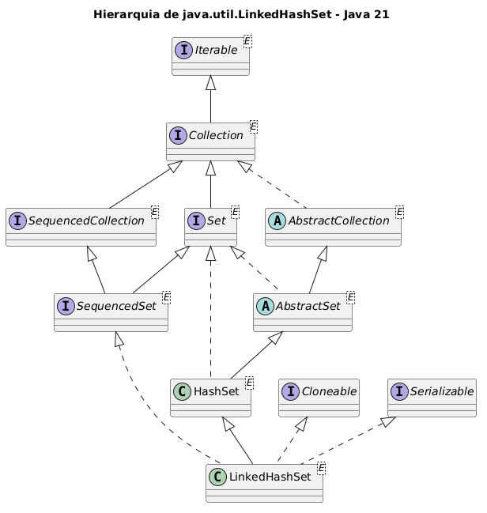

</div>
<div>

- Conjunto baseado em hash e lista encadeada
- Implementa `SequencedSet`
- Não permite elementos duplicados
- Mantém ordem de inserção
- Permite um valor `null`
- Não é _thread-safe_
- Complexidade das operações
  - `add`, `remove` e `contains`: O(1), em média
  - iteração segue a ordem de inserção

</div>
</div>

---

# java.util.LinkedHashSet: hierarquia simplificada

<div class="columns">

<div>

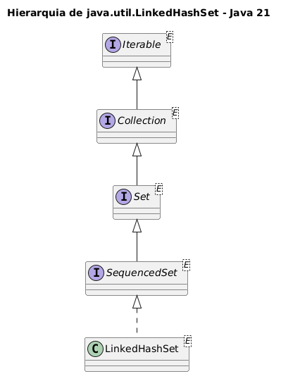

</div>

<div>

```java
import java.util.LinkedHashSet;
import java.util.Set;
import java.util.SequencedSet;
//...

LinkedHashSet<String> nomes =
    new LinkedHashSet<>();

Set<String> conjunto = new LinkedHashSet<>();

SequencedSet<String> sequenciado =
    new LinkedHashSet<>();
```

</div>

</div>

---

<!-- _class: compact -->

# java.util.LinkedHashSet: principais métodos

- `add(E e)`: adiciona o elemento se ele ainda não existir.
- `addFirst(E e)`: adiciona ou move o elemento para o início.
- `addLast(E e)`: adiciona ou move o elemento para o fim.
- `getFirst()` / `getLast()`: acessa o primeiro ou o último elemento.
- `removeFirst()` / `removeLast()`: remove o primeiro ou o último elemento.
- `reversed()`: retorna uma visão na ordem inversa.
- `contains(Object o)`: verifica se o elemento pertence ao conjunto.
- `size()` / `isEmpty()` / `clear()`: consulta ou limpa o conjunto.

---

# java.util.LinkedHashSet: exemplo

<div class="columns">

<div>

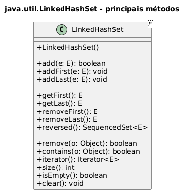

</div>

<div>

```java
import java.util.LinkedHashSet;
//...

LinkedHashSet<String> nomes =
    new LinkedHashSet<>();

nomes.add("Bruno");
nomes.add("Ana");
nomes.add("Carla");
nomes.add("Ana");

System.out.println(nomes);
//[Bruno, Ana, Carla]

nomes.addFirst("Diego");
System.out.println(nomes.getFirst()); //Diego
```

</div>

</div>

---

<!-- _class: compact -->

# java.util.LinkedHashSet: iteração

<div class="columns small">

<div>

```java
LinkedHashSet<String> nomes =
    new LinkedHashSet<>();

nomes.add("Bruno");
nomes.add("Ana");
nomes.add("Carla");

for (String nome : nomes) {
    System.out.println(nome);
}
```

Percorre em ordem de inserção:

```text
Bruno
Ana
Carla
```

</div>

<div>

```java
for (String nome : nomes.reversed()) {
    System.out.println(nome);
}

Iterator<String> it = nomes.iterator();

while (it.hasNext()) {
    if (it.next().startsWith("A")) {
        it.remove();
    }
}
```

- `reversed()` oferece visão inversa.
- A ordem é previsível.

</div>

</div>

---

<!-- _class: compact -->

# java.util.LinkedHashSet: ordem dos elementos

<div class="columns small">

<div>

```java
LinkedHashSet<String> nomes =
    new LinkedHashSet<>();

nomes.add("Bruno");
nomes.add("Ana");
nomes.add("Carla");
nomes.add("Ana");

System.out.println(nomes);
```

Saída:

```text
[Bruno, Ana, Carla]
```

</div>

<div>

```java
nomes.addFirst("Diego");
nomes.addLast("Eva");

System.out.println(nomes);
```

Saída:

```text
[Diego, Bruno, Ana, Carla, Eva]
```

- Mantém ordem de inserção.
- Elementos repetidos não são adicionados.
- `addFirst` e `addLast` ajustam as extremidades.

</div>

</div>

---

<!-- _class: compact -->

# java.util.TreeSet: hierarquia

<div class="columns">
<div>

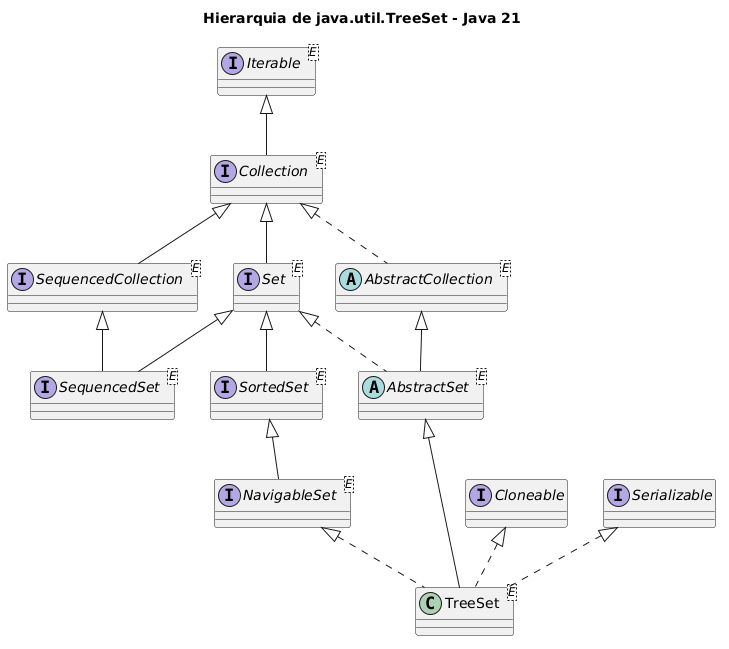

</div>
<div>

- Conjunto ordenado baseado em árvore
- Implementa `NavigableSet`
- Não permite elementos duplicados
- Ordena por ordem natural ou `Comparator`
- Com ordem natural, não aceita `null`
- Com `Comparator`, `null` só funciona se o comparador tratar esse caso
- Não é _thread-safe_
- Complexidade das operações
  - `add`, `remove` e `contains`: O(log n)
  - navegação por menor/maior elemento: O(log n)
- A ordenação deve ser consistente com `equals`

</div>
</div>

---

# java.util.TreeSet: hierarquia simplificada

<div class="columns">

<div>

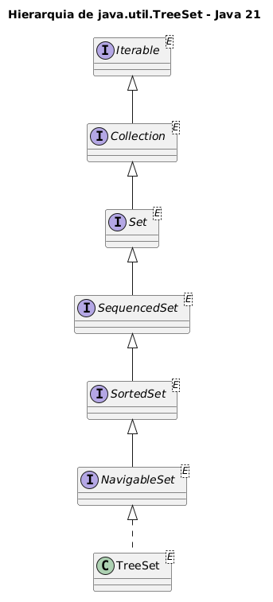

</div>

<div>

```java
import java.util.TreeSet;
import java.util.Set;
import java.util.SortedSet;
import java.util.NavigableSet;
//...

TreeSet<String> nomes = new TreeSet<>();

Set<String> conjunto = new TreeSet<>();

SortedSet<String> ordenado = new TreeSet<>();

NavigableSet<String> navegavel = new TreeSet<>();
```

</div>

</div>

---

<!-- _class: compact -->

# java.util.TreeSet: principais métodos

- `add(E e)`: adiciona o elemento se ele ainda não existir.
- `remove(Object o)`: remove o elemento, se estiver presente.
- `contains(Object o)`: verifica se o elemento pertence ao conjunto.
- `first()` / `last()`: acessa o menor ou o maior elemento.
- `lower(E e)` / `higher(E e)`: navega para vizinhos estritos.
- `floor(E e)` / `ceiling(E e)`: navega para vizinhos inclusivos.
- `pollFirst()` / `pollLast()`: remove o menor ou o maior elemento.
- `descendingSet()`: retorna uma visão em ordem decrescente.
- `comparator()`: retorna o comparador, ou `null` se usa ordem natural.

---

# java.util.TreeSet: exemplo

<div class="columns">

<div>

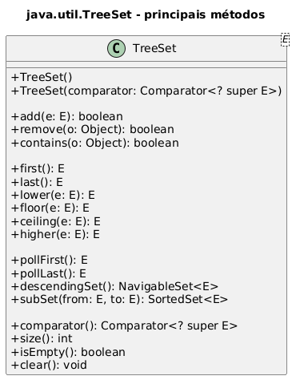

</div>

<div>

```java
import java.util.TreeSet;
//...

TreeSet<String> nomes = new TreeSet<>();

nomes.add("Bruno");
nomes.add("Ana");
nomes.add("Carla");
nomes.add("Ana");

System.out.println(nomes);
//[Ana, Bruno, Carla]

System.out.println(nomes.first()); //Ana
System.out.println(nomes.higher("Ana")); //Bruno
System.out.println(nomes.pollLast()); //Carla
```

</div>

</div>

---

<!-- _class: compact -->

# java.util.TreeSet: iteração

<div class="columns small">

<div>

```java
TreeSet<String> nomes =
    new TreeSet<>();

nomes.add("Bruno");
nomes.add("Ana");
nomes.add("Carla");

for (String nome : nomes) {
    System.out.println(nome);
}
```

Percorre em ordem natural:

```text
Ana
Bruno
Carla
```

</div>

<div>

```java
for (String nome : nomes.descendingSet()) {
    System.out.println(nome);
}

SortedSet<String> trecho =
    nomes.subSet("Ana", "Carla");
```

- A iteração segue a ordenação do conjunto.
- `descendingSet()` percorre em ordem inversa.
- `subSet()` permite iterar por intervalo.

</div>

</div>

---

<!-- _class: compact -->

# java.util.TreeSet: ordem com Comparable

<div class="columns small">

<div>

```java
class Aluno implements Comparable<Aluno> {
    String nome;
    int matricula;

    Aluno(String nome, int matricula) {
        this.nome = nome;
        this.matricula = matricula;
    }

    public int compareTo(Aluno outro) {
        return Integer.compare(
            this.matricula,
            outro.matricula
        );
    }
}
```

</div>

<div>

```java
TreeSet<Aluno> alunos =
    new TreeSet<>();

alunos.add(new Aluno("Ana", 30));
alunos.add(new Aluno("Bruno", 10));
alunos.add(new Aluno("Carla", 20));

for (Aluno aluno : alunos) {
    System.out.println(aluno.nome);
}
```

Saída pela ordem natural:

```text
Bruno
Carla
Ana
```

- `compareTo` define a ordem natural.
- O `TreeSet` reorganiza os elementos ao inserir.

</div>

</div>

---

<!-- _class: compact -->

# java.util.TreeSet: ordem por comparação

<div class="columns small">

<div>

```java
TreeSet<String> nomes =
    new TreeSet<>();

nomes.add("Bruno");
nomes.add("Ana");
nomes.add("Carla");

System.out.println(nomes);
```

Ordem natural:

```text
[Ana, Bruno, Carla]
```

</div>

<div>

```java
TreeSet<String> porTamanho =
    new TreeSet<>(
        Comparator
            .comparingInt(String::length)
            .thenComparing(Comparator.naturalOrder())
    );

porTamanho.add("Bruno");
porTamanho.add("Ana");
porTamanho.add("Eva");

System.out.println(porTamanho);
```

Saída:

```text
[Ana, Eva, Bruno]
```

- `TreeSet` mantém os elementos ordenados.
- O `Comparator` define a regra de ordenação.
- A comparação também participa da ideia de duplicidade.

</div>

</div>

---

<!-- _class: compact -->

# HashSet, LinkedHashSet e TreeSet

<table class="tiny">
  <thead>
    <tr>
      <th>Classe</th>
      <th>Ordem</th>
      <th>Duplicados</th>
      <th>null</th>
      <th>Ponto forte</th>
      <th>Cuidado</th>
    </tr>
  </thead>
  <tbody>
    <tr>
      <td><code>HashSet</code></td>
      <td>não garante</td>
      <td>não permite</td>
      <td>permite um</td>
      <td>operações básicas O(1), em média</td>
      <td>não use quando a ordem importa</td>
    </tr>
    <tr>
      <td><code>LinkedHashSet</code></td>
      <td>inserção</td>
      <td>não permite</td>
      <td>permite um</td>
      <td>preserva a ordem de inserção</td>
      <td>custo extra para manter encadeamento</td>
    </tr>
    <tr>
      <td><code>TreeSet</code></td>
      <td>ordenada</td>
      <td>não permite</td>
      <td>não com ordem natural</td>
      <td>mantém elementos sempre ordenados</td>
      <td>operações básicas custam O(log n)</td>
    </tr>
  </tbody>
</table>

---

<!-- _class: compact -->

# java.util.HashMap: hierarquia

<div class="columns">
<div>

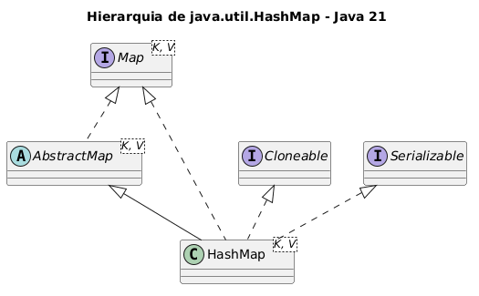

`Map` faz parte do _Java Collections Framework_, mas não é uma subinterface de `Collection`.

</div>
<div>

- Mapa baseado em tabela hash
- Implementa `Map`
- Associa chaves a valores
- Não permite chaves duplicadas
- Não garante ordem de iteração
- Permite uma chave `null` e múltiplos valores `null`
- Não é _thread-safe_
- Complexidade das operações
  - `get` e `put`: O(1), em média
  - iteração depende do tamanho e da capacidade interna

</div>
</div>

---

# java.util.HashMap: hierarquia simplificada

<div class="columns">

<div>

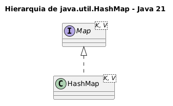

</div>

<div>

```java
import java.util.HashMap;
import java.util.Map;
//...

HashMap<String, Aluno> porCpf =
    new HashMap<>();

Map<String, Aluno> alunos =
    new HashMap<>();
```

</div>

</div>

---

<!-- _class: compact -->

# java.util.HashMap: principais métodos

- `put(K k, V v)`: associa uma chave a um valor.
- `get(Object k)`: retorna o valor associado à chave.
- `getOrDefault(Object k, V padrao)`: retorna valor ou padrão.
- `remove(Object k)`: remove o par associado à chave.
- `containsKey(Object k)`: verifica se a chave existe.
- `containsValue(Object v)`: verifica se algum valor existe.
- `keySet()`: retorna uma visão das chaves.
- `values()`: retorna uma visão dos valores.
- `entrySet()`: retorna uma visão dos pares chave-valor.
- `size()` / `isEmpty()` / `clear()`: consulta ou limpa o mapa.

---

# java.util.HashMap: exemplo

<div class="columns">

<div>

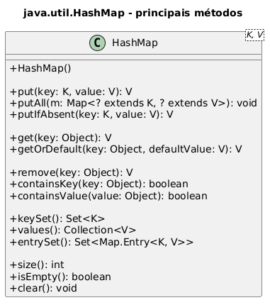

</div>

<div>

```java
import java.util.HashMap;
//...

HashMap<String, Aluno> alunos =
    new HashMap<>();

alunos.put("001", new Aluno("Ana"));
alunos.put("002", new Aluno("Bruno"));

System.out.println(alunos.get("001"));

alunos.put("001", new Aluno("Carla"));
System.out.println(alunos.size()); //2

for (var entrada : alunos.entrySet()) {
    System.out.println(entrada.getKey());
}
```

</div>

</div>

---

<!-- _class: compact -->

# java.util.HashMap: iteração

<div class="columns small">

<div>

```java
HashMap<String, Aluno> alunos =
    new HashMap<>();

alunos.put("001", new Aluno("Ana"));
alunos.put("002", new Aluno("Bruno"));

for (String matricula : alunos.keySet()) {
    System.out.println(matricula);
}

for (Aluno aluno : alunos.values()) {
    System.out.println(aluno);
}
```

</div>

<div>

```java
for (Map.Entry<String, Aluno> entrada
        : alunos.entrySet()) {
    System.out.println(
        entrada.getKey()
        + ": "
        + entrada.getValue()
    );
}
```

- `keySet()` percorre chaves.
- `values()` percorre valores.
- `entrySet()` é melhor quando precisa de chave e valor.
- `HashMap` não garante ordem.

</div>

</div>

---

<!-- _class: compact -->

# java.util.LinkedHashMap: hierarquia

<div class="columns">
<div>

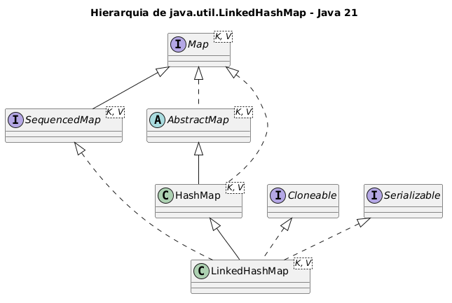

</div>
<div>

- Mapa baseado em hash e lista encadeada
- Implementa `SequencedMap`
- Mantém ordem de inserção por padrão
- Pode ser criado com ordem de acesso
  - útil em estratégias do tipo LRU
- Permite uma chave `null` e múltiplos valores `null`
- Não é _thread-safe_
- Complexidade das operações
  - `get` e `put`: O(1), em média
  - iteração segue a ordem definida

</div>
</div>

---

# java.util.LinkedHashMap: hierarquia simplificada

<div class="columns">

<div>

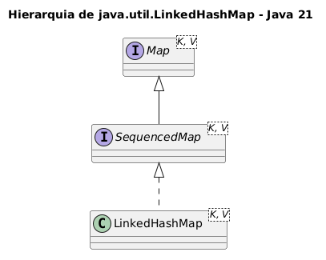

</div>

<div>

```java
import java.util.LinkedHashMap;
import java.util.Map;
import java.util.SequencedMap;
//...

LinkedHashMap<String, Aluno> alunos =
    new LinkedHashMap<>();

Map<String, Aluno> mapa =
    new LinkedHashMap<>();

SequencedMap<String, Aluno> sequenciado =
    new LinkedHashMap<>();
```

</div>

</div>

---

<!-- _class: compact -->

# java.util.LinkedHashMap: principais métodos

- `put(K k, V v)`: associa uma chave a um valor.
- `putFirst(K k, V v)`: posiciona a entrada no início.
- `putLast(K k, V v)`: posiciona a entrada no fim.
- `get(Object k)`: retorna o valor associado à chave.
- `firstEntry()` / `lastEntry()`: acessa primeira ou última entrada.
- `pollFirstEntry()` / `pollLastEntry()`: remove primeira ou última entrada.
- `reversed()`: retorna uma visão na ordem inversa.
- `keySet()` / `values()` / `entrySet()`: visões do mapa.
- `size()` / `isEmpty()` / `clear()`: consulta ou limpa o mapa.

---

# java.util.LinkedHashMap: exemplo

<div class="columns">

<div>

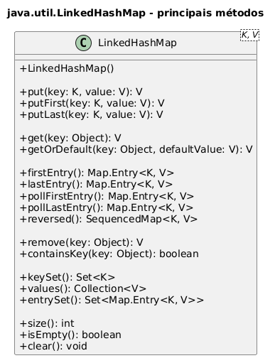

</div>

<div>

```java
import java.util.LinkedHashMap;
//...

LinkedHashMap<String, String> capitais =
    new LinkedHashMap<>();

capitais.put("DF", "Brasília");
capitais.put("BA", "Salvador");
capitais.put("SP", "São Paulo");

System.out.println(capitais.keySet());
//[DF, BA, SP]

capitais.putFirst("RJ", "Rio");
System.out.println(capitais.firstEntry());
```

</div>

</div>

---

<!-- _class: compact -->

# java.util.LinkedHashMap: iteração

<div class="columns small">

<div>

```java
LinkedHashMap<String, String> capitais =
    new LinkedHashMap<>();

capitais.put("DF", "Brasília");
capitais.put("BA", "Salvador");
capitais.put("SP", "São Paulo");

for (var entrada : capitais.entrySet()) {
    System.out.println(entrada);
}
```

Percorre em ordem de inserção.

</div>

<div>

```java
for (var entrada
        : capitais.reversed().entrySet()) {
    System.out.println(entrada);
}

for (String uf : capitais.keySet()) {
    System.out.println(uf);
}
```

- `entrySet()` mantém a ordem previsível do mapa.
- `reversed()` permite percorrer na ordem inversa.
- A ordem pode ser de inserção ou de acesso, conforme o construtor.

</div>

</div>

---

<!-- _class: compact -->

# java.util.TreeMap: hierarquia

<div class="columns">
<div>

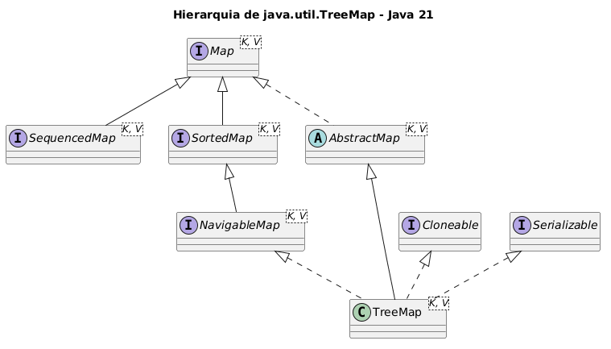

</div>
<div>

- Mapa ordenado por chave
- Implementa `NavigableMap`
- Baseado em árvore rubro-negra
- Ordena por ordem natural ou `Comparator`
- Não permite chaves duplicadas
- Com ordem natural, não aceita chave `null`
- Valores `null` são permitidos
- Não é _thread-safe_
- Complexidade das operações
  - `containsKey`, `get`, `put` e `remove`: O(log n)
- A ordenação deve ser consistente com `equals`

</div>
</div>

---

# java.util.TreeMap: hierarquia simplificada

<div class="columns">

<div>

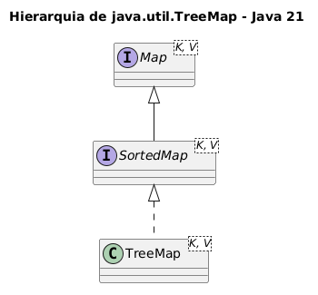

</div>

<div>

```java
import java.util.TreeMap;
import java.util.Map;
import java.util.SortedMap;
//...

TreeMap<String, Aluno> alunos =
    new TreeMap<>();

Map<String, Aluno> mapa =
    new TreeMap<>();

SortedMap<String, Aluno> ordenado =
    new TreeMap<>();
```

</div>

</div>

---

<!-- _class: compact -->

# java.util.TreeMap: principais métodos

- `put(K k, V v)`: associa uma chave a um valor.
- `get(Object k)`: retorna o valor associado à chave.
- `remove(Object k)`: remove o par associado à chave.
- `containsKey(Object k)`: verifica se a chave existe.
- `firstKey()` / `lastKey()`: acessa menor ou maior chave.
- `lowerKey(K k)` / `higherKey(K k)`: navega para chaves vizinhas.
- `floorKey(K k)` / `ceilingKey(K k)`: navega com inclusão.
- `firstEntry()` / `lastEntry()`: acessa menor ou maior entrada.
- `descendingMap()`: retorna uma visão em ordem decrescente.
- `keySet()` / `values()` / `entrySet()`: visões do mapa.

---

# java.util.TreeMap: exemplo

<div class="columns">

<div>

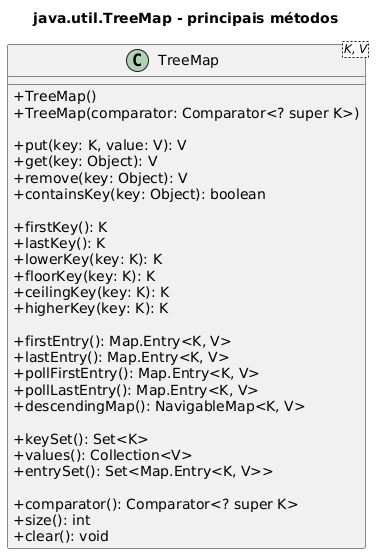

</div>

<div>

```java
import java.util.TreeMap;
//...

TreeMap<String, Integer> notas =
    new TreeMap<>();

notas.put("Bruno", 8);
notas.put("Ana", 10);
notas.put("Carla", 9);

System.out.println(notas.keySet());
//[Ana, Bruno, Carla]

System.out.println(notas.firstKey()); //Ana
System.out.println(notas.higherKey("Ana")); //Bruno
```

</div>

</div>

---

<!-- _class: compact -->

# java.util.TreeMap: iteração

<div class="columns small">

<div>

```java
TreeMap<String, Integer> notas =
    new TreeMap<>();

notas.put("Bruno", 8);
notas.put("Ana", 10);
notas.put("Carla", 9);

for (var entrada : notas.entrySet()) {
    System.out.println(entrada);
}
```

Percorre em ordem crescente das chaves.

</div>

<div>

```java
for (var entrada
        : notas.descendingMap().entrySet()) {
    System.out.println(entrada);
}

for (String nome : notas.keySet()) {
    System.out.println(nome);
}
```

- A iteração segue a ordenação das chaves.
- `descendingMap()` percorre em ordem inversa.
- Útil quando a ordem das chaves faz parte do problema.

</div>

</div>

---

<!-- _class: compact -->

# HashMap, LinkedHashMap e TreeMap

<table class="tiny">
  <thead>
    <tr>
      <th>Classe</th>
      <th>Ordem</th>
      <th>Chaves</th>
      <th>null</th>
      <th>Ponto forte</th>
      <th>Cuidado</th>
    </tr>
  </thead>
  <tbody>
    <tr>
      <td><code>HashMap</code></td>
      <td>não garante</td>
      <td>únicas</td>
      <td>uma chave; vários valores</td>
      <td><code>get</code> e <code>put</code> O(1), em média</td>
      <td>não use quando a ordem importa</td>
    </tr>
    <tr>
      <td><code>LinkedHashMap</code></td>
      <td>inserção ou acesso</td>
      <td>únicas</td>
      <td>uma chave; vários valores</td>
      <td>preserva ordem previsível</td>
      <td>custo extra para manter encadeamento</td>
    </tr>
    <tr>
      <td><code>TreeMap</code></td>
      <td>ordenada por chave</td>
      <td>únicas</td>
      <td>sem chave nula com ordem natural; valores nulos possíveis</td>
      <td>mantém chaves sempre ordenadas</td>
      <td>operações principais custam O(log n)</td>
    </tr>
  </tbody>
</table>

---

<!-- _class: compact -->

# java.util.Collections

A classe `Collections` reúne métodos estáticos que operam sobre coleções ou retornam coleções especializadas.

<div class="callout">

**Ideia central**

Ela oferece algoritmos reutilizáveis, wrappers e fábricas utilitárias sem depender de uma implementação específica.

</div>

Exemplos de uso:

- ordenar, embaralhar, inverter e buscar em listas;
- encontrar mínimo e máximo;
- contar frequência de elementos;
- criar coleções vazias, imutáveis ou com cópias repetidas;
- criar _views_ sincronizadas, não modificáveis ou com checagem dinâmica de tipo.

---

<!-- _class: compact -->

# java.util.Collections: principais algoritmos

<table class="tiny">
  <thead>
    <tr>
      <th>Método</th>
      <th>Uso</th>
      <th>Observação</th>
    </tr>
  </thead>
  <tbody>
    <tr>
      <td><code>sort(list)</code></td>
      <td>ordena uma lista</td>
      <td>usa ordem natural ou comparador.</td>
    </tr>
    <tr>
      <td><code>binarySearch(list, key)</code></td>
      <td>busca em lista ordenada</td>
      <td>a lista precisa estar previamente ordenada.</td>
    </tr>
    <tr>
      <td><code>reverse(list)</code></td>
      <td>inverte a ordem</td>
      <td>modifica a lista recebida.</td>
    </tr>
    <tr>
      <td><code>shuffle(list)</code></td>
      <td>embaralha elementos</td>
      <td>útil para simulações e sorteios.</td>
    </tr>
    <tr>
      <td><code>min(coll)</code> / <code>max(coll)</code></td>
      <td>menor ou maior elemento</td>
      <td>usa ordem natural ou comparador.</td>
    </tr>
    <tr>
      <td><code>frequency(coll, obj)</code></td>
      <td>conta ocorrências</td>
      <td>usa <code>equals()</code> para comparação.</td>
    </tr>
    <tr>
      <td><code>disjoint(c1, c2)</code></td>
      <td>verifica se não há interseção</td>
      <td>retorna <code>true</code> se não compartilham elementos.</td>
    </tr>
  </tbody>
</table>

---

# java.util.Collections: exemplo

```java
import java.util.ArrayList;
import java.util.Collections;
import java.util.List;
//...

List<Integer> notas = new ArrayList<>();

Collections.addAll(notas, 8, 10, 6, 10);

Collections.sort(notas);
System.out.println(notas); //[6, 8, 10, 10]

System.out.println(Collections.max(notas)); //10
System.out.println(Collections.frequency(notas, 10)); //2

Collections.reverse(notas);
System.out.println(notas); //[10, 10, 8, 6]
```

---

<!-- _class: compact -->

# java.util.Collections: wrappers e fábricas

<table class="tiny">
  <thead>
    <tr>
      <th>Método</th>
      <th>Uso</th>
      <th>Cuidado</th>
    </tr>
  </thead>
  <tbody>
    <tr>
      <td><code>unmodifiableList(list)</code></td>
      <td>cria uma visão não modificável</td>
      <td>alterações na lista original podem aparecer na visão.</td>
    </tr>
    <tr>
      <td><code>synchronizedList(list)</code></td>
      <td>cria uma visão sincronizada</td>
      <td>iteração ainda exige cuidado externo.</td>
    </tr>
    <tr>
      <td><code>checkedList(list, type)</code></td>
      <td>verifica tipo em tempo de execução</td>
      <td>útil ao interoperar com código legado.</td>
    </tr>
    <tr>
      <td><code>emptyList()</code></td>
      <td>retorna lista vazia imutável</td>
      <td>não permite adicionar elementos.</td>
    </tr>
    <tr>
      <td><code>singletonList(obj)</code></td>
      <td>lista imutável com um elemento</td>
      <td>boa para retornar resultado único.</td>
    </tr>
    <tr>
      <td><code>nCopies(n, obj)</code></td>
      <td>lista imutável com cópias repetidas</td>
      <td>não cria cópias independentes do objeto.</td>
    </tr>
  </tbody>
</table>

<div class="callout">

Operações como `add`, `remove`, `clear` ou algoritmos que alteram a lista (`sort`, `reverse`, `shuffle`) podem lançar `UnsupportedOperationException` em coleções não modificáveis ou de tamanho fixo.

</div>

---

# Fail-fast: detecção de erro

Muitas implementações possuem iteradores _fail-fast_.

<div class="callout">

**O que isso significa?**

Se a coleção for modificada de forma indevida enquanto está sendo percorrida, o iterador tenta detectar o problema rapidamente.

</div>

Esse comportamento é uma ajuda para encontrar bugs, não um mecanismo de controle de fluxo.

Exemplo do erro comum:

```java
for (String nome : nomes) {
    nomes.remove(nome); // risco de ConcurrentModificationException
}
```

Para remover durante o percurso, use um `Iterator` e chame `remove()` no próprio iterador.

---

# Concorrência

Coleções usadas por várias threads exigem cuidado.

Interfaces e classes específicas ajudam nesse cenário:

- `BlockingQueue`
- `ConcurrentMap`
- `ConcurrentNavigableMap`
- `CopyOnWriteArrayList`
- `ConcurrentHashMap`
- `ConcurrentSkipListMap`

---

# Boas práticas

- Programe para interfaces: `List`, `Set`, `Map`.
- Escolha implementação conforme uso esperado.
- Use generics sempre que possível.
- Não dependa de ordem quando a implementação não garante ordem.
- Implemente `equals()` e `hashCode()` corretamente em objetos usados em `Set` ou como chave de `Map`.
- Prefira APIs prontas antes de reinventar estruturas.

---

<!-- _class: compact -->

# Estudo de caso 1: cadastro de alunos

**Cenário:** uma coordenação precisa registrar alunos na ordem em que foram cadastrados.

**Coleção escolhida:** `List<Aluno>` com `ArrayList`.

**Implementação**

1. Crie uma classe `Aluno` com atributos `nome` e `matricula`.
2. Implemente construtor e métodos de acesso.
3. Declare a variável pela interface: `List<Aluno> alunos`.
4. Instancie com `new ArrayList<>()`.
5. Cadastre alunos com `add()`.
6. Liste em ordem de cadastro com `for-each`.
7. Conte o total com `size()`.

**Verifique:** alunos com o mesmo nome são permitidos; a ordem de inserção é preservada.

---

<!-- _class: compact -->

# Estudo de caso 2: inscrições únicas

**Cenário:** uma atividade complementar não pode receber a mesma matrícula duas vezes.

**Coleção escolhida:** `Set<String>`, primeiro com `HashSet`, depois com `LinkedHashSet`.

**Implementação**

1. Declare `Set<String> matriculas`.
2. Instancie com `new HashSet<>()`.
3. Insira matrículas com `add()`.
4. Insira uma matrícula repetida e observe o retorno de `add()`.
5. Exiba o total com `size()`.
6. Troque para `new LinkedHashSet<>()` e compare a ordem de iteração.

**Verifique:** a duplicidade continua bloqueada; a diferença está na previsibilidade da ordem.

---

<!-- _class: compact -->

# Estudo de caso 3: índice por matrícula

**Cenário:** a secretaria precisa localizar rapidamente um aluno pela matrícula.

**Coleção escolhida:** `Map<String, Aluno>` com `HashMap`.

**Implementação**

1. Crie uma classe `Aluno` com atributos `nome` e `matricula`.
2. Implemente construtor e métodos de acesso.
3. Declare `Map<String, Aluno> alunosPorMatricula`.
4. Instancie com `new HashMap<>()`.
5. Cadastre usando `put(matricula, aluno)`.
6. Busque com `get(matricula)`.
7. Percorra pares com `entrySet()`.
8. Teste uma matrícula repetida e observe a substituição do valor.

**Verifique:** a chave é única; o acesso deixa de depender da posição do aluno.

---

# Conclusão

<div class="callout">

**Mensagem principal**

O Java Collections Framework permite escrever código mais claro, reutilizável e eficiente ao separar intenção, contrato e implementação.

</div>

Para escolher bem:

- comece pela interface;
- pense em duplicidade, ordem, busca e concorrência;
- só então escolha a implementação.

---

<!-- _class: practice -->
<!-- _paginate: false -->

# Prática

<iframe
  class="compiler-frame"
  src="https://onecompiler.com/embed/java/44paj6nnv?hideTitle=true&hideLanguageSelection=true&hideNew=false&hideNewFileOption=false&hideStdin=true&hideResult=true&hideEditorOptions=false&theme=light&fontSize=20"
  title="OneCompiler Java"
  allow="clipboard-read; clipboard-write"
></iframe>

---

<!-- _class: practice -->
<!-- _paginate: false -->

# Challenge

<div class="challenge-login">
  <input id="onecompiler-user-token" type="password" placeholder="Token do usuário">
  <button type="button" onclick="loadOneCompilerChallenge()">Carregar challenge</button>
</div>

<iframe
  id="onecompiler-challenge"
  class="compiler-frame challenge-frame"
  frameborder="0"
  allowfullscreen
  allowFullScreen
  mozallowfullscreen="true"
  webkitallowfullscreen="true"
  src="https://onecompiler.com/embed/challenges/44png67sv/arraylist?theme=light&hideLanguageSelection=true&hideNew=true"
  title="OneCompiler Challenge"
></iframe>

<div class="source">
  Desafio: <a href="https://onecompiler.com/challenges/44png67sv/arraylist">https://onecompiler.com/challenges/44png67sv/arraylist</a>
</div>

<script>
function loadOneCompilerChallenge() {
  const apiKey = 'oc_44pg5vds2_44pg5vdsh_76371a8954165f68cbadb9d6309590ce9eec5eb1195eac75';
  const userToken = document.getElementById('onecompiler-user-token').value.trim();
  const frame = document.getElementById('onecompiler-challenge');
  const base = 'https://onecompiler.com/embed/challenges/44png67sv/arraylist';

  const params = new URLSearchParams({
    theme: 'light',
    hideLanguageSelection: 'true',
    hideNew: 'true'
  });

  if (apiKey) params.set('apiKey', apiKey);
  if (userToken) params.set('userApiToken', userToken);

  frame.src = `${base}?${params.toString()}`;
}
</script>
