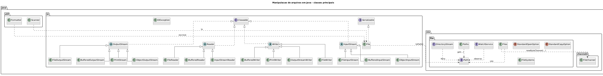
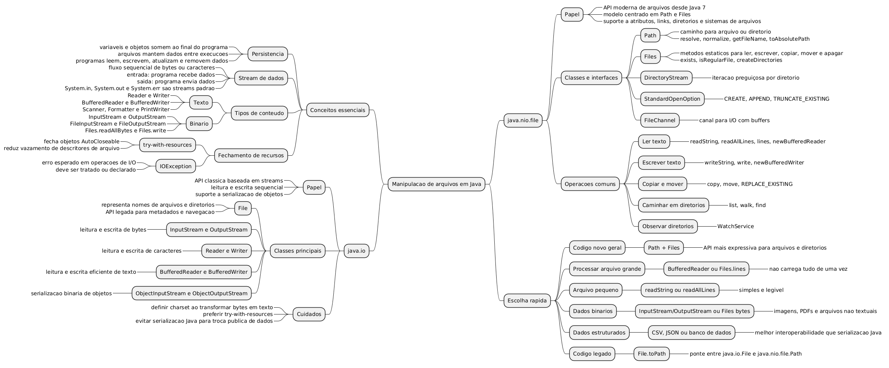

<!-- _class: title -->
<!-- _paginate: false -->

## Programação Orientada a Objetos

# Manipulação de arquivos em Java

<div class="objectives">

**Objetivos da aula**

- Compreender persistência de dados em arquivos
- Diferenciar arquivos de texto, binários e dados estruturados
- Usar `java.io` para streams, readers, writers e serialização
- Usar `java.nio.file` com `Path`, `Files` e operações em diretórios
- Tratar exceções e fechar recursos corretamente
- Construir pequenos programas que leem, escrevem e processam arquivos

</div>

<div class="contact">
Prof. Fabricio Santana<br>
fabricio.santana@idp.edu.br<br>
www.linkedin.com/in/fabriciofsantana/
</div>

---

# Por que arquivos?

- Variáveis, objetos, arrays e coleções ficam em memória
  - quando o programa termina, esses dados desaparecem
- Arquivos permitem **persistência**
  - dados continuam disponíveis entre execuções
  - outros programas também podem ler ou produzir esses dados
- Um programa real costuma precisar:
  - importar dados
  - exportar relatórios
  - gravar logs
  - salvar configurações
  - processar arquivos recebidos de outros sistemas

---

# Arquivo: o que é?

> Para um programa Java, arquivo é um recurso externo que pode ser acessado por um caminho e processado como fluxo (_stream_) de bytes, caracteres ou registros estruturados.

<div class="callout">

**Ideia central**

Arquivos não são objetos comuns em memória. Eles dependem do sistema operacional, permissões, caminhos, codificação de texto e fechamento de recursos.

</div>

---

# Stream de dados: intuição

**Stream** é um fluxo sequencial de dados.

- **Entrada:** dados vêm de fora para dentro do programa
  - teclado, arquivo, rede, memória
- **Saída:** dados saem do programa
  - console, arquivo, rede, memória
- Em Java, I/O tradicional é modelado como:
  - bytes: `InputStream` e `OutputStream`
  - caracteres: `Reader` e `Writer`

---

# Streams padrão do Java

Quando um programa Java inicia, ele já possui três fluxos padrão:

<table class="tiny">
  <thead>
    <tr>
      <th>Stream</th>
      <th>Tipo</th>
      <th>Uso comum</th>
    </tr>
  </thead>
  <tbody>
    <tr>
      <td><code>System.in</code></td>
      <td><code>InputStream</code></td>
      <td>Entrada padrão, normalmente teclado.</td>
    </tr>
    <tr>
      <td><code>System.out</code></td>
      <td><code>PrintStream</code></td>
      <td>Saída padrão, normalmente console.</td>
    </tr>
    <tr>
      <td><code>System.err</code></td>
      <td><code>PrintStream</code></td>
      <td>Saída de erro, normalmente console.</td>
    </tr>
  </tbody>
</table>

Esses fluxos podem ser redirecionados com:

- `System.setIn`
- `System.setOut`
- `System.setErr`.

---

# Tipos de arquivos

Antes de escolher uma classe de I/O, precisamos entender como o conteúdo do arquivo será interpretado pelo programa: como texto, como bytes ou como representação de objetos.

<table class="tiny">
  <thead>
    <tr>
      <th>Tipo</th>
      <th>Como o programa enxerga</th>
      <th>Classes comuns</th>
      <th>Exemplos</th>
    </tr>
  </thead>
  <tbody>
    <tr>
      <td>Texto</td>
      <td>Sequência de caracteres</td>
      <td><code>Reader</code>, <code>Writer</code>, <code>Scanner</code>, <code>Formatter</code></td>
      <td><code>.txt</code>, <code>.csv</code>, <code>.json</code></td>
    </tr>
    <tr>
      <td>Binário</td>
      <td>Sequência de bytes</td>
      <td><code>InputStream</code>, <code>OutputStream</code></td>
      <td><code>.png</code>, <code>.pdf</code>, <code>.zip</code></td>
    </tr>
    <tr>
      <td>Objeto serializado</td>
      <td>Representação binária de objetos Java</td>
      <td><code>ObjectInputStream</code>, <code>ObjectOutputStream</code></td>
      <td><code>.ser</code>, dados internos</td>
    </tr>
  </tbody>
</table>

---

# Bytes vs. caracteres

Todo arquivo é armazenado como bytes; a diferença é se o programa trata esses bytes diretamente ou se os converte para caracteres usando uma codificação de texto.

<div class="columns">
<div>

**Bytes**

```java
try (InputStream in =
         new FileInputStream("foto.png")) {
    byte[] dados = in.readAllBytes();
    System.out.println(dados.length);
}
```

- Adequado para conteúdo binário
- Não interpreta codificação de texto

</div>
<div>

**Caracteres**

```java
try (BufferedReader reader =
         new BufferedReader(
             new FileReader("nomes.txt"))) {
    System.out.println(reader.readLine());
}
```

- Adequado para texto
- Depende de charset

</div>
</div>

---

# Pacotes fundamentais

A manipulação de arquivos em Java envolve mais de um pacote: alguns representam fluxos de dados, outros representam caminhos, operações no sistema de arquivos e utilitários para processar o conteúdo lido.

<table class="tiny">
  <thead>
    <tr>
      <th>Pacote</th>
      <th>Papel</th>
    </tr>
  </thead>
  <tbody>
    <tr>
      <td><code>java.io</code></td>
      <td>API clássica de entrada e saída por streams, readers, writers, arquivos e serialização.</td>
    </tr>
    <tr>
      <td><code>java.nio</code></td>
      <td>Buffers e tipos usados por canais e operações de I/O mais próximas do sistema.</td>
    </tr>
    <tr>
      <td><code>java.nio.file</code></td>
      <td>API moderna para caminhos, arquivos, diretórios, atributos, cópia, movimentação e remoção.</td>
    </tr>
    <tr>
      <td><code>java.nio.channels</code></td>
      <td>Canais como <code>FileChannel</code>, usados em I/O com buffers e arquivos grandes.</td>
    </tr>
    <tr>
      <td><code>java.util</code></td>
      <td><code>Scanner</code>, <code>Formatter</code> e coleções úteis no processamento dos dados lidos.</td>
    </tr>
  </tbody>
</table>

---

<!-- _class: compact -->

# Pacotes auxiliares importantes

Além dos pacotes centrais, algumas tarefas exigem apoio de APIs especializadas para tratar codificação de texto, metadados do sistema de arquivos, compactação e integração com URIs.

<table class="tiny">
  <thead>
    <tr>
      <th>Pacote</th>
      <th>Quando aparece</th>
    </tr>
  </thead>
  <tbody>
    <tr>
      <td><code>java.nio.charset</code></td>
      <td>Conversão entre bytes e caracteres; inclui <code>Charset</code> e <code>StandardCharsets</code>.</td>
    </tr>
    <tr>
      <td><code>java.nio.file.attribute</code></td>
      <td>Metadados como tamanho, data de modificação, dono, permissões e atributos POSIX.</td>
    </tr>
    <tr>
      <td><code>java.util.zip</code></td>
      <td>Leitura e escrita de arquivos compactados, como ZIP e GZIP.</td>
    </tr>
    <tr>
      <td><code>java.util.jar</code></td>
      <td>Manipulação de arquivos JAR, que são arquivos ZIP com metadados Java.</td>
    </tr>
    <tr>
      <td><code>java.net</code></td>
      <td>Conversão entre caminhos e URIs, além de leitura de recursos remotos quando aplicável.</td>
    </tr>
  </tbody>
</table>

---

# java.nio.file: visão geral

- `java.nio.file` é a API moderna do Java para trabalhar com arquivos e diretórios.
- `Path` representa o caminho de um arquivo ou diretório no sistema de arquivos.
- `Files` concentra métodos estáticos para criar, ler, escrever, copiar, mover, apagar e consultar arquivos.
- `DirectoryStream` permite percorrer o conteúdo de diretórios de forma controlada.
- `StandardOpenOption`, `StandardCopyOption` e `LinkOption` padronizam decisões comuns de abertura, cópia e tratamento de links.
- `FileSystem` e `FileSystems` representam o sistema de arquivos usado pela aplicação.

---

# java.nio.file: classes principais

O pacote `java.nio.file` organiza a manipulação moderna de arquivos em torno de caminhos (`Path`), operações utilitárias (`Files`) e opções padronizadas para abrir, copiar e consultar arquivos.


---

<!-- _class: compact -->

# java.nio.file: métodos principais

Esta tabela resume quais operações procurar em cada classe: criação de caminhos, leitura e escrita, navegação por diretórios, opções de abertura e comportamento em cópias ou links simbólicos.

<table class="tiny">
  <thead>
    <tr>
      <th>Classe/interface</th>
      <th>Métodos e usos principais</th>
    </tr>
  </thead>
  <tbody>
    <tr>
      <td><code>Path</code></td>
      <td><code>of</code>, <code>resolve</code>, <code>normalize</code>, <code>toAbsolutePath</code>, <code>getFileName</code>, <code>getParent</code>.</td>
    </tr>
    <tr>
      <td><code>Paths</code></td>
      <td><code>get</code>. Fábrica legada/conveniente para criar <code>Path</code>; aparece muito em código anterior a <code>Path.of</code>.</td>
    </tr>
    <tr>
      <td><code>Files</code></td>
      <td><code>exists</code>, <code>isRegularFile</code>, <code>createDirectories</code>, <code>readString</code>, <code>readAllLines</code>, <code>writeString</code>, <code>copy</code>, <code>move</code>, <code>deleteIfExists</code>, <code>list</code>, <code>walk</code>.</td>
    </tr>
    <tr>
      <td><code>FileSystems</code></td>
      <td><code>getDefault</code>, <code>getFileSystem</code>, <code>newFileSystem</code>. Acesso a sistemas de arquivos locais ou especiais.</td>
    </tr>
    <tr>
      <td><code>FileSystem</code></td>
      <td><code>getPath</code>, <code>getSeparator</code>, <code>getRootDirectories</code>, <code>isReadOnly</code>, <code>provider</code>.</td>
    </tr>
    <tr>
      <td><code>DirectoryStream</code></td>
      <td><code>iterator</code>, <code>close</code>. Usado com <code>Files.newDirectoryStream</code> para percorrer diretórios.</td>
    </tr>
    <tr>
      <td><code>StandardOpenOption</code></td>
      <td><code>CREATE</code>, <code>CREATE_NEW</code>, <code>APPEND</code>, <code>TRUNCATE_EXISTING</code>, <code>READ</code>, <code>WRITE</code>.</td>
    </tr>
    <tr>
      <td><code>StandardCopyOption</code></td>
      <td><code>REPLACE_EXISTING</code>, <code>COPY_ATTRIBUTES</code>, <code>ATOMIC_MOVE</code>.</td>
    </tr>
    <tr>
      <td><code>LinkOption</code></td>
      <td><code>NOFOLLOW_LINKS</code>. Evita seguir links simbólicos em consultas de metadados.</td>
    </tr>
  </tbody>
</table>

---

<!-- _class: practice -->
<!-- _paginate: false -->

# java.nio.file: demonstração

<iframe
  class="compiler-frame"
  src="https://onecompiler.com/embed/java/44qtqw3s9?hideTitle=false&hideLanguageSelection=false&hideNew=false&hideNewFileOption=false&hideStdin=false&hideResult=false&hideEditorOptions=false&availableLanguages=true&disableAutoComplete=true&theme=light&fontSize=20"
  title="OneCompiler Java"
  allow="clipboard-read; clipboard-write"
></iframe>

---

<!-- _class: compact -->

# java.io: visão geral

`java.io` é a API clássica de I/O do Java.

**Famílias principais**

- `File`: representa um caminho abstrato de arquivo ou diretório
- `Reader` / `Writer`: leitura e escrita de caracteres
- `InputStream` / `OutputStream`: leitura e escrita de bytes
- `BufferedReader` / `BufferedWriter`: leitura e escrita textual com buffer
- `ObjectInputStream` / `ObjectOutputStream`: serialização binária de objetos
- `PrintWriter` / `PrintStream`: escrita formatada e conveniente
- `IOException`: erro comum em operações de entrada e saída

---

# java.io: Writer

`Writer` é a base para escrever texto em Java: suas subclasses gravam caracteres, podem usar buffers para melhorar desempenho e fazem a ponte entre texto e bytes quando necessário.


---

# java.io: Reader

`Reader` é a base para ler texto em Java: suas subclasses leem caracteres, podem usar buffers para eficiência e adaptam entradas de arquivo para leitura textual.


---

<!-- _class: practice -->
<!-- _paginate: false -->

# java.io: Reader e Writer

<iframe
  class="compiler-frame"
  src="https://onecompiler.com/embed/java/44r5h796b?hideTitle=false&hideLanguageSelection=false&hideNew=false&hideNewFileOption=false&hideStdin=false&hideResult=false&hideEditorOptions=false&availableLanguages=true&disableAutoComplete=true&theme=light&fontSize=20"
  title="OneCompiler Java"
  allow="clipboard-read; clipboard-write"
></iframe>

---

# java.io: OutputStream


---

# java.io: InputStream


---

# Charset: detalhe que muda tudo

Texto em arquivo é armazenado como bytes.

Para transformar bytes em caracteres, o Java precisa saber a codificação:

- `UTF-8`
- `ISO-8859-1`
- `US-ASCII`
- outras

<div class="callout">

Em código novo, prefira informar explicitamente o `Charset`, especialmente quando o arquivo vem de outro sistema.

</div>

```java
Charset utf8 = StandardCharsets.UTF_8;
```

---

# try-with-resources

Recursos de I/O precisam ser fechados.

```java
try (BufferedReader reader = Files.newBufferedReader(path)) {
    String linha = reader.readLine();
    System.out.println(linha);
} catch (IOException e) {
    System.err.println("Erro ao ler arquivo: " + e.getMessage());
}
```

O `try-with-resources` fecha automaticamente objetos que implementam `AutoCloseable`, incluindo muitos objetos de `java.io` e `java.nio`.

---

# Ciclo de vida de um recurso


---

<!-- _class: compact -->

# java.nio.file: antes dos exemplos

Antes de entrar nos exemplos, guarde a ideia central da API:

- o caminho fica em `Path`;
- as operações ficam em `Files`;
- as opções dizem como abrir, copiar, mover ou consultar;
- diretórios podem ser percorridos por `DirectoryStream`, `Files.list` ou `Files.walk`;
- quase toda operação real de arquivo pode lançar `IOException`.

> Em código Java atual, normalmente começamos por um `Path` e executamos operações por meio da classe utilitária `Files`.

---

# Path: caminho para arquivo ou diretório

```java
Path relativo = Path.of("data", "entrada.txt");
Path absoluto = relativo.toAbsolutePath();

System.out.println(relativo.getFileName());
System.out.println(relativo.getParent());
System.out.println(absoluto.normalize());
```

`Path` não lê nem escreve o arquivo sozinho.

Ele representa a localização; as operações geralmente ficam em `Files`.

`Paths.get(...)` também existe e aparece bastante em código escrito antes de `Path.of(...)`.

---

# Files: operações comuns

```java
Path path = Path.of("data", "entrada.txt");

System.out.println(Files.exists(path));
System.out.println(Files.isRegularFile(path));
System.out.println(Files.size(path));
System.out.println(Files.getLastModifiedTime(path));
```

`Files` concentra operações de alto nível:

- consultar metadados
- criar diretórios
- ler e escrever conteúdo
- copiar, mover e apagar
- percorrer diretórios

---

# java.nio.file: fluxo de trabalho


---

<!-- _class: compact -->

# Ler arquivo pequeno com Files.readString

```java
import java.io.IOException;
import java.nio.charset.StandardCharsets;
import java.nio.file.Files;
import java.nio.file.Path;

public class LerTexto {
    public static void main(String[] args) {
        Path path = Path.of("data", "mensagem.txt");

        try {
            String conteudo = Files.readString(path, StandardCharsets.UTF_8);
            System.out.println(conteudo);
        } catch (IOException e) {
            System.err.println("Nao foi possivel ler: " + e.getMessage());
        }
    }
}
```

Boa opção para arquivos pequenos.

---

<!-- _class: compact -->

# Ler linhas com Files.readAllLines

```java
Path path = Path.of("data", "alunos.csv");

try {
    List<String> linhas = Files.readAllLines(path, StandardCharsets.UTF_8);

    for (String linha : linhas) {
        System.out.println(linha);
    }
} catch (IOException e) {
    System.err.println("Erro de leitura: " + e.getMessage());
}
```

`readAllLines` carrega todas as linhas em memória.

Use quando o arquivo cabe confortavelmente na memória.

---

<!-- _class: compact -->

# Processar arquivo grande com Files.lines

```java
Path path = Path.of("data", "acessos.log");

try (Stream<String> linhas = Files.lines(path, StandardCharsets.UTF_8)) {
    long erros = linhas
        .filter(linha -> linha.contains("ERROR"))
        .count();

    System.out.println("Erros: " + erros);
} catch (IOException e) {
    System.err.println("Erro ao processar log: " + e.getMessage());
}
```

`Files.lines` devolve um `Stream<String>` e precisa ser fechado.

---

<!-- _class: compact -->

# Escrever texto com Files.writeString

```java
Path path = Path.of("data", "saida.txt");

try {
    Files.createDirectories(path.getParent());

    Files.writeString(
        path,
        "Primeira linha\nSegunda linha\n",
        StandardCharsets.UTF_8
    );
} catch (IOException e) {
    System.err.println("Erro ao escrever: " + e.getMessage());
}
```

Por padrão, a escrita cria o arquivo se ele não existir e substitui o conteúdo se ele existir.

---

<!-- _class: compact -->

# Acrescentar conteúdo com StandardOpenOption

```java
Path path = Path.of("data", "eventos.log");

try {
    Files.createDirectories(path.getParent());

    Files.writeString(
        path,
        "usuario=ana acao=login\n",
        StandardCharsets.UTF_8,
        StandardOpenOption.CREATE,
        StandardOpenOption.APPEND
    );
} catch (IOException e) {
    System.err.println("Erro ao atualizar log: " + e.getMessage());
}
```

`APPEND` adiciona ao final do arquivo.

---

# Opções comuns de abertura

<table class="tiny">
  <thead>
    <tr>
      <th>Opção</th>
      <th>Comportamento</th>
    </tr>
  </thead>
  <tbody>
    <tr>
      <td><code>CREATE</code></td>
      <td>Cria o arquivo se ele não existir.</td>
    </tr>
    <tr>
      <td><code>CREATE_NEW</code></td>
      <td>Cria somente se o arquivo ainda não existir; falha se já existir.</td>
    </tr>
    <tr>
      <td><code>APPEND</code></td>
      <td>Escreve ao final do arquivo.</td>
    </tr>
    <tr>
      <td><code>TRUNCATE_EXISTING</code></td>
      <td>Apaga o conteúdo existente ao abrir para escrita.</td>
    </tr>
    <tr>
      <td><code>WRITE</code></td>
      <td>Abre para escrita.</td>
    </tr>
    <tr>
      <td><code>READ</code></td>
      <td>Abre para leitura.</td>
    </tr>
  </tbody>
</table>

---

# Copiar, mover e apagar

```java
Path origem = Path.of("data", "entrada.txt");
Path copia = Path.of("backup", "entrada.txt");

try {
    Files.createDirectories(copia.getParent());
    Files.copy(origem, copia, StandardCopyOption.REPLACE_EXISTING);

    Path destino = Path.of("data", "processado.txt");
    Files.move(origem, destino, StandardCopyOption.REPLACE_EXISTING);

    Files.deleteIfExists(copia);
} catch (IOException e) {
    System.err.println("Operacao falhou: " + e.getMessage());
}
```

---

<!-- _class: compact -->

# Diretórios com Files

```java
Path dir = Path.of("data");

try {
    Files.createDirectories(dir);

    try (Stream<Path> arquivos = Files.list(dir)) {
        arquivos
            .filter(Files::isRegularFile)
            .forEach(System.out::println);
    }
} catch (IOException e) {
    System.err.println("Erro no diretorio: " + e.getMessage());
}
```

`Files.list` lista apenas o nível atual do diretório.

---

<!-- _class: compact -->

# Percorrer árvore com Files.walk

```java
Path raiz = Path.of("data");

try (Stream<Path> caminhos = Files.walk(raiz)) {
    caminhos
        .filter(Files::isRegularFile)
        .filter(path -> path.toString().endsWith(".csv"))
        .forEach(System.out::println);
} catch (IOException e) {
    System.err.println("Erro ao percorrer: " + e.getMessage());
}
```

`Files.walk` percorre recursivamente a árvore de diretórios.

---

# DirectoryStream

`DirectoryStream` permite iterar por diretórios com filtro simples.

```java
Path dir = Path.of("data");

try (DirectoryStream<Path> stream =
         Files.newDirectoryStream(dir, "*.csv")) {

    for (Path arquivo : stream) {
        System.out.println(arquivo.getFileName());
    }
} catch (IOException e) {
    System.err.println("Erro ao listar CSVs: " + e.getMessage());
}
```

É uma alternativa simples quando não precisamos da API de `Stream`.

---

<!-- _class: compact -->

# Scanner: leitura orientada a tokens

```java
Path path = Path.of("data", "notas.csv");

try (Scanner scanner = new Scanner(path, StandardCharsets.UTF_8)) {
    scanner.useDelimiter("[,\\n]");

    while (scanner.hasNext()) {
        String nome = scanner.next();
        double nota = scanner.nextDouble();

        System.out.printf("%s -> %.1f%n", nome, nota);
    }
} catch (IOException e) {
    System.err.println("Erro ao abrir arquivo: " + e.getMessage());
} catch (InputMismatchException e) {
    System.err.println("Arquivo com dado em formato inesperado.");
}
```

---

# Formatter: escrita formatada

```java
Path path = Path.of("data", "boletim.txt");

try (Formatter out =
         new Formatter(path, StandardCharsets.UTF_8)) {

    out.format("%-20s %5s%n", "Aluno", "Nota");
    out.format("%-20s %5.1f%n", "Ana", 9.5);
    out.format("%-20s %5.1f%n", "Bruno", 7.8);
} catch (IOException e) {
    System.err.println("Erro ao escrever boletim: " + e.getMessage());
}
```

`Formatter` usa a mesma ideia de formatação de `System.out.printf`.

---

<!-- _class: compact -->

# BufferedReader e BufferedWriter

```java
Path entrada = Path.of("data", "entrada.txt");
Path saida = Path.of("data", "saida.txt");

try (
    BufferedReader reader =
        Files.newBufferedReader(entrada, StandardCharsets.UTF_8);
    BufferedWriter writer =
        Files.newBufferedWriter(saida, StandardCharsets.UTF_8)
) {
    String linha;

    while ((linha = reader.readLine()) != null) {
        writer.write(linha.toUpperCase());
        writer.newLine();
    }
} catch (IOException e) {
    System.err.println("Erro no processamento: " + e.getMessage());
}
```

Boa escolha para processamento linha a linha.

---

# File: API legada

`java.io.File` representa um caminho abstrato.

```java
File file = new File("data/entrada.txt");

System.out.println(file.exists());
System.out.println(file.isFile());
System.out.println(file.getAbsolutePath());

Path path = file.toPath();
```

<div class="callout">

Em código novo, prefira `Path` e `Files`. Quando encontrar `File` em código legado, use `toPath()` para migrar gradualmente.

</div>

---

# Path vs. File

<table class="tiny">
  <thead>
    <tr>
      <th>Critério</th>
      <th><code>java.io.File</code></th>
      <th><code>java.nio.file.Path</code></th>
    </tr>
  </thead>
  <tbody>
    <tr>
      <td>API</td>
      <td>Clássica, anterior ao NIO.2.</td>
      <td>Moderna, integrada a <code>Files</code>.</td>
    </tr>
    <tr>
      <td>Operações</td>
      <td>Métodos no próprio objeto.</td>
      <td>Caminho separado das operações.</td>
    </tr>
    <tr>
      <td>Erro</td>
      <td>Muitos métodos retornam <code>false</code>.</td>
      <td>Operações costumam lançar exceções mais informativas.</td>
    </tr>
    <tr>
      <td>Uso recomendado</td>
      <td>Manutenção de código legado.</td>
      <td>Código novo.</td>
    </tr>
  </tbody>
</table>

---

# Arquivos binários

```java
Path origem = Path.of("imagens", "foto.png");
Path destino = Path.of("backup", "foto.png");

try {
    Files.createDirectories(destino.getParent());

    byte[] bytes = Files.readAllBytes(origem);
    Files.write(destino, bytes);
} catch (IOException e) {
    System.err.println("Erro ao copiar bytes: " + e.getMessage());
}
```

Para arquivos grandes, prefira copiar com `Files.copy` ou processar por streams/buffers.

---

# Canais e buffers

`java.nio.channels.FileChannel` permite I/O com `ByteBuffer`.

```java
Path path = Path.of("data", "binario.dat");

try (FileChannel channel = FileChannel.open(path, StandardOpenOption.READ)) {
    ByteBuffer buffer = ByteBuffer.allocate(1024);

    while (channel.read(buffer) != -1) {
        buffer.flip();
        System.out.println("Bytes lidos: " + buffer.remaining());
        buffer.clear();
    }
} catch (IOException e) {
    System.err.println("Erro no canal: " + e.getMessage());
}
```

Útil quando precisamos de controle fino sobre buffers e canais.

---

<!-- _class: compact -->

# Serialização de objetos

Serializar é gravar o estado de um objeto em um fluxo.

```java
public class Aluno implements Serializable {
    private String nome;
    private double nota;

    public Aluno(String nome, double nota) {
        this.nome = nome;
        this.nota = nota;
    }
}
```

```java
try (ObjectOutputStream out =
         new ObjectOutputStream(
             Files.newOutputStream(Path.of("aluno.ser")))) {
    out.writeObject(new Aluno("Ana", 9.5));
}
```

---

<!-- _class: compact -->

# Desserialização de objetos

```java
try (ObjectInputStream in =
         new ObjectInputStream(
             Files.newInputStream(Path.of("aluno.ser")))) {

    Aluno aluno = (Aluno) in.readObject();
    System.out.println(aluno);
} catch (IOException e) {
    System.err.println("Erro de I/O: " + e.getMessage());
} catch (ClassNotFoundException e) {
    System.err.println("Classe nao encontrada: " + e.getMessage());
}
```

<div class="callout">

Serialização Java é útil em exemplos e cenários internos controlados. Para integração entre sistemas, prefira formatos como CSV, JSON, XML ou banco de dados.

</div>

---

# Exceções comuns em I/O

<table class="tiny">
  <thead>
    <tr>
      <th>Exceção</th>
      <th>Situação comum</th>
    </tr>
  </thead>
  <tbody>
    <tr>
      <td><code>NoSuchFileException</code></td>
      <td>O arquivo informado não existe.</td>
    </tr>
    <tr>
      <td><code>AccessDeniedException</code></td>
      <td>O programa não tem permissão de leitura, escrita ou remoção.</td>
    </tr>
    <tr>
      <td><code>FileAlreadyExistsException</code></td>
      <td>Uma criação com <code>CREATE_NEW</code> encontrou arquivo existente.</td>
    </tr>
    <tr>
      <td><code>DirectoryNotEmptyException</code></td>
      <td>Tentativa de apagar diretório com conteúdo.</td>
    </tr>
    <tr>
      <td><code>MalformedInputException</code></td>
      <td>Bytes do arquivo não combinam com o charset usado para leitura.</td>
    </tr>
    <tr>
      <td><code>InputMismatchException</code></td>
      <td><code>Scanner</code> encontrou token incompatível com o tipo esperado.</td>
    </tr>
  </tbody>
</table>

---

# Boas práticas

- Prefira `Path` e `Files` em código novo
- Use `try-with-resources` para fechar recursos
- Informe `Charset` ao ler ou escrever texto
- Use `readString` e `readAllLines` apenas para arquivos pequenos
- Use `BufferedReader`, `Files.lines` ou streams para arquivos grandes
- Crie diretórios antes de escrever em caminhos novos
- Evite sobrescrever arquivos importantes sem intenção
- Separe parsing de dados da lógica de I/O
- Valide formato, permissões e existência do arquivo

---

# Critérios de escolha

<table class="tiny">
  <thead>
    <tr>
      <th>Necessidade</th>
      <th>Escolha comum</th>
      <th>Motivo</th>
    </tr>
  </thead>
  <tbody>
    <tr>
      <td>Ler arquivo de texto pequeno</td>
      <td><code>Files.readString</code></td>
      <td>Simples e direto.</td>
    </tr>
    <tr>
      <td>Ler linhas de arquivo pequeno</td>
      <td><code>Files.readAllLines</code></td>
      <td>Retorna <code>List&lt;String&gt;</code>.</td>
    </tr>
    <tr>
      <td>Processar arquivo grande</td>
      <td><code>BufferedReader</code> ou <code>Files.lines</code></td>
      <td>Processamento incremental.</td>
    </tr>
    <tr>
      <td>Escrever relatório textual</td>
      <td><code>BufferedWriter</code>, <code>PrintWriter</code> ou <code>Formatter</code></td>
      <td>Controle de linhas e formatação.</td>
    </tr>
    <tr>
      <td>Copiar arquivo</td>
      <td><code>Files.copy</code></td>
      <td>Operação pronta da API.</td>
    </tr>
    <tr>
      <td>Dados binários</td>
      <td><code>InputStream</code>, <code>OutputStream</code>, <code>Files.copy</code></td>
      <td>Preserva bytes sem interpretar texto.</td>
    </tr>
  </tbody>
</table>

---

<!-- _class: compact -->

# Demonstração: criar e ler arquivo

```java
import java.io.IOException;
import java.nio.charset.StandardCharsets;
import java.nio.file.Files;
import java.nio.file.Path;

public class DemoArquivo {
    public static void main(String[] args) throws IOException {
        Path path = Path.of("data", "mensagem.txt");

        Files.createDirectories(path.getParent());
        Files.writeString(path, "POO com arquivos\n", StandardCharsets.UTF_8);

        String conteudo = Files.readString(path, StandardCharsets.UTF_8);
        System.out.println(conteudo);
    }
}
```

<!-- TODO: substituir por iframe OneCompiler quando o link da demo for enviado. -->

---

<!-- _class: compact -->

# Demonstração: processar CSV

```java
record Aluno(String nome, double nota) {}

Path path = Path.of("data", "notas.csv");

try (Stream<String> linhas = Files.lines(path, StandardCharsets.UTF_8)) {
    List<Aluno> aprovados = linhas
        .skip(1)
        .map(linha -> linha.split(","))
        .map(colunas -> new Aluno(
            colunas[0],
            Double.parseDouble(colunas[1])
        ))
        .filter(aluno -> aluno.nota() >= 7.0)
        .toList();

    aprovados.forEach(System.out::println);
}
```

<!-- TODO: substituir por iframe OneCompiler quando o link da demo for enviado. -->

---

<!-- _class: compact -->

# Demonstração: relatório de frequência

```java
Path path = Path.of("data", "acessos.log");

try (Stream<String> linhas = Files.lines(path, StandardCharsets.UTF_8)) {
    Map<String, Long> frequencia = linhas
        .map(linha -> linha.split(" ")[0])
        .collect(Collectors.groupingBy(
            ip -> ip,
            Collectors.counting()
        ));

    frequencia.entrySet().stream()
        .sorted(Map.Entry.<String, Long>comparingByValue().reversed())
        .limit(5)
        .forEach(System.out::println);
}
```

<!-- TODO: substituir por iframe OneCompiler quando o link da demo for enviado. -->

---

<!-- _class: practice -->
<!-- _paginate: false -->

# Exercício: agenda em arquivo

Construa um programa que mantenha contatos em `data/contatos.csv`.

Cada contato deve ter:

- nome
- e-mail
- telefone

O programa deve:

- criar o arquivo se ele não existir
- adicionar novos contatos sem apagar os anteriores
- listar os contatos cadastrados
- ignorar linhas vazias

<!-- TODO: substituir por challenge OneCompiler quando o link for enviado. -->

---

<!-- _class: practice -->
<!-- _paginate: false -->

# Exercício: analisador de notas

Leia um arquivo `data/notas.csv` no formato:

```text
nome,nota
Ana,9.5
Bruno,6.8
Carla,8.1
```

O programa deve:

- calcular a média da turma
- listar estudantes aprovados
- gravar `data/aprovados.txt`
- tratar arquivo ausente e nota inválida

<!-- TODO: substituir por challenge OneCompiler quando o link for enviado. -->

---

<!-- _class: practice -->
<!-- _paginate: false -->

# Exercício: organizador de arquivos

Crie um programa que leia todos os arquivos de uma pasta `entrada`.

O programa deve:

- criar uma pasta `saida`
- copiar arquivos `.txt` para `saida/textos`
- copiar arquivos `.csv` para `saida/planilhas`
- ignorar subdiretórios
- imprimir um resumo da quantidade copiada por tipo

<!-- TODO: substituir por challenge OneCompiler quando o link for enviado. -->

---

# Checklist mental

Antes de escrever código de arquivo, pergunte:

- O caminho é relativo ou absoluto?
- O arquivo precisa existir antes da leitura?
- O diretório de destino existe?
- O conteúdo é texto ou binário?
- Qual charset será usado?
- O arquivo cabe em memória?
- A escrita deve substituir ou acrescentar?
- Qual exceção deve ser tratada de forma específica?
- O recurso será fechado automaticamente?

---

# Arquitetura geral de I/O



---

# java.io: famílias de streams


---

# Manipulação de arquivos: mapa da aula



---

# Referências oficiais

- Oracle Java Tutorial: Basic I/O
  - https://docs.oracle.com/javase/tutorial/essential/io/
- Oracle Java Tutorial: File I/O com NIO.2
  - https://docs.oracle.com/javase/tutorial/essential/io/fileio.html
- Oracle Java Tutorial: try-with-resources
  - https://docs.oracle.com/javase/tutorial/essential/exceptions/tryResourceClose.html
- Java SE API: `java.io`
  - https://docs.oracle.com/en/java/javase/21/docs/api/java.base/java/io/package-summary.html
- Java SE API: `java.nio.file`
  - https://docs.oracle.com/en/java/javase/21/docs/api/java.base/java/nio/file/package-summary.html

---

<!-- _class: title -->
<!-- _paginate: false -->

# Perguntas?

<div class="contact">
Prof. Fabricio Santana<br>
fabricio.santana@idp.edu.br<br>
www.linkedin.com/in/fabriciofsantana/
</div>
