<!-- _class: title -->
<!-- _paginate: false -->

## Programação Orientada a Objetos

# Manipulação de arquivos em Java

<div class="objectives">

**Objetivos da aula**

- Compreender persistência de dados em arquivos
- Diferenciar arquivos de texto, binários e dados estruturados
- Usar `java.io` para streams, readers, writers e serialização
- Usar `java.nio.file` com `Path`, `Files` e operações em diretórios
- Tratar exceções e fechar recursos corretamente
- Construir pequenos programas que leem, escrevem e processam arquivos

</div>

<div class="contact">
Prof. Fabricio Santana<br>
fabricio.santana@idp.edu.br<br>
www.linkedin.com/in/fabriciofsantana/
</div>

---

# Por que arquivos?

- Variáveis, objetos, arrays e coleções ficam em memória
  - quando o programa termina, esses dados desaparecem
- Arquivos permitem **persistência**
  - dados continuam disponíveis entre execuções
  - outros programas também podem ler ou produzir esses dados
- Um programa real costuma precisar:
  - importar dados
  - exportar relatórios
  - gravar logs
  - salvar configurações
  - processar arquivos recebidos de outros sistemas

---

# Arquivo: o que é?

> Para um programa Java, arquivo é um recurso externo que pode ser acessado por um caminho e processado como fluxo (_stream_) de bytes, caracteres ou registros estruturados.

<div class="callout">

**Ideia central**

Arquivos não são objetos comuns em memória. Eles dependem do sistema operacional, permissões, caminhos, codificação de texto e fechamento de recursos.

</div>

---

# Stream de dados: intuição

**Stream** é um fluxo sequencial de dados.

- **Entrada:** dados vêm de fora para dentro do programa
  - teclado, arquivo, rede, memória
- **Saída:** dados saem do programa
  - console, arquivo, rede, memória
- Em Java, I/O tradicional é modelado como:
  - bytes: `InputStream` e `OutputStream`
  - caracteres: `Reader` e `Writer`

---

# Streams padrão do Java

Quando um programa Java inicia, ele já possui três fluxos padrão:

<table class="tiny">
  <thead>
    <tr>
      <th>Stream</th>
      <th>Tipo</th>
      <th>Uso comum</th>
    </tr>
  </thead>
  <tbody>
    <tr>
      <td><code>System.in</code></td>
      <td><code>InputStream</code></td>
      <td>Entrada padrão, normalmente teclado.</td>
    </tr>
    <tr>
      <td><code>System.out</code></td>
      <td><code>PrintStream</code></td>
      <td>Saída padrão, normalmente console.</td>
    </tr>
    <tr>
      <td><code>System.err</code></td>
      <td><code>PrintStream</code></td>
      <td>Saída de erro, normalmente console.</td>
    </tr>
  </tbody>
</table>

Esses fluxos podem ser redirecionados com:

- `System.setIn`
- `System.setOut`
- `System.setErr`.

---

# Tipos de arquivos

Antes de escolher uma classe de I/O, precisamos entender como o conteúdo do arquivo será interpretado pelo programa: como texto, como bytes ou como representação de objetos.

<table class="tiny">
  <thead>
    <tr>
      <th>Tipo</th>
      <th>Como o programa enxerga</th>
      <th>Classes comuns</th>
      <th>Exemplos</th>
    </tr>
  </thead>
  <tbody>
    <tr>
      <td>Texto</td>
      <td>Sequência de caracteres</td>
      <td><code>Reader</code>, <code>Writer</code>, <code>Scanner</code>, <code>Formatter</code></td>
      <td><code>.txt</code>, <code>.csv</code>, <code>.json</code></td>
    </tr>
    <tr>
      <td>Binário</td>
      <td>Sequência de bytes</td>
      <td><code>InputStream</code>, <code>OutputStream</code></td>
      <td><code>.png</code>, <code>.pdf</code>, <code>.zip</code></td>
    </tr>
    <tr>
      <td>Objeto serializado</td>
      <td>Representação binária de objetos Java</td>
      <td><code>ObjectInputStream</code>, <code>ObjectOutputStream</code></td>
      <td><code>.ser</code>, dados internos</td>
    </tr>
  </tbody>
</table>

---

# Tipo de processamento: bytes vs caracteres

Todo arquivo é armazenado como bytes; a diferença é se o programa trata esses bytes diretamente ou se os converte para caracteres usando uma codificação de texto.

<div class="columns">
<div>

**Bytes**

```java
try (InputStream in =
         new FileInputStream("foto.png")) {
    byte[] dados = in.readAllBytes();
    System.out.println(dados.length);
}
```

- Adequado para conteúdo binário
- Não interpreta codificação de texto

</div>
<div>

**Caracteres**

```java
try (BufferedReader reader =
         new BufferedReader(
             new FileReader("nomes.txt"))) {
    System.out.println(reader.readLine());
}
```

- Adequado para texto
- Depende de charset

</div>
</div>

---

# Pacotes fundamentais

A manipulação de arquivos em Java envolve mais de um pacote: alguns representam fluxos de dados, outros representam caminhos, operações no sistema de arquivos e utilitários para processar o conteúdo lido.

<table class="tiny">
  <thead>
    <tr>
      <th>Pacote</th>
      <th>Papel</th>
    </tr>
  </thead>
  <tbody>
    <tr>
      <td><code>java.nio.file</code></td>
      <td>API moderna para caminhos, arquivos, diretórios, atributos, cópia, movimentação e remoção.</td>
    </tr>
    <tr>
      <td><code>java.util</code></td>
      <td><code>Scanner</code>, <code>Formatter</code> e coleções úteis no processamento dos dados lidos.</td>
    </tr>
    <tr>
      <td><code>java.nio.charset</code></td>
      <td>Codificação de texto: faz a ponte entre bytes e caracteres com classes como <code>Charset</code> e <code>StandardCharsets</code>.</td>
    </tr>
    <tr>
      <td><code>java.io</code></td>
      <td>API clássica de entrada e saída por streams, readers, writers, arquivos e serialização.</td>
    </tr>
  </tbody>
</table>

---

<!-- _class: compact -->

# Pacotes complementares

Além dos pacotes fundamentais, existem outros pacotes que complementam a manipulação de arquivos em Java.

<table class="tiny">
  <thead>
    <tr>
      <th>Pacote</th>
      <th>Quando aparece</th>
    </tr>
  </thead>
  <tbody>
    <tr>
      <td><code>java.nio</code></td>
      <td>Buffers e tipos de apoio para operações de I/O mais próximas do sistema, como <code>ByteBuffer</code>.</td>
    </tr>
    <tr>
      <td><code>java.nio.channels</code></td>
      <td>Canais como <code>FileChannel</code>, úteis em arquivos grandes, buffers e I/O de nível mais baixo.</td>
    </tr>
    <tr>
      <td><code>java.nio.file.attribute</code></td>
      <td>Metadados como tamanho, data de modificação, dono, permissões e atributos POSIX.</td>
    </tr>
    <tr>
      <td><code>java.util.zip</code></td>
      <td>Leitura e escrita de arquivos compactados, como ZIP e GZIP.</td>
    </tr>
    <tr>
      <td><code>java.util.jar</code></td>
      <td>Manipulação de arquivos JAR, que são arquivos ZIP com metadados Java.</td>
    </tr>
    <tr>
      <td><code>java.net</code></td>
      <td>Conversão entre caminhos e URIs, além de leitura de recursos remotos quando aplicável.</td>
    </tr>
  </tbody>
</table>

> Esses pacotes estão fora do escopo desta aula

---

# java.nio.file: visão geral

- `java.nio.file` é a API moderna do Java para trabalhar com arquivos e diretórios.
- `Path` representa o caminho de um arquivo ou diretório no sistema de arquivos.
- `Files` concentra métodos estáticos para criar, ler, escrever, copiar, mover, apagar e consultar arquivos.
- `DirectoryStream` permite percorrer o conteúdo de diretórios de forma controlada.
- `StandardOpenOption`, `StandardCopyOption` e `LinkOption` padronizam decisões comuns de abertura, cópia e tratamento de links.
- `FileSystem` e `FileSystems` representam o sistema de arquivos usado pela aplicação.

---

# java.nio.file: classes principais

O pacote `java.nio.file` organiza a manipulação moderna de arquivos em torno de caminhos (`Path`), operações utilitárias (`Files`) e opções padronizadas para abrir, copiar e consultar arquivos.

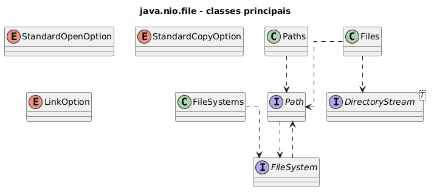

---

<!-- _class: compact -->

# java.nio.file: Path, Paths e Files

> Em `java.nio.file`, caminho, criação de caminhos e operações de arquivo são responsabilidades separadas.

<table class="tiny">
  <thead>
    <tr>
      <th>Elemento</th>
      <th>Papel</th>
      <th>Ideia principal</th>
    </tr>
  </thead>
  <tbody>
    <tr>
      <td><code>Path</code></td>
      <td>Interface</td>
      <td>Representa a localização de um recurso, permite combinar, normalizar e consultar partes do caminho; não lê nem escreve sozinho, pois as operações ficam em <code>Files</code>, que recebe um <code>Path</code>.</td>
    </tr>
    <tr>
      <td><code>Paths</code></td>
      <td>Classe utilitária</td>
      <td>Oferece <code>get(...)</code> para criar <code>Path</code>; aparece bastante em código escrito antes de <code>Path.of(...)</code>.</td>
    </tr>
    <tr>
      <td><code>Files</code></td>
      <td>Classe utilitária</td>
      <td>Concentra métodos estáticos que recebem <code>Path</code> e interagem com o sistema de arquivos.</td>
    </tr>
  </tbody>
</table>

---

<!-- _class: compact -->

# java.nio.file: Path

<div class="columns">
<div>

> `Path` representa o caminho de um arquivo ou diretório no sistema de arquivos.

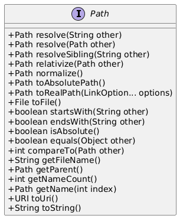

</div>
<div>

- **`resolve(...)`:** combina caminhos (ex.: `pasta.resolve("a.txt")`).
- **`of(...)`:** cria um `Path` a partir de uma ou mais partes de caminho.
- **`normalize()`:** remove `.` e `..` do caminho.
- **`toAbsolutePath()` / `toRealPath(...)`:** converte para caminho absoluto (e resolve links/normaliza).
- **`getFileName()` / `getParent()`:** navegação por partes do caminho.
- **`isAbsolute()` / `startsWith()` / `endsWith()`:** consultas sobre o formato do caminho.

</div>
</div>

---

<!-- _class: compact -->

# java.nio.file: Paths

<div class="columns">
<div>

> `Paths` fornece métodos utilitários para criar objetos `Path` a partir de strings ou URIs.

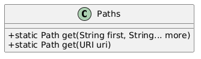

</div>
<div>

- **`get(String..., String...)`:** cria um `Path` a partir de partes de caminho.
- **`get(URI)`:** converte um `URI` em um `Path`.
- **`Path.of(...)`:** alternativa moderna preferida para criar caminhos em código novo.

</div>
</div>

---

<!-- _class: compact -->

# java.nio.file: Files

<div class="columns">
<div>

> `Files` concentra operações de alto nível sobre arquivos e diretórios usando `Path`.

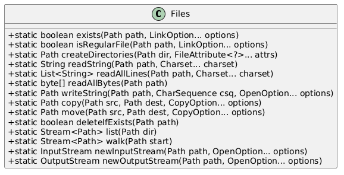

</div>
<div>

- **`exists(...)`:** verifica se o caminho existe.
- **`createDirectories(...)`:** cria diretórios, inclusive pais necessários.
- **`readString(...)`:** lê todo o conteúdo de um arquivo como `String`.
- **`writeString(...)`:** escreve texto em um arquivo.
- **`copy(...)` / `move(...)`:** copia ou move arquivos entre caminhos.
- **`deleteIfExists(...)`:** apaga o arquivo se ele existir.
- **`list(...)` / `walk(...)`:** percorre o conteúdo de diretórios.

</div>
</div>

---

<!-- _class: compact -->

# java.nio.file: Files.readAllLines

```java
Path path = Path.of("data", "alunos.csv");

try {
    List<String> linhas = Files.readAllLines(path, StandardCharsets.UTF_8);

    for (String linha : linhas) {
        System.out.println(linha);
    }
} catch (IOException e) {
    System.err.println("Erro de leitura: " + e.getMessage());
}
```

`Files.readAllLines` carrega todas as linhas em memória.

Use quando o arquivo for pequeno e você precisar acessar as linhas como uma lista.

---

<!-- _class: compact -->

# java.nio.file: Files.lines

```java
Path path = Path.of("data", "acessos.log");

try (Stream<String> linhas = Files.lines(path, StandardCharsets.UTF_8)) {
    long erros = linhas
        .filter(linha -> linha.contains("ERROR"))
        .count();

    System.out.println("Erros: " + erros);
} catch (IOException e) {
    System.err.println("Erro ao processar log: " + e.getMessage());
}
```

`Files.lines` devolve um `Stream<String>`, processa o conteúdo de forma mais gradual e precisa ser fechado.

---

<!-- _class: compact -->

# java.nio.file: Files.list

```java
Path dir = Path.of("data");

try {
    Files.createDirectories(dir);

    try (Stream<Path> arquivos = Files.list(dir)) {
        arquivos
            .filter(Files::isRegularFile)
            .forEach(System.out::println);
    }
} catch (IOException e) {
    System.err.println("Erro no diretorio: " + e.getMessage());
}
```

`Files.list` lista apenas o nível atual do diretório.

---

<!-- _class: compact -->

# java.nio.file: Files.walk

```java
Path raiz = Path.of("data");

try (Stream<Path> caminhos = Files.walk(raiz)) {
    caminhos
        .filter(Files::isRegularFile)
        .filter(path -> path.toString().endsWith(".csv"))
        .forEach(System.out::println);
} catch (IOException e) {
    System.err.println("Erro ao percorrer: " + e.getMessage());
}
```

`Files.walk` percorre recursivamente a árvore de diretórios.

---

<!-- _class: compact -->

# java.nio.file: Files.readAllBytes e Files.write

```java
Path origem = Path.of("imagens", "foto.png");
Path destino = Path.of("backup", "foto.png");

try {
    Files.createDirectories(destino.getParent());

    byte[] bytes = Files.readAllBytes(origem);
    Files.write(destino, bytes);
} catch (IOException e) {
    System.err.println("Erro ao copiar bytes: " + e.getMessage());
}
```

Para arquivos grandes, prefira copiar com `Files.copy` ou processar por streams e buffers.

---

<!-- _class: compact -->

# java.nio.file: exemplo

<div class="columns">
<div>

> A interface `Path` representa um caminho para arquivo ou diretório.

```java
Path pasta = Path.of("dados");
Path arquivo = pasta.resolve("mensagem.txt");

Path legado = Paths.get(
    "dados",
    "mensagem.txt"
);
```

- Em código novo, prefira `Path.of(...)`.
- `Paths.get(...)` pode ser mantido em código legado.

</div>
<div>

> A classe `Files` executa operações sobre arquivos e diretórios a partir de um `Path`.

```java
try {
    Files.createDirectories(pasta);

    Files.writeString(
        arquivo,
        "Ola, arquivo!\n"
    );

    String texto = Files.readString(legado);
    System.out.println(texto);
} catch (IOException e) {
    System.err.println(e.getMessage());
}
```

</div>
</div>

---

<!-- _class: practice -->
<!-- _paginate: false -->

# java.nio.file: demostração Path e Files

<iframe
  class="compiler-frame"
  src="https://onecompiler.com/embed/java/44rsv3zhn?hideTitle=false&hideLanguageSelection=false&hideNew=false&hideNewFileOption=false&hideStdin=false&hideResult=false&hideEditorOptions=false&availableLanguages=true&disableAutoComplete=true&theme=light&fontSize=20"
  title="OneCompiler Java"
  allow="clipboard-read; clipboard-write"
></iframe>

---

<!-- _class: practice -->
<!-- _paginate: false -->

# java.nio.file: atividade prática

<div
  data-onecompiler-challenge
  data-challenge-id="44rsv5qmr"
  data-challenge-slug="manipula-o-de-arquivos-java-nio-file-path-e-java-nio-file-files"
>
  <div class="challenge-login">
    <input data-onecompiler-user-token type="password" placeholder="Token do usuário">
    <button data-onecompiler-load type="button">Carregar challenge</button>
  </div>

  <iframe
    data-onecompiler-frame
    class="compiler-frame challenge-frame"
    frameborder="0"
    allowfullscreen
    allowFullScreen
    mozallowfullscreen="true"
    webkitallowfullscreen="true"
    title="OneCompiler Challenge"
  ></iframe>

  <div class="source">
    Desafio: <a data-onecompiler-source href=""></a>
  </div>
</div>

---

<!-- _class: compact -->

# java.nio.file: StandardOpenOption

<div class="columns">
<div>

> `StandardOpenOption` é um enum que diz como um arquivo deve ser aberto ou criado.

- `CREATE`: cria o arquivo se não existir
- `APPEND`: adiciona ao final do arquivo existente
- `TRUNCATE_EXISTING`: substitui o conteúdo ao abrir
- `READ` / `WRITE`: define o modo de acesso

</div>
<div>

```java
Path arquivo = Path.of("dados/mensagem.txt");
try {
    Files.writeString(
        arquivo,
        "Olá, arquivo!\n",
        StandardOpenOption.CREATE,
        StandardOpenOption.APPEND
    );
} catch (IOException e) {
    System.err.println(e.getMessage());
}
```

</div>
</div>

---

<!-- _class: compact -->

# java.nio.file: StandardCopyOption

<div class="columns">
<div>

> `StandardCopyOption` é um enum que controla o comportamento de cópia e movimentação de arquivos.

- `REPLACE_EXISTING`: substitui o destino se já existir
- `COPY_ATTRIBUTES`: preserva atributos do arquivo
- `ATOMIC_MOVE`: tenta mover de forma atômica

</div>
<div>

```java
Path origem = Path.of("dados/mensagem.txt");
Path destino = Path.of("backup/mensagem.txt");

Files.copy(
    origem,
    destino,
    StandardCopyOption.REPLACE_EXISTING
);
```

</div>
</div>

---

<!-- _class: practice -->
<!-- _paginate: false -->

# StandardOpenOption, StandardCopyOption: demo

<iframe
  class="compiler-frame"
  src="https://onecompiler.com/embed/java/44rsxc4bk?hideTitle=false&hideLanguageSelection=false&hideNew=false&hideNewFileOption=false&hideStdin=false&hideResult=false&hideEditorOptions=false&availableLanguages=true&disableAutoComplete=true&theme=light&fontSize=20"
  title="OneCompiler Java"
  allow="clipboard-read; clipboard-write"
></iframe>

---

<!-- _class: compact -->

# java.nio.charset: StandardCharsets

- `StandardCharsets` define encodings de caracteres padrão seguros e convenientemente acessíveis.
- Usar um `Charset` explícito garante que os bytes lidos ou escritos sejam traduzidos corretamente para caracteres.
  - `UTF_8`: codificação UTF-8, recomendada para leitura e escrita de texto.
  - `US_ASCII`: codificação ASCII de 7 bits.
  - `ISO_8859_1`: codificação Latin-1 para texto ocidental.

```java
Path path = Path.of("dados.txt");
String texto = Files.readString(path, StandardCharsets.UTF_8);
Files.writeString(path, texto, StandardCharsets.UTF_8);
```

> Em código novo, prefira informar explicitamente o `Charset`, especialmente quando o arquivo vem de outro sistema.

---

<!-- _class: practice -->
<!-- _paginate: false -->

# java.nio.charset.StandardCharsets: demostração

<iframe
  class="compiler-frame"
  src="https://onecompiler.com/embed/java/44rsycyf7?hideTitle=false&hideLanguageSelection=false&hideNew=false&hideNewFileOption=false&hideStdin=false&hideResult=false&hideEditorOptions=false&availableLanguages=true&disableAutoComplete=true&theme=light&fontSize=20"
  title="OneCompiler Java"
  allow="clipboard-read; clipboard-write"
></iframe>

---

# java.util.Scanner: do console para o arquivo

Em aulas anteriores, usamos `Scanner` para ler dados do console com `System.in`. A mesma classe também pode ler dados de um arquivo, quando recebe um `Path` como fonte de entrada.

<div class="columns">
<div>

```java
Scanner teclado = new Scanner(System.in);

System.out.print("Nome: ");
String nome = teclado.nextLine();
```

- Entrada vem do console
- Usuário digita os dados

</div>
<div>

```java
Path path = Path.of("alunos.txt");

try (Scanner scanner = new Scanner(path)) {
    while (scanner.hasNextLine()) {
        String linha = scanner.nextLine();
        System.out.println(linha);
    }
} catch (IOException e) {
    System.err.println(e.getMessage());
}
```

- Entrada vem do arquivo
- Programa percorre o conteúdo salvo

</div>
</div>

---

# java.util.Formatter: escrita formatada

`Formatter` formata texto com especificadores de formato antes de gravar em um arquivo.

```java
Path path = Path.of("data", "boletim.txt");

try (Formatter out =
         new Formatter(path, StandardCharsets.UTF_8)) {

    out.format("%-20s %5s%n", "Aluno", "Nota");
    out.format("%-20s %5.1f%n", "Ana", 9.5);
    out.format("%-20s %5.1f%n", "Bruno", 7.8);
} catch (IOException e) {
    System.err.println("Erro ao escrever boletim: " + e.getMessage());
}
```

`Formatter` usa a mesma ideia de formatação de `System.out.printf`.

---

<!-- _class: practice -->
<!-- _paginate: false -->

# java.util.Scanner e java.util.Formatter: demo

<iframe
  class="compiler-frame"
  src="https://onecompiler.com/embed/java/44rsywg3w?hideTitle=false&hideLanguageSelection=false&hideNew=false&hideNewFileOption=false&hideStdin=false&hideResult=false&hideEditorOptions=false&availableLanguages=true&disableAutoComplete=true&theme=light&fontSize=20"
  title="OneCompiler Java"
  allow="clipboard-read; clipboard-write"
></iframe>

---

<!-- _class: compact -->

# java.nio.file: FileSystems

<div class="columns">
<div>

> `FileSystems` fornece acesso ao sistema de arquivos padrão e permite criar ou carregar outros sistemas de arquivos.

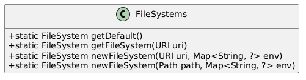

</div>
<div>

- **`getDefault()`:** retorna o `FileSystem` padrão do JRE.
- **`getFileSystem(URI)`:** obtém um `FileSystem` a partir de um URI.
- **`newFileSystem(URI, Map<String,?>)`:** cria um sistema de arquivos especial, como ZIP.
- **`newFileSystem(Path, Map<String,?>)`:** abre um sistema de arquivos para um arquivo de contêiner.

</div>
</div>

---

<!-- _class: compact -->

# java.nio.file: FileSystem

<div class="columns">
<div>

> `FileSystem` representa um sistema de arquivos e expõe caminhos, raízes e o provedor subjacente.

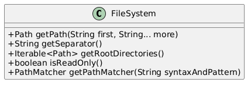

</div>
<div>

- **`getPath(String, String...)`:** cria um `Path` dentro deste sistema de arquivos.
- **`getSeparator()`:** retorna o separador de caminhos usado pelo sistema.
- **`getRootDirectories()`:** lista as raízes disponíveis.
- **`isReadOnly()`:** indica se o sistema é somente leitura.

</div>
</div>

---

<!-- _class: compact -->

# java.nio.file: FileSystems e FileSystem

> `FileSystems` dá acesso ao sistema de arquivos atual; `FileSystem` expõe características dele e ajuda a criar caminhos.

```java
FileSystem fs = FileSystems.getDefault();

System.out.println(
    "Separador: " + fs.getSeparator()
);

for (Path raiz : fs.getRootDirectories()) {
    System.out.println("Raiz: " + raiz);
}

Path pasta = fs.getPath("docs");
```

---

<!-- _class: practice -->
<!-- _paginate: false -->

# FileSystems e FileSystem: demostração

<iframe
  class="compiler-frame"
  src="https://onecompiler.com/embed/java/44rt338pv?hideTitle=false&hideLanguageSelection=false&hideNew=false&hideNewFileOption=false&hideStdin=false&hideResult=false&hideEditorOptions=false&availableLanguages=true&disableAutoComplete=true&theme=light&fontSize=20"
  title="OneCompiler Java"
  allow="clipboard-read; clipboard-write"
></iframe>

---

<!-- _class: compact -->

# java.nio.file: DirectoryStream

<div class="columns">
<div>

> `DirectoryStream` permite percorrer o conteúdo de um diretório de forma eficiente e com baixo uso de memória.

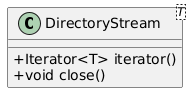

</div>
<div>

- **`Files.newDirectoryStream(Path)`:** abre um stream para listar entradas de diretório.
- **`iterator()`:** percorre os caminhos retornados.
- **`close()`:** fecha o stream e libera recursos.
- **`Files.newDirectoryStream(Path, String)`:** filtra nomes usando padrões simples.

</div>
</div>

---

<!-- _class: compact -->

# java.nio.file: DirectoryStream (exemplo)

> `DirectoryStream` percorre as entradas de um diretório com uso controlado de recursos.

```java
try (
    DirectoryStream<Path> stream =
        Files.newDirectoryStream(pasta)
) {
    for (Path item : stream) {
        System.out.println(
            item.getFileName()
        );
    }
}
```

- O `try-with-resources` garante o fechamento do stream.

---

<!-- _class: compact -->

# java.nio.file: resumo

<table class="tiny">
  <thead>
    <tr>
      <th>Classe/interface</th>
      <th>Métodos e usos principais</th>
    </tr>
  </thead>
  <tbody>
    <tr>
      <td><code>Path</code></td>
      <td><code>of</code>, <code>resolve</code>, <code>normalize</code>, <code>toAbsolutePath</code>, <code>getFileName</code>, <code>getParent</code>.</td>
    </tr>
    <tr>
      <td><code>Paths</code></td>
      <td><code>get</code>. Fábrica legada/conveniente para criar <code>Path</code>; aparece muito em código anterior a <code>Path.of</code>.</td>
    </tr>
    <tr>
      <td><code>Files</code></td>
      <td><code>exists</code>, <code>isRegularFile</code>, <code>createDirectories</code>, <code>readString</code>, <code>readAllLines</code>, <code>writeString</code>, <code>copy</code>, <code>move</code>, <code>deleteIfExists</code>, <code>list</code>, <code>walk</code>.</td>
    </tr>
    <tr>
      <td><code>StandardOpenOption</code></td>
      <td><code>CREATE</code>, <code>CREATE_NEW</code>, <code>APPEND</code>, <code>TRUNCATE_EXISTING</code>, <code>READ</code>, <code>WRITE</code>.</td>
    </tr>
    <tr>
      <td><code>StandardCopyOption</code></td>
      <td><code>REPLACE_EXISTING</code>, <code>COPY_ATTRIBUTES</code>, <code>ATOMIC_MOVE</code>.</td>
    </tr>
    <tr>
      <td><code>StandardCharsets</code></td>
      <td><code>UTF_8</code>, <code>US_ASCII</code>, <code>ISO_8859_1</code>. Define codificações padrão para converter bytes e caracteres.</td>
    </tr>
    <tr>
      <td><code>Scanner</code></td>
      <td><code>nextLine</code>, <code>next</code>, <code>nextDouble</code>, <code>hasNext</code>, <code>useDelimiter</code>. Leitura de dados do console ou de arquivos.</td>
    </tr>
    <tr>
      <td><code>Formatter</code></td>
      <td><code>format</code>. Escrita formatada de texto em arquivo usando especificadores semelhantes ao <code>printf</code>.</td>
    </tr>
    <tr>
      <td><code>FileSystems</code></td>
      <td><code>getDefault</code>, <code>getFileSystem</code>, <code>newFileSystem</code>. Acesso a sistemas de arquivos locais ou especiais.</td>
    </tr>
    <tr>
      <td><code>FileSystem</code></td>
      <td><code>getPath</code>, <code>getSeparator</code>, <code>getRootDirectories</code>, <code>isReadOnly</code>, <code>provider</code>.</td>
    </tr>
    <tr>
      <td><code>DirectoryStream</code></td>
      <td><code>iterator</code>, <code>close</code>. Usado com <code>Files.newDirectoryStream</code> para percorrer diretórios.</td>
    </tr>
  </tbody>
</table>

---

# java.nio.file: fluxo de trabalho

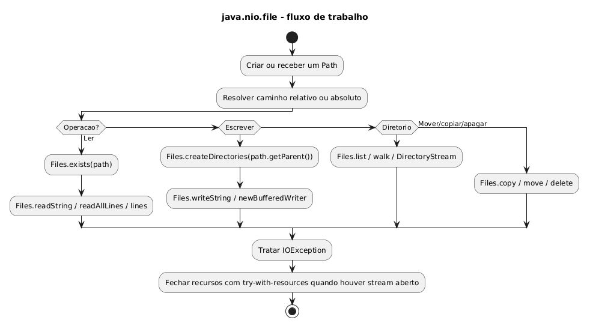

---

<!-- _class: practice -->
<!-- _paginate: false -->

# java.nio.file: demonstração

<iframe
  class="compiler-frame"
  src="https://onecompiler.com/embed/java/44qtqw3s9?hideTitle=false&hideLanguageSelection=false&hideNew=false&hideNewFileOption=false&hideStdin=false&hideResult=false&hideEditorOptions=false&availableLanguages=true&disableAutoComplete=true&theme=light&fontSize=20"
  title="OneCompiler Java"
  allow="clipboard-read; clipboard-write"
></iframe>

---

<!-- _class: compact -->

# java.io: visão geral

> `java.io` é a API clássica do Java para entrada e saída de dados, organizada em classes que leem e escrevem bytes, caracteres, arquivos e objetos serializados.

**Famílias principais**

- `File`: representa um caminho abstrato de arquivo ou diretório
- `Reader` / `Writer`: leitura e escrita de caracteres
- `FileReader` / `FileWriter`: leitura e escrita de caracteres em arquivos
- `BufferedReader` / `BufferedWriter`: leitura e escrita textual com buffer
- `InputStream` / `OutputStream`: leitura e escrita de bytes
- `ObjectInputStream` / `ObjectOutputStream`: serialização binária de objetos
- `IOException`: erro comum em operações de entrada e saída

---

# java.io: famílias de streams

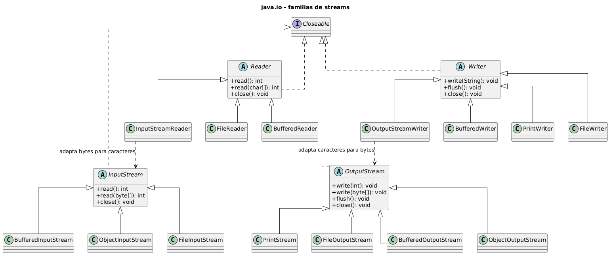

---

<!-- _class: compact -->

# java.io: File

<div class="columns">
<div>

> `File` representa um caminho abstrato para arquivo ou diretório.

Principais métodos:

- `exists()`: verifica se existe
- `isFile()`: verifica se é arquivo
- `isDirectory()`: verifica se é diretório
- `getName()`: retorna o nome
- `getAbsolutePath()`: retorna caminho absoluto
- `length()`: retorna tamanho em bytes
- `toPath()`: converte para `Path`

</div>
<div>

```java
File file = new File("data/entrada.txt");

System.out.println(file.exists());
System.out.println(file.isFile());
System.out.println(file.getName());
System.out.println(file.getAbsolutePath());
System.out.println(file.length());

Path path = file.toPath();
```

<div class="callout">

Em código novo, prefira `Path` e `Files`; use `File` principalmente para entender ou manter código legado.

</div>

</div>
</div>

---

<!-- _class: compact -->

# java.io.File vs. java.nio.file.Path

> Essa comparação ajuda a entender por que `Path` e `Files` são a escolha preferida em código novo, enquanto `File` aparece principalmente em código legado.

<table class="tiny">
  <thead>
    <tr>
      <th>Critério</th>
      <th>java.io.File</th>
      <th>java.nio.file.Path</th>
    </tr>
  </thead>
  <tbody>
    <tr>
      <td>API</td>
      <td>Clássica, anterior ao NIO.2.</td>
      <td>Moderna, integrada a <code>Files</code>.</td>
    </tr>
    <tr>
      <td>Operações</td>
      <td>Métodos no próprio objeto.</td>
      <td>Caminho separado das operações.</td>
    </tr>
    <tr>
      <td>Erro</td>
      <td>Muitos métodos retornam <code>false</code>.</td>
      <td>Operações costumam lançar exceções mais informativas.</td>
    </tr>
    <tr>
      <td>Uso recomendado</td>
      <td>Manutenção de código legado.</td>
      <td>Código novo.</td>
    </tr>
  </tbody>
</table>

---

# java.io: Writer

<div class="columns">
<div>

> `Writer` é a base para escrever caracteres em Java.

Principais subclasses para saída de texto:

- em arquivos: `FileWriter`
- com buffer: `BufferedWriter`
- adaptando caracteres para bytes: `OutputStreamWriter`

</div>
<div>

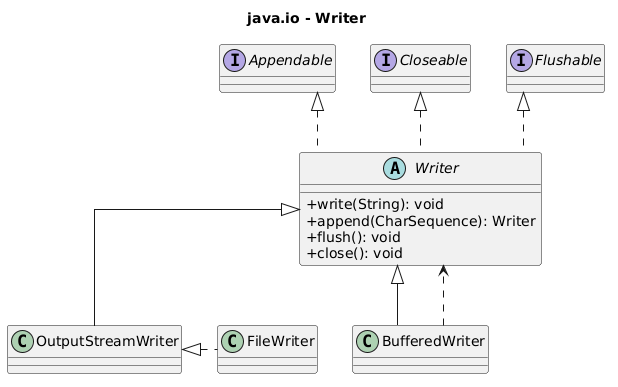

</div>
</div>

---

<!-- _class: compact -->

# java.io: FileWriter

<div class="columns">
<div>

> `FileWriter` escreve caracteres diretamente em um arquivo.

Principais métodos herdados de `Writer`:

- `write(String)`: escreve texto
- `write(char[])`: escreve caracteres
- `append(CharSequence)`: acrescenta texto
- `flush()`: força a saída pendente
- `close()`: fecha o recurso

Use quando a escrita é simples e não exige controle fino de charset.

</div>
<div>

```java
try (FileWriter writer =
         new FileWriter("mensagem.txt")) {

    writer.write("Primeira linha\n");
    writer.write("Segunda linha\n");
    writer.append("Fim\n");
} catch (IOException e) {
    System.err.println(
        "Erro: " + e.getMessage()
    );
}
```

</div>
</div>

---

<!-- _class: compact -->

# java.io: BufferedWriter

<div class="columns">
<div>

> `BufferedWriter` envolve outro `Writer` e usa buffer para tornar a escrita textual mais eficiente.

Principais métodos:

- `write(String)`: escreve texto
- `newLine()`: escreve quebra de linha
- `flush()`: descarrega o buffer
- `close()`: fecha o recurso

Use quando houver muitas escritas pequenas ou escrita linha a linha.

</div>
<div>

```java
try (BufferedWriter writer =
         new BufferedWriter(
             new FileWriter("log.txt"))) {

    writer.write("Aplicacao iniciada");
    writer.newLine();

    writer.write("Usuario: Ana");
    writer.newLine();
} catch (IOException e) {
    System.err.println(
        "Erro: " + e.getMessage()
    );
}
```

</div>
</div>

---

# java.io: Reader

<div class="columns">
<div>

> `Reader` é a base para ler caracteres em Java.

Principais subclasses para entrada de texto:

- de arquivos: `FileReader`
- com buffer: `BufferedReader`
- adaptando bytes para caracteres: `InputStreamReader`

</div>
<div>

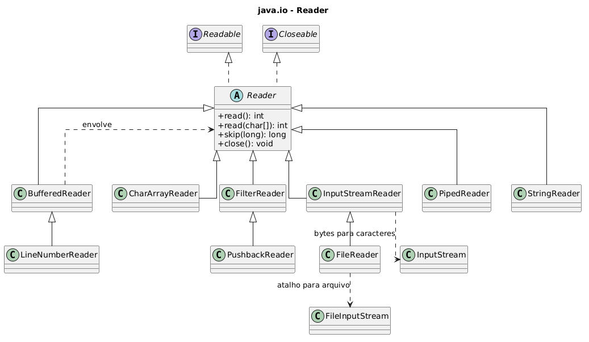

</div>
</div>

---

<!-- _class: compact -->

# java.io: FileReader

<div class="columns">
<div>

> `FileReader` lê caracteres diretamente de um arquivo.

Principais métodos herdados de `Reader`:

- `read()`: lê um caractere
- `read(char[])`: lê vários caracteres
- `skip(long)`: pula caracteres
- `close()`: fecha o recurso

Use quando a leitura é simples e não precisa ser linha a linha.

</div>
<div>

```java
try (FileReader reader =
         new FileReader("mensagem.txt")) {

    int caractere;

    while ((caractere = reader.read()) != -1) {
        System.out.print((char) caractere);
    }
} catch (IOException e) {
    System.err.println(
        "Erro: " + e.getMessage()
    );
}
```

</div>
</div>

---

<!-- _class: compact -->

# java.io: BufferedReader

<div class="columns">
<div>

> `BufferedReader` envolve outro `Reader` e usa buffer para tornar a leitura textual mais eficiente.

Principais métodos:

- `readLine()`: lê uma linha
- `read()`: lê um caractere
- `lines()`: retorna um `Stream<String>`
- `close()`: fecha o recurso

Use quando quiser ler texto linha a linha.

</div>
<div>

```java
try (BufferedReader reader =
         new BufferedReader(
             new FileReader("mensagem.txt"))) {

    String linha;

    while ((linha = reader.readLine()) != null) {
        System.out.println(linha);
    }
} catch (IOException e) {
    System.err.println(
        "Erro: " + e.getMessage()
    );
}
```

</div>
</div>

---

<!-- _class: compact -->

# java.io: BufferedReader e BufferedWriter

> Exemplo de leitura linha a linha com escrita do resultado em outro arquivo.

```java
try (
    BufferedReader reader =
        Files.newBufferedReader(Path.of("data", "entrada.txt"), StandardCharsets.UTF_8);
    BufferedWriter writer =
        Files.newBufferedWriter(Path.of("data", "saida.txt"), StandardCharsets.UTF_8)
) {
    String linha;

    while ((linha = reader.readLine()) != null) {
        writer.write(linha.toUpperCase());
        writer.newLine();
    }
} catch (IOException e) {
    System.err.println("Erro: " + e.getMessage());
}
```

Boa escolha para processamento linha a linha.

---

<!-- _class: practice -->
<!-- _paginate: false -->

# java.io: Reader e Writer

<iframe
  class="compiler-frame"
  src="https://onecompiler.com/embed/java/44r5h796b?hideTitle=false&hideLanguageSelection=false&hideNew=false&hideNewFileOption=false&hideStdin=false&hideResult=false&hideEditorOptions=false&availableLanguages=true&disableAutoComplete=true&theme=light&fontSize=20"
  title="OneCompiler Java"
  allow="clipboard-read; clipboard-write"
></iframe>

---

<!-- _class: compact -->

# java.io: OutputStream

<div class="columns">
<div>

> `OutputStream` é a base para escrever bytes em Java.

Principais subclasses para saída de dados:

- em arquivos: `FileOutputStream`
- com buffer: `BufferedOutputStream`
- com tipos primitivos: `DataOutputStream`
- com objetos serializados: `ObjectOutputStream`

</div>
<div>

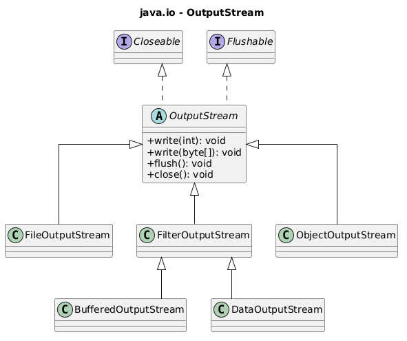

</div>
</div>

---

<!-- _class: compact -->

# java.io: InputStream

<div class="columns">
<div>

> `InputStream` é a base para ler bytes em Java.

Principais subclasses para entrada de dados:

- de arquivos: `FileInputStream`
- com buffer: `BufferedInputStream`
- com tipos primitivos: `DataInputStream`
- com objetos serializados: `ObjectInputStream`

</div>
<div>

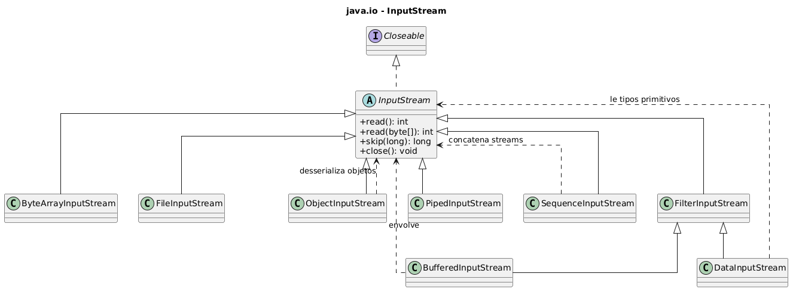

</div>
</div>

---

<!-- _class: practice -->
<!-- _paginate: false -->

# java.io: InputStream e OutputStream

<iframe
  class="compiler-frame"
  src="https://onecompiler.com/embed/java/44r7ndarr?hideTitle=false&hideLanguageSelection=false&hideNew=false&hideNewFileOption=false&hideStdin=false&hideResult=false&hideEditorOptions=false&availableLanguages=true&disableAutoComplete=true&theme=light&fontSize=20"
  title="OneCompiler Java"
  allow="clipboard-read; clipboard-write"
></iframe>

---

# Serialização de objetos: visão geral

> Serializar é gravar o estado de um objeto em um fluxo de dados (**stream**).

- A serialização transforma um objeto Java em uma sequência de bytes.
- A desserialização reconstrói o objeto a partir desses bytes.
- A classe do objeto precisa implementar `Serializable`.
- A escrita usa `ObjectOutputStream`; a leitura usa `ObjectInputStream`.
- É adequada para cenários internos e controlados, não para troca pública entre sistemas.
- Para integração entre sistemas, prefira formatos abertos e interoperáveis como CSV, JSON, XML ou banco de dados.

---

<!-- _class: practice -->
<!-- _paginate: false -->

# Serialização de objetos: demonstração

<iframe
  class="compiler-frame"
  src="https://onecompiler.com/embed/java/44r7r2emj?hideTitle=false&hideLanguageSelection=false&hideNew=false&hideNewFileOption=false&hideStdin=false&hideResult=false&hideEditorOptions=false&availableLanguages=true&disableAutoComplete=true&theme=light&fontSize=20"
  title="OneCompiler Java"
  allow="clipboard-read; clipboard-write"
></iframe>

---

# Exceções comuns em I/O

> Em I/O, erros fazem parte do fluxo: arquivos podem não existir, estar protegidos ou ter conteúdo inesperado.

<table class="tiny">
  <thead>
    <tr>
      <th>Exceção</th>
      <th>Situação comum</th>
    </tr>
  </thead>
  <tbody>
    <tr>
      <td><code>NoSuchFileException</code></td>
      <td>O arquivo informado não existe.</td>
    </tr>
    <tr>
      <td><code>AccessDeniedException</code></td>
      <td>O programa não tem permissão de leitura, escrita ou remoção.</td>
    </tr>
    <tr>
      <td><code>FileAlreadyExistsException</code></td>
      <td>Uma criação com <code>CREATE_NEW</code> encontrou arquivo existente.</td>
    </tr>
    <tr>
      <td><code>DirectoryNotEmptyException</code></td>
      <td>Tentativa de apagar diretório com conteúdo.</td>
    </tr>
    <tr>
      <td><code>MalformedInputException</code></td>
      <td>Bytes do arquivo não combinam com o charset usado para leitura.</td>
    </tr>
    <tr>
      <td><code>InputMismatchException</code></td>
      <td><code>Scanner</code> encontrou token incompatível com o tipo esperado.</td>
    </tr>
  </tbody>
</table>

---

# try-with-resources

Recursos de I/O precisam ser fechados.

```java
try (BufferedReader reader = Files.newBufferedReader(path)) {
    String linha = reader.readLine();
    System.out.println(linha);
} catch (IOException e) {
    System.err.println("Erro ao ler arquivo: " + e.getMessage());
}
```

O `try-with-resources` fecha automaticamente objetos que implementam `AutoCloseable`, incluindo muitos objetos de `java.io` e `java.nio`.

---

# try-with-resources: ciclo de vida de um recurso

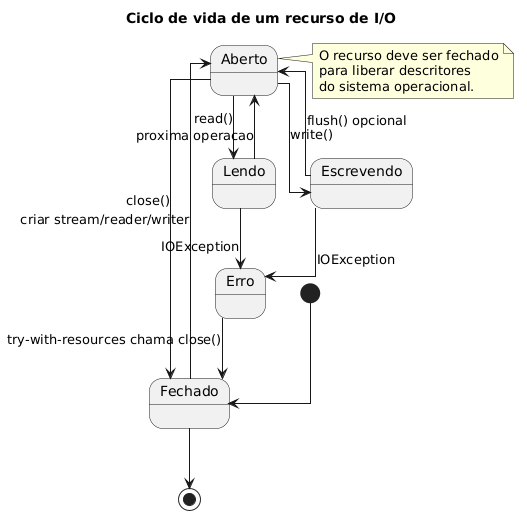

---

# Boas práticas

- Prefira `Path` e `Files` em código novo
- Use `try-with-resources` para fechar recursos
- Informe `Charset` ao ler ou escrever texto
- Use `readString` e `readAllLines` apenas para arquivos pequenos
- Use `BufferedReader`, `Files.lines` ou streams para arquivos grandes
- Crie diretórios antes de escrever em caminhos novos
- Evite sobrescrever arquivos importantes sem intenção
- Separe parsing de dados da lógica de I/O
- Valide formato, permissões e existência do arquivo

---

# Critérios de escolha: caminhos e leitura

<table class="tiny">
  <thead>
    <tr>
      <th>Situação</th>
      <th>Escolha recomendada</th>
      <th>Quando faz sentido</th>
    </tr>
  </thead>
  <tbody>
    <tr>
      <td>Representar caminho de arquivo ou diretório</td>
      <td><code>Path.of</code></td>
      <td>Criação moderna e direta de caminhos em código novo.</td>
    </tr>
    <tr>
      <td>Criar, ler, escrever, copiar ou apagar arquivo</td>
      <td><code>Files</code></td>
      <td>API principal para operações de alto nível com <code>Path</code>.</td>
    </tr>
    <tr>
      <td>Ler texto pequeno inteiro</td>
      <td><code>Files.readString</code></td>
      <td>Quando o conteúdo cabe em memória e você quer simplicidade.</td>
    </tr>
    <tr>
      <td>Ler arquivo pequeno linha a linha como lista</td>
      <td><code>Files.readAllLines</code></td>
      <td>Quando você precisa de uma <code>List&lt;String&gt;</code>.</td>
    </tr>
    <tr>
      <td>Processar arquivo textual grande</td>
      <td><code>Files.lines</code> ou <code>BufferedReader</code></td>
      <td>Processamento incremental, sem carregar tudo em memória.</td>
    </tr>
    <tr>
      <td>Ler tokens ou dados simples de texto</td>
      <td><code>Scanner</code></td>
      <td>Útil para console, arquivos simples e parsing básico.</td>
    </tr>
  </tbody>
</table>

---

<!-- _class: compact -->

# Critérios de escolha: escrita e formatação

<table class="tiny">
  <thead>
    <tr>
      <th>Situação</th>
      <th>Escolha recomendada</th>
      <th>Quando faz sentido</th>
    </tr>
  </thead>
  <tbody>
    <tr>
      <td>Escrever texto simples rapidamente</td>
      <td><code>Files.writeString</code> ou <code>FileWriter</code></td>
      <td>Boa escolha para saídas pequenas e diretas.</td>
    </tr>
    <tr>
      <td>Escrever texto linha a linha</td>
      <td><code>BufferedWriter</code></td>
      <td>Mais adequado para muitas escritas pequenas ou em loop.</td>
    </tr>
    <tr>
      <td>Gerar saída formatada</td>
      <td><code>Formatter</code></td>
      <td>Quando o arquivo segue colunas, alinhamento ou máscaras de formato.</td>
    </tr>
    <tr>
      <td>Acrescentar conteúdo ao final de um arquivo</td>
      <td><code>Files.writeString</code> com <code>StandardOpenOption.APPEND</code></td>
      <td>Quando você quer preservar o conteúdo existente e adicionar novas linhas.</td>
    </tr>
    <tr>
      <td>Copiar ou mover arquivos</td>
      <td><code>Files.copy</code> / <code>Files.move</code></td>
      <td>Operações prontas e mais claras que ler e gravar manualmente.</td>
    </tr>
    <tr>
      <td>Controlar codificação de texto</td>
      <td><code>StandardCharsets.UTF_8</code></td>
      <td>Evita ambiguidade na conversão entre bytes e caracteres.</td>
    </tr>
  </tbody>
</table>

---

<!-- _class: compact -->

# Critérios de escolha: objetos, opções e recursos

<table class="tiny">
  <thead>
    <tr>
      <th>Situação</th>
      <th>Escolha recomendada</th>
      <th>Quando faz sentido</th>
    </tr>
  </thead>
  <tbody>
    <tr>
      <td>Serializar objetos Java</td>
      <td><code>ObjectOutputStream</code> / <code>ObjectInputStream</code></td>
      <td>Quando você precisa gravar e reconstruir o estado de objetos em formato binário.</td>
    </tr>
    <tr>
      <td>Escolher como abrir um arquivo</td>
      <td><code>StandardOpenOption</code></td>
      <td>Quando a operação depende de criar, truncar, acrescentar ou abrir para leitura/escrita.</td>
    </tr>
    <tr>
      <td>Controlar comportamento de cópia ou movimentação</td>
      <td><code>StandardCopyOption</code></td>
      <td>Quando você precisa substituir destino, preservar atributos ou tentar movimento atômico.</td>
    </tr>
    <tr>
      <td>Fechar recursos automaticamente</td>
      <td><code>try-with-resources</code></td>
      <td>Use sempre que trabalhar com streams, readers, writers, scanners e outros recursos de I/O.</td>
    </tr>
  </tbody>
</table>

---

<!-- _class: compact -->

# Critérios de escolha: diretórios, binários e legado

<table class="tiny">
  <thead>
    <tr>
      <th>Situação</th>
      <th>Escolha recomendada</th>
      <th>Quando faz sentido</th>
    </tr>
  </thead>
  <tbody>
    <tr>
      <td>Percorrer diretório atual</td>
      <td><code>Files.list</code> ou <code>DirectoryStream</code></td>
      <td><code>list</code> integra com streams; <code>DirectoryStream</code> é simples e controlado.</td>
    </tr>
    <tr>
      <td>Percorrer árvore de diretórios</td>
      <td><code>Files.walk</code></td>
      <td>Quando é preciso visitar subdiretórios recursivamente.</td>
    </tr>
    <tr>
      <td>Trabalhar com dados binários</td>
      <td><code>InputStream</code>, <code>OutputStream</code>, <code>Files.readAllBytes</code></td>
      <td>Preserva bytes sem interpretar o conteúdo como texto.</td>
    </tr>
    <tr>
      <td>Lidar com código legado</td>
      <td><code>File</code>, <code>FileReader</code>, <code>FileWriter</code></td>
      <td>Importante para manutenção, mas prefira <code>Path</code> e <code>Files</code> em código novo.</td>
    </tr>
  </tbody>
</table>

---

# Referências

- Oracle Java Tutorial: Basic I/O
  - https://docs.oracle.com/javase/tutorial/essential/io/
- Oracle Java Tutorial: File I/O com NIO.2
  - https://docs.oracle.com/javase/tutorial/essential/io/fileio.html
- Oracle Java Tutorial: try-with-resources
  - https://docs.oracle.com/javase/tutorial/essential/exceptions/tryResourceClose.html
- Java SE API: `java.io`
  - https://docs.oracle.com/en/java/javase/21/docs/api/java.base/java/io/package-summary.html
- Java SE API: `java.nio.file`
  - https://docs.oracle.com/en/java/javase/21/docs/api/java.base/java/nio/file/package-summary.html

<script src="../scripts/onecompiler-challenge.js"></script>
