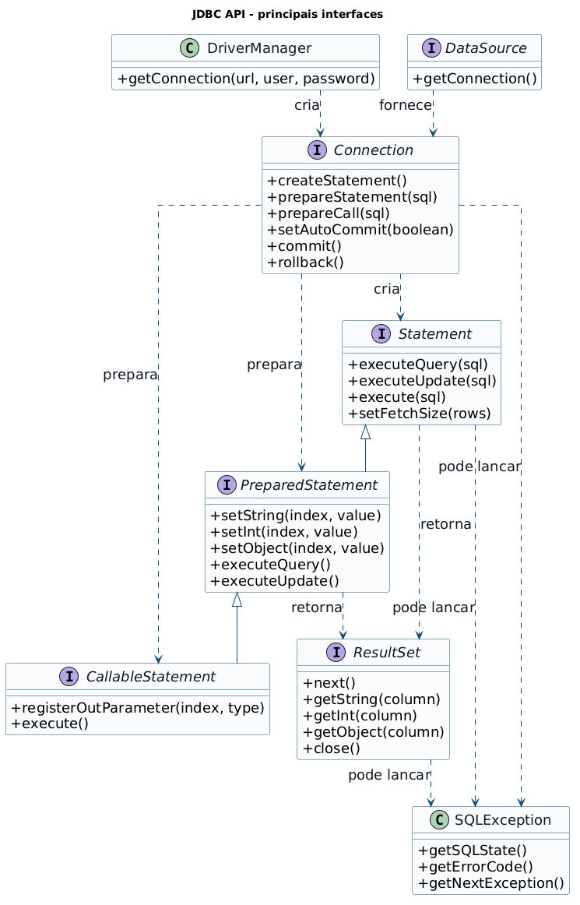
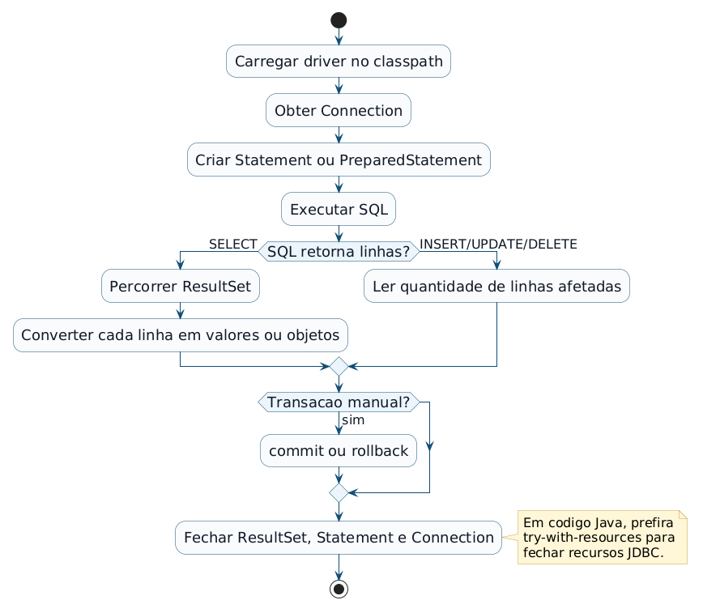
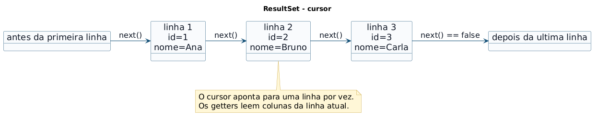
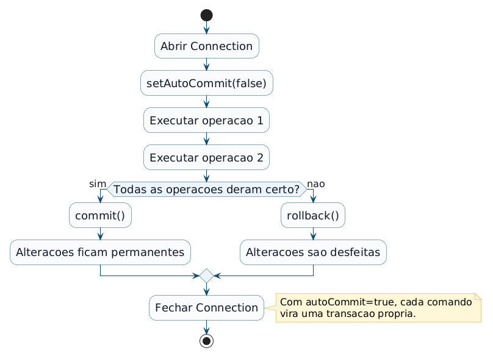
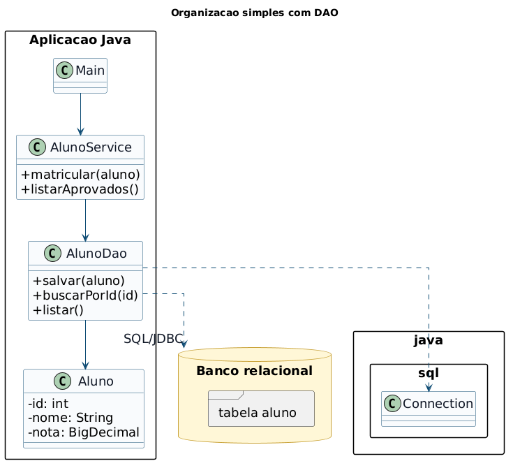

<!-- _class: title -->
<!-- _paginate: false -->

## Programação Orientada a Objetos

# Acesso a banco de dados com JDBC

<div class="objectives">

**Objetivos da aula**

- Revisar conceitos essenciais de bancos relacionais e SQL
- Compreender o papel da API JDBC em aplicações Java
- Conectar uma aplicação Java a um banco usando `DriverManager`
- Executar `SELECT`, `INSERT`, `UPDATE` e `DELETE`
- Usar `PreparedStatement`, `ResultSet` e `SQLException`
- Controlar transações com `commit` e `rollback`
- Organizar acesso a dados com uma camada DAO simples

</div>

<div class="contact">
Prof. Fabricio Santana<br>
fabricio.santana@idp.edu.br<br>
www.linkedin.com/in/fabriciofsantana/
</div>

---

# Por que banco de dados?

- Variáveis, objetos, arrays e coleções ficam em memória
  - ao encerrar o programa, esses dados desaparecem
- Arquivos permitem persistência, mas têm limites importantes
  - concorrência difícil
  - busca e filtro manuais
  - integridade depende do código da aplicação
  - relatórios e cruzamentos ficam trabalhosos
- Bancos de dados oferecem persistência com estrutura, consulta, segurança, transações e controle de acesso

---

# Banco de dados: o que é?

> Banco de dados é uma coleção organizada de dados relacionados, mantida para permitir armazenamento, recuperação, alteração e controle desses dados.

<div class="callout">

**Ideia central**

Em vez de salvar apenas bytes ou linhas de texto, a aplicação conversa com um sistema especializado em armazenar dados, validar regras e responder consultas.

</div>

---

# SGBD: o que é?

**SGBD** significa Sistema de Gerenciamento de Banco de Dados.

Em inglês, aparece como **DBMS**: _Database Management System_.

**Responsabilidades comuns**

- armazenar dados em estruturas persistentes
- controlar acesso de vários usuários
- aplicar restrições de integridade
- recuperar dados com linguagem de consulta
- controlar transações e concorrência
- oferecer mecanismos de backup, auditoria e segurança

---

# Bancos relacionais

Em bancos relacionais, os dados são organizados em tabelas.

<table class="tiny">
  <thead>
    <tr>
      <th>Conceito</th>
      <th>Descrição</th>
      <th>Exemplo</th>
    </tr>
  </thead>
  <tbody>
    <tr>
      <td>Tabela</td>
      <td>Conjunto de linhas com a mesma estrutura.</td>
      <td><code>aluno</code>, <code>curso</code>, <code>matricula</code></td>
    </tr>
    <tr>
      <td>Coluna</td>
      <td>Atributo tipado da tabela.</td>
      <td><code>nome VARCHAR</code>, <code>nota NUMERIC</code></td>
    </tr>
    <tr>
      <td>Linha</td>
      <td>Registro com valores para as colunas.</td>
      <td>Um aluno específico.</td>
    </tr>
    <tr>
      <td>Chave primária</td>
      <td>Identifica uma linha de forma única.</td>
      <td><code>id</code></td>
    </tr>
    <tr>
      <td>Chave estrangeira</td>
      <td>Relaciona uma linha a outra tabela.</td>
      <td><code>curso_id</code></td>
    </tr>
  </tbody>
</table>

---

# SQL: linguagem do banco relacional

**SQL** significa _Structured Query Language_.

Ela permite descrever o que queremos consultar ou alterar no banco.

<table class="tiny">
  <thead>
    <tr>
      <th>Categoria</th>
      <th>Comandos comuns</th>
      <th>Uso</th>
    </tr>
  </thead>
  <tbody>
    <tr>
      <td>DQL / consulta</td>
      <td><code>SELECT</code></td>
      <td>Recuperar dados.</td>
    </tr>
    <tr>
      <td>DML</td>
      <td><code>INSERT</code>, <code>UPDATE</code>, <code>DELETE</code></td>
      <td>Manipular registros.</td>
    </tr>
    <tr>
      <td>DDL</td>
      <td><code>CREATE TABLE</code>, <code>ALTER TABLE</code>, <code>DROP</code></td>
      <td>Definir estrutura.</td>
    </tr>
    <tr>
      <td>TCL</td>
      <td><code>COMMIT</code>, <code>ROLLBACK</code>, <code>SAVEPOINT</code></td>
      <td>Controlar transações.</td>
    </tr>
  </tbody>
</table>

---

# CRUD: do Java para o SQL

Operações comuns de uma aplicação aparecem como comandos SQL.

<table class="tiny">
  <thead>
    <tr>
      <th>Operação</th>
      <th>Significado</th>
      <th>SQL comum</th>
      <th>Exemplo de método Java</th>
    </tr>
  </thead>
  <tbody>
    <tr>
      <td>Create</td>
      <td>Criar registro</td>
      <td><code>INSERT</code></td>
      <td><code>salvar(aluno)</code></td>
    </tr>
    <tr>
      <td>Read</td>
      <td>Ler registros</td>
      <td><code>SELECT</code></td>
      <td><code>buscarPorId(id)</code></td>
    </tr>
    <tr>
      <td>Update</td>
      <td>Atualizar registro</td>
      <td><code>UPDATE</code></td>
      <td><code>atualizar(aluno)</code></td>
    </tr>
    <tr>
      <td>Delete</td>
      <td>Excluir registro</td>
      <td><code>DELETE</code></td>
      <td><code>remover(id)</code></td>
    </tr>
  </tbody>
</table>

---

<!-- _class: compact -->

# SQL: exemplo de consulta

```sql
SELECT a.id, a.nome, a.email, a.nota
FROM aluno a
WHERE a.nota >= 7.0
ORDER BY a.nome;
```

**Leitura da consulta**

- `SELECT`: quais colunas retornar
- `FROM`: de qual tabela os dados vêm
- `WHERE`: filtro aplicado às linhas
- `ORDER BY`: ordenação do resultado

> O JDBC não substitui SQL. Ele permite que uma aplicação Java envie SQL ao banco e processe a resposta.

---

# JDBC: o que é?

**JDBC** significa _Java Database Connectivity_.

> JDBC é a API padrão do Java para conectar aplicações a bancos de dados relacionais, executar comandos SQL e processar resultados.

**Papel do JDBC**

- padronizar o código Java de acesso a dados
- esconder parte das diferenças entre fornecedores de banco
- permitir que drivers específicos façam a comunicação real com o SGBD

---

# JDBC: onde fica?

A API principal está no pacote `java.sql`.

Funcionalidades complementares aparecem em `javax.sql`.

<table class="tiny">
  <thead>
    <tr>
      <th>Pacote</th>
      <th>Papel</th>
    </tr>
  </thead>
  <tbody>
    <tr>
      <td><code>java.sql</code></td>
      <td>Interfaces e classes centrais: <code>Connection</code>, <code>Statement</code>, <code>PreparedStatement</code>, <code>ResultSet</code>, <code>SQLException</code>.</td>
    </tr>
    <tr>
      <td><code>javax.sql</code></td>
      <td>Recursos mais avançados, como <code>DataSource</code>, pool de conexões e <code>RowSet</code>.</td>
    </tr>
  </tbody>
</table>

---

# Driver JDBC

> Driver JDBC é uma biblioteca que implementa a comunicação entre a API JDBC e um banco específico.

**Exemplos**

- PostgreSQL: driver PostgreSQL JDBC
- MySQL: MySQL Connector/J
- Oracle: Oracle JDBC Driver
- SQL Server: Microsoft JDBC Driver
- H2 ou SQLite: drivers úteis para estudo, testes e aplicações pequenas

<div class="callout">

**Regra prática**

O código usa as interfaces do JDBC; o driver traduz essas chamadas para o protocolo do banco.

</div>

---

# URL JDBC

Para conectar, a aplicação informa uma URL JDBC.

```text
jdbc:subprotocolo://host:porta/banco
```

**Exemplos**

```text
jdbc:postgresql://localhost:5432/escola
jdbc:mysql://localhost:3306/escola
jdbc:h2:mem:escola
jdbc:sqlite:escola.db
```

Além da URL, normalmente usamos usuário e senha.

---

# JDBC API: interfaces principais



---

<!-- _class: compact -->

# JDBC API: resumo

<table class="tiny">
  <thead>
    <tr>
      <th>Elemento</th>
      <th>Papel</th>
    </tr>
  </thead>
  <tbody>
    <tr>
      <td><code>DriverManager</code></td>
      <td>Obtém uma conexão a partir da URL JDBC, usuário e senha.</td>
    </tr>
    <tr>
      <td><code>DataSource</code></td>
      <td>Alternativa mais flexível para obter conexões, comum com pool.</td>
    </tr>
    <tr>
      <td><code>Connection</code></td>
      <td>Representa a sessão aberta com o banco.</td>
    </tr>
    <tr>
      <td><code>Statement</code></td>
      <td>Executa SQL estático, sem parâmetros externos.</td>
    </tr>
    <tr>
      <td><code>PreparedStatement</code></td>
      <td>Executa SQL parametrizado com placeholders <code>?</code>.</td>
    </tr>
    <tr>
      <td><code>ResultSet</code></td>
      <td>Cursor usado para percorrer linhas retornadas por uma consulta.</td>
    </tr>
    <tr>
      <td><code>SQLException</code></td>
      <td>Exceção base para erros de acesso ao banco.</td>
    </tr>
  </tbody>
</table>

---

# Ciclo de vida JDBC



---

<!-- _class: compact -->

# Estrutura básica

```java
try {
    // 1. estabelecer conexao com o banco
    // 2. criar Statement ou PreparedStatement
    // 3. executar SQL
    // 4. processar ResultSet ou linhas afetadas
} catch (SQLException e) {
    // tratar erro de banco
} finally {
    // fechar ResultSet, Statement e Connection
}
```

Essa estrutura explica o fluxo, mas em código moderno preferimos `try-with-resources`.

---

<!-- _class: compact -->

# try-with-resources

Objetos JDBC importantes implementam `AutoCloseable`.

Por isso, podem ser fechados automaticamente.

```java
try (
    Connection conn = DriverManager.getConnection(url, user, password);
    PreparedStatement ps = conn.prepareStatement(sql);
    ResultSet rs = ps.executeQuery()
) {
    while (rs.next()) {
        System.out.println(rs.getString("nome"));
    }
} catch (SQLException e) {
    System.err.println("Erro JDBC: " + e.getMessage());
}
```

> Fechar recursos evita vazamento de conexões e cursores no banco.

---

<!-- _class: compact -->

# Conexão com DriverManager

```java
import java.sql.Connection;
import java.sql.DriverManager;
import java.sql.SQLException;

public class TestaConexao {
    public static void main(String[] args) {
        String url = "jdbc:postgresql://localhost:5432/escola";
        String user = "postgres";
        String password = "postgres";

        try (Connection conn =
                 DriverManager.getConnection(url, user, password)) {
            System.out.println("Conectado!");
        } catch (SQLException e) {
            System.err.println("Falha: " + e.getMessage());
        }
    }
}
```

---

<!-- _class: compact -->

# Configuração com Properties

Evite espalhar dados de conexão pelo código.

```properties
# db.properties
url=jdbc:postgresql://localhost:5432/escola
user=postgres
password=postgres
```

```java
Properties props = new Properties();

try (InputStream in = Files.newInputStream(Path.of("db.properties"))) {
    props.load(in);
}

String url = props.getProperty("url");
String user = props.getProperty("user");
String password = props.getProperty("password");
```

Em aplicações reais, variáveis de ambiente e gerenciadores de segredo são escolhas melhores.

---

<!-- _class: compact -->

# Statement

`Statement` executa SQL como texto.

```java
String sql = """
    SELECT id, nome, email
    FROM aluno
    ORDER BY nome
    """;

try (
    Connection conn = DriverManager.getConnection(url, user, password);
    Statement stmt = conn.createStatement();
    ResultSet rs = stmt.executeQuery(sql)
) {
    while (rs.next()) {
        System.out.printf(
            "%d - %s%n",
            rs.getInt("id"),
            rs.getString("nome")
        );
    }
}
```

Use `Statement` apenas para comandos fixos, sem dados vindos de usuário.

---

<!-- _class: compact -->

# Métodos de execução

<table class="tiny">
  <thead>
    <tr>
      <th>Método</th>
      <th>Quando usar</th>
      <th>Retorno</th>
    </tr>
  </thead>
  <tbody>
    <tr>
      <td><code>executeQuery</code></td>
      <td>Consultas que retornam linhas, normalmente <code>SELECT</code>.</td>
      <td><code>ResultSet</code></td>
    </tr>
    <tr>
      <td><code>executeUpdate</code></td>
      <td><code>INSERT</code>, <code>UPDATE</code>, <code>DELETE</code> e alguns DDL.</td>
      <td>Número de linhas afetadas.</td>
    </tr>
    <tr>
      <td><code>execute</code></td>
      <td>Comando genérico quando o tipo de retorno pode variar.</td>
      <td><code>boolean</code>: indica se houve <code>ResultSet</code>.</td>
    </tr>
  </tbody>
</table>

---

# Problema: SQL injection

Nunca monte SQL concatenando dados externos.

```java
String email = entradaDoUsuario;

String sql = "SELECT * FROM aluno WHERE email = '" + email + "'";
```

Se a entrada contiver trechos de SQL, o comando final pode fazer algo diferente do esperado.

<div class="callout">

**Regra prática**

Quando houver parâmetro externo, use `PreparedStatement`.

</div>

---

<!-- _class: compact -->

# PreparedStatement

`PreparedStatement` usa placeholders `?` e parâmetros tipados.

```java
String sql = """
    SELECT id, nome, email
    FROM aluno
    WHERE email = ?
    """;

try (
    Connection conn = DriverManager.getConnection(url, user, password);
    PreparedStatement ps = conn.prepareStatement(sql)
) {
    ps.setString(1, "ana@email.com");

    try (ResultSet rs = ps.executeQuery()) {
        while (rs.next()) {
            System.out.println(rs.getString("nome"));
        }
    }
}
```

O índice do parâmetro começa em `1`.

---

<!-- _class: compact -->

# PreparedStatement: benefícios

- **Segurança:** reduz risco de SQL injection
- **Clareza:** SQL e parâmetros ficam separados
- **Tipos:** `setString`, `setInt`, `setBigDecimal`, `setObject`
- **Reuso:** o mesmo comando pode ser executado várias vezes com valores diferentes
- **Performance:** o banco pode reaproveitar o plano de execução em alguns cenários

```java
ps.setString(1, aluno.getNome());
ps.setString(2, aluno.getEmail());
ps.setBigDecimal(3, aluno.getNota());
```

---

<!-- _class: compact -->

# INSERT com PreparedStatement

```java
String sql = """
    INSERT INTO aluno (nome, email, nota)
    VALUES (?, ?, ?)
    """;

try (
    Connection conn = DriverManager.getConnection(url, user, password);
    PreparedStatement ps = conn.prepareStatement(sql)
) {
    ps.setString(1, "Ana");
    ps.setString(2, "ana@email.com");
    ps.setBigDecimal(3, new BigDecimal("9.5"));

    int linhas = ps.executeUpdate();
    System.out.println("Linhas inseridas: " + linhas);
}
```

`executeUpdate` retorna a quantidade de linhas afetadas.

---

<!-- _class: compact -->

# UPDATE e DELETE

<div class="columns">
<div>

**UPDATE**

```java
String sql = """
    UPDATE aluno
    SET nota = ?
    WHERE id = ?
    """;

try (PreparedStatement ps =
         conn.prepareStatement(sql)) {
    ps.setBigDecimal(1, novaNota);
    ps.setInt(2, id);

    int linhas = ps.executeUpdate();
}
```

</div>
<div>

**DELETE**

```java
String sql = """
    DELETE FROM aluno
    WHERE id = ?
    """;

try (PreparedStatement ps =
         conn.prepareStatement(sql)) {
    ps.setInt(1, id);

    int linhas = ps.executeUpdate();
}
```

</div>
</div>

---

# ResultSet

> `ResultSet` representa o resultado de uma consulta como um cursor que aponta para uma linha por vez.

Por padrão, o cursor começa antes da primeira linha.

Para acessar a primeira linha, chamamos `next()`.

```java
while (rs.next()) {
    int id = rs.getInt("id");
    String nome = rs.getString("nome");
    BigDecimal nota = rs.getBigDecimal("nota");
}
```

Quando `next()` retorna `false`, não há mais linhas.

---

# ResultSet: cursor



---

<!-- _class: compact -->

# ResultSet: leitura de colunas

<table class="tiny">
  <thead>
    <tr>
      <th>Método</th>
      <th>Tipo Java comum</th>
      <th>Uso</th>
    </tr>
  </thead>
  <tbody>
    <tr>
      <td><code>getString</code></td>
      <td><code>String</code></td>
      <td>Texto, nomes, códigos e emails.</td>
    </tr>
    <tr>
      <td><code>getInt</code></td>
      <td><code>int</code></td>
      <td>Identificadores e contadores inteiros.</td>
    </tr>
    <tr>
      <td><code>getBigDecimal</code></td>
      <td><code>BigDecimal</code></td>
      <td>Valores decimais que exigem precisão.</td>
    </tr>
    <tr>
      <td><code>getDate</code>, <code>getTimestamp</code></td>
      <td><code>Date</code>, <code>Timestamp</code></td>
      <td>Código legado ou integração com tipos SQL.</td>
    </tr>
    <tr>
      <td><code>getObject</code></td>
      <td>Tipo informado ou genérico</td>
      <td>Leitura flexível, inclusive com tipos modernos.</td>
    </tr>
  </tbody>
</table>

Prefira nomes de coluna a índices para deixar o código mais legível.

---

<!-- _class: compact -->

# Mapeando linha para objeto

```java
public class Aluno {
    private int id;
    private String nome;
    private String email;
    private BigDecimal nota;

    public Aluno(int id, String nome, String email, BigDecimal nota) {
        this.id = id;
        this.nome = nome;
        this.email = email;
        this.nota = nota;
    }
}
```

```java
Aluno aluno = new Aluno(
    rs.getInt("id"),
    rs.getString("nome"),
    rs.getString("email"),
    rs.getBigDecimal("nota")
);
```

O banco devolve linhas; a aplicação costuma trabalhar com objetos.

---

<!-- _class: compact -->

# Listando objetos

```java
List<Aluno> alunos = new ArrayList<>();

String sql = """
    SELECT id, nome, email, nota
    FROM aluno
    ORDER BY nome
    """;

try (
    PreparedStatement ps = conn.prepareStatement(sql);
    ResultSet rs = ps.executeQuery()
) {
    while (rs.next()) {
        alunos.add(new Aluno(
            rs.getInt("id"),
            rs.getString("nome"),
            rs.getString("email"),
            rs.getBigDecimal("nota")
        ));
    }
}
```

Aqui, JDBC e Collections trabalham juntos.

---

# SQLException

`SQLException` é a exceção base de erros JDBC.

Ela pode indicar:

- URL inválida
- usuário ou senha incorretos
- driver ausente
- tabela ou coluna inexistente
- violação de chave primária ou estrangeira
- erro de sintaxe SQL
- indisponibilidade do banco

---

<!-- _class: compact -->

# SQLException: informações úteis

```java
try {
    // operacoes JDBC
} catch (SQLException e) {
    System.err.println("Mensagem: " + e.getMessage());
    System.err.println("SQLState: " + e.getSQLState());
    System.err.println("Codigo: " + e.getErrorCode());

    SQLException proxima = e.getNextException();
    while (proxima != null) {
        System.err.println(proxima.getMessage());
        proxima = proxima.getNextException();
    }
}
```

<div class="callout">

**Em aula**

Use as mensagens para entender o erro. Em produção, registre logs e evite expor detalhes sensíveis ao usuário final.

</div>

---

<!-- _class: compact -->

# Metadados

JDBC também permite consultar informações sobre resultados e sobre o banco.

<table class="tiny">
  <thead>
    <tr>
      <th>Interface</th>
      <th>O que descreve</th>
      <th>Uso comum</th>
    </tr>
  </thead>
  <tbody>
    <tr>
      <td><code>ResultSetMetaData</code></td>
      <td>Colunas retornadas por uma consulta.</td>
      <td>Tabelas dinâmicas, exportação e logs.</td>
    </tr>
    <tr>
      <td><code>DatabaseMetaData</code></td>
      <td>Banco, driver, tabelas, chaves e recursos suportados.</td>
      <td>Ferramentas, diagnóstico e introspecção.</td>
    </tr>
    <tr>
      <td><code>ParameterMetaData</code></td>
      <td>Parâmetros de um comando preparado.</td>
      <td>SQL dinâmico e validações avançadas.</td>
    </tr>
  </tbody>
</table>

---

<!-- _class: compact -->

# ResultSetMetaData

```java
String sql = "SELECT id, nome, email FROM aluno";

try (
    Statement stmt = conn.createStatement();
    ResultSet rs = stmt.executeQuery(sql)
) {
    ResultSetMetaData meta = rs.getMetaData();
    int colunas = meta.getColumnCount();

    for (int i = 1; i <= colunas; i++) {
        System.out.printf(
            "%s (%s)%n",
            meta.getColumnName(i),
            meta.getColumnTypeName(i)
        );
    }
}
```

Assim como parâmetros, colunas em metadados começam no índice `1`.

---

# DataSource

`DataSource` é uma alternativa ao `DriverManager` para obter conexões.

Em aplicações profissionais, ele costuma ser preferido porque permite:

- configuração centralizada
- pool de conexões
- integração com servidores, frameworks e containers
- troca da implementação sem mudar o código de negócio

```java
try (Connection conn = dataSource.getConnection()) {
    // usar a conexao
}
```

---

# Pool de conexões

Abrir conexão com banco pode custar caro.

Um pool mantém conexões prontas para reuso.

**Fluxo simplificado**

- a aplicação pede uma conexão
- o pool entrega uma conexão disponível
- o código usa a conexão
- ao chamar `close()`, a conexão volta para o pool

<div class="callout">

**Importante**

Mesmo com pool, continue usando `try-with-resources`. O `close()` devolve a conexão ao pool.

</div>

---

# Transação

> Transação é uma sequência de operações de banco tratada como uma única unidade lógica de trabalho.

Exemplo:

- debitar valor de uma conta
- creditar valor em outra conta
- registrar histórico da transferência

Essas operações devem ser confirmadas juntas ou desfeitas juntas.

---

<!-- _class: compact -->

# ACID

<table class="tiny">
  <thead>
    <tr>
      <th>Propriedade</th>
      <th>Ideia</th>
    </tr>
  </thead>
  <tbody>
    <tr>
      <td>Atomicidade</td>
      <td>Ou todas as operações da transação acontecem, ou nenhuma fica permanente.</td>
    </tr>
    <tr>
      <td>Consistência</td>
      <td>As regras de integridade do banco continuam válidas.</td>
    </tr>
    <tr>
      <td>Isolamento</td>
      <td>Transações concorrentes não devem interferir indevidamente umas nas outras.</td>
    </tr>
    <tr>
      <td>Durabilidade</td>
      <td>Depois do <code>commit</code>, o resultado confirmado deve sobreviver a falhas previstas.</td>
    </tr>
  </tbody>
</table>

---

# Transação: ciclo de vida



---

<!-- _class: compact -->

# Transação em JDBC

```java
try (Connection conn =
         DriverManager.getConnection(url, user, password)) {
    conn.setAutoCommit(false);

    try {
        atualizarEstoque(conn, produtoId, quantidade);
        registrarVenda(conn, produtoId, quantidade);

        conn.commit();
    } catch (SQLException e) {
        conn.rollback();
        throw e;
    }
}
```

Por padrão, `autoCommit` costuma vir como `true`: cada comando é confirmado automaticamente.

---

<!-- _class: compact -->

# Savepoint e isolamento

Além de `commit` e `rollback`, `Connection` oferece recursos avançados.

<table class="tiny">
  <thead>
    <tr>
      <th>Método</th>
      <th>Papel</th>
    </tr>
  </thead>
  <tbody>
    <tr>
      <td><code>setSavepoint</code></td>
      <td>Cria um ponto intermediário para rollback parcial.</td>
    </tr>
    <tr>
      <td><code>rollback(savepoint)</code></td>
      <td>Desfaz até um ponto específico da transação.</td>
    </tr>
    <tr>
      <td><code>setTransactionIsolation</code></td>
      <td>Define o nível de isolamento da transação.</td>
    </tr>
    <tr>
      <td><code>getAutoCommit</code></td>
      <td>Consulta se a conexão confirma comandos automaticamente.</td>
    </tr>
  </tbody>
</table>

Use esses recursos quando houver uma necessidade clara de controle transacional.

---

# CallableStatement

`CallableStatement` executa _stored procedures_ e funções definidas no banco.

```java
String sql = "{ call recalcular_media(?) }";

try (CallableStatement cs = conn.prepareCall(sql)) {
    cs.setInt(1, turmaId);
    cs.execute();
}
```

Também é possível registrar parâmetros de saída:

```java
cs.registerOutParameter(2, Types.NUMERIC);
```

Em POO introdutória, o foco principal costuma ficar em `PreparedStatement`.

---

# Organização com DAO

DAO significa _Data Access Object_.

> Um DAO concentra o código de acesso ao banco para uma entidade ou agregado, evitando espalhar SQL pela aplicação inteira.



---

<!-- _class: compact -->

# DAO: exemplo de interface mental

```java
public class AlunoDao {
    private final Connection conn;

    public AlunoDao(Connection conn) {
        this.conn = conn;
    }

    public void salvar(Aluno aluno) throws SQLException {
        String sql = """
            INSERT INTO aluno (nome, email, nota)
            VALUES (?, ?, ?)
            """;

        try (PreparedStatement ps = conn.prepareStatement(sql)) {
            ps.setString(1, aluno.getNome());
            ps.setString(2, aluno.getEmail());
            ps.setBigDecimal(3, aluno.getNota());
            ps.executeUpdate();
        }
    }
}
```

---

<!-- _class: compact -->

# Boas práticas

- Use `PreparedStatement` para dados externos
- Feche `Connection`, `Statement` e `ResultSet` com `try-with-resources`
- Não deixe senha fixa no código-fonte
- Separe SQL de regras de negócio quando a aplicação crescer
- Valide a quantidade de linhas afetadas em `UPDATE` e `DELETE`
- Use transações quando múltiplas operações precisarem ser atômicas
- Registre erros com contexto, mas não exponha credenciais em mensagens

---

<!-- _class: compact -->

# Erros comuns

<table class="tiny">
  <thead>
    <tr>
      <th>Erro</th>
      <th>Sintoma</th>
      <th>Correção</th>
    </tr>
  </thead>
  <tbody>
    <tr>
      <td>Driver fora do classpath</td>
      <td><code>No suitable driver</code></td>
      <td>Adicionar dependência do driver JDBC.</td>
    </tr>
    <tr>
      <td>URL errada</td>
      <td>Falha de conexão</td>
      <td>Conferir protocolo, host, porta e nome do banco.</td>
    </tr>
    <tr>
      <td>Coluna inexistente</td>
      <td>Erro ao executar consulta</td>
      <td>Conferir SQL e estrutura da tabela.</td>
    </tr>
    <tr>
      <td>Recurso não fechado</td>
      <td>Conexões esgotadas</td>
      <td>Usar <code>try-with-resources</code>.</td>
    </tr>
    <tr>
      <td>Concatenar SQL com entrada externa</td>
      <td>Risco de SQL injection</td>
      <td>Usar <code>PreparedStatement</code>.</td>
    </tr>
  </tbody>
</table>

---

<!-- _class: compact -->

# JDBC: resumo

<table class="tiny">
  <thead>
    <tr>
      <th>Elemento</th>
      <th>Você deve lembrar</th>
    </tr>
  </thead>
  <tbody>
    <tr>
      <td><code>Connection</code></td>
      <td>Representa a conexão aberta com o banco.</td>
    </tr>
    <tr>
      <td><code>Statement</code></td>
      <td>Executa SQL fixo.</td>
    </tr>
    <tr>
      <td><code>PreparedStatement</code></td>
      <td>Executa SQL com parâmetros; é a escolha padrão para CRUD.</td>
    </tr>
    <tr>
      <td><code>ResultSet</code></td>
      <td>Percorre linhas retornadas por <code>SELECT</code>.</td>
    </tr>
    <tr>
      <td><code>SQLException</code></td>
      <td>Representa falhas de banco, SQL, driver ou conexão.</td>
    </tr>
    <tr>
      <td><code>commit</code> / <code>rollback</code></td>
      <td>Confirmam ou desfazem uma transação manual.</td>
    </tr>
  </tbody>
</table>

---

# Atividade prática

Crie uma aplicação Java que cadastre e consulte alunos em uma tabela relacional.

**Requisitos**

- criar a tabela `aluno`
- inserir alunos com `PreparedStatement`
- listar alunos ordenados por nome
- buscar aluno por email
- atualizar nota de um aluno
- remover aluno por id
- usar `try-with-resources`
- tratar `SQLException` exibindo mensagem, `SQLState` e código

---

# Atividade prática: roteiro

1. Crie a classe `Aluno`
2. Crie a classe `AlunoDao`
3. Implemente `salvar`, `listar`, `buscarPorEmail`, `atualizarNota` e `remover`
4. Crie uma classe `Main` para testar as operações
5. Use transação quando o teste executar mais de uma alteração dependente
6. Ao final, explique em quais pontos a aplicação usou CRUD

---

<!-- _class: compact -->

# Referências

- Oracle Java Documentation: `java.sql`
  - https://docs.oracle.com/en/java/javase/21/docs/api/java.sql/java/sql/package-summary.html
- Oracle Java Documentation: `javax.sql`
  - https://docs.oracle.com/en/java/javase/21/docs/api/java.sql/javax/sql/package-summary.html
- PostgreSQL JDBC Driver
  - https://jdbc.postgresql.org/
- Deitel, Paul; Deitel, Harvey. _Java: How to Program, Early Objects_. 11. ed. Pearson, 2017.

---

# Fechamento

Nesta aula, JDBC apareceu como a ponte entre objetos Java e dados relacionais.

**O ponto mais importante**

> Use `PreparedStatement`, feche recursos corretamente e controle transações quando várias operações precisarem ser confirmadas juntas.

